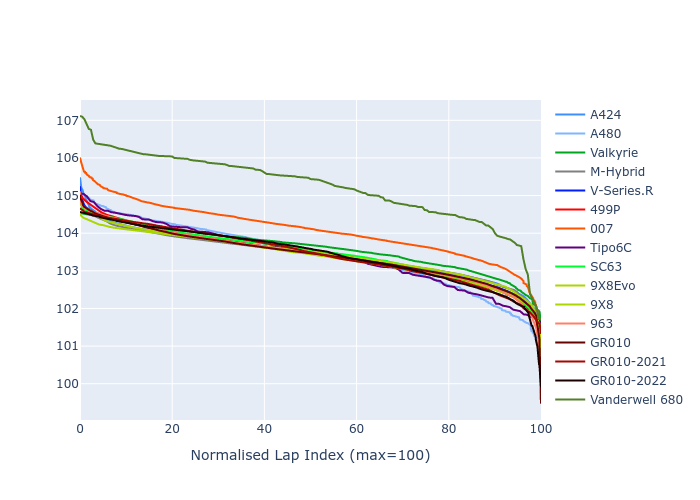

# Combined Plots

## Metadata

- BoP Accuracy: 96.68%
- Overall BoP Grade: A1
- Track: QATAR
- Threshhold: 250.0kph

## BoP Table
| Manufacturer     | Car            | Weight   | Power   | PINC   | E/Stint   | FDS    | RDP    | QDP    | TDP    |
|:-----------------|:---------------|:---------|:--------|:-------|:----------|:-------|:-------|:-------|:-------|
| Alpine           | A424           | 1075kg   | 480.0kw | +0.30% | 889MJ     | -      | 52.35% | 61.85% | 27.84% |
| Alpine           | A480           | 952kg    | 410.0kw | +0.10% | 762MJ     | -      | 54.51% | 76.19% | 54.04% |
| Aston Martin     | Valkyrie       | 1042kg   | 481.0kw | -0.20% | 877MJ     | -      | 53.59% | 53.33% | 21.51% |
| BMW              | M-Hybrid       | 1080kg   | 480.0kw | +1.70% | 886MJ     | -      | 53.26% | 57.23% | 34.54% |
| Cadillac         | V-Series.R     | 1100kg   | 482.0kw | +6.30% | 894MJ     | -      | 47.80% | 56.73% | 19.63% |
| Ferrari          | 499P           | 1100kg   | 480.0kw | +0.20% | 885MJ     | 200kph | 53.02% | 42.32% | 9.88%  |
| Glickenhaus      | 007            | 1056kg   | 484.0kw | +3.70% | 889MJ     | -      | 46.49% | 46.07% | 47.78% |
| Isotta Fraschini | Tipo6C         | 1086kg   | 520.0kw | -2.20% | 917MJ     | 190kph | 43.95% | 47.22% | 31.53% |
| Lamborghini      | SC63           | 1076kg   | 504.0kw | -0.70% | 899MJ     | -      | 46.33% | 59.50% | 29.33% |
| Peugeot          | 9X8Evo         | 1060kg   | 480.0kw | -      | 889MJ     | 190kph | 48.47% | 51.26% | 16.02% |
| Peugeot          | 9X8            | 1100kg   | 488.0kw | +6.50% | 898MJ     | 150kph | 54.07% | 57.08% | 10.80% |
| Porsche          | 963            | 1076kg   | 480.0kw | +0.80% | 884MJ     | -      | 50.87% | 45.25% | 30.77% |
| Toyota           | GR010          | 1100kg   | 480.0kw | -      | 884MJ     | 200kph | 52.43% | 57.12% | 12.82% |
| Toyota           | GR010-2021     | 1100kg   | 481.0kw | +8.10% | 899MJ     | 200kph | 54.09% | 52.67% | 26.37% |
| Toyota           | GR010-2022     | 1100kg   | 480.0kw | +2.00% | 882MJ     | 200kph | 53.48% | 69.44% | 7.86%  |
| Vanwall          | Vanderwell 680 | 1045kg   | 520.0kw | -      | 905MJ     | -      | 53.41% | 56.28% | 29.85% |

## Performance Table
| Manufacturer     | Car            | RP      | QP      | Vavg      |   RDLC | BOP-Grade   | Match   |
|:-----------------|:---------------|:--------|:--------|:----------|-------:|:------------|:--------|
| Alpine           | A424           | 1:44.93 | 1:41.49 | 292.38kph |   1.03 | ~A1         | 98.91%  |
| Alpine           | A480           | 1:42.64 | 1:40.27 | 288.91kph |   1.02 | -D1         | 66.07%  |
| Aston Martin     | Valkyrie       | 1:44.94 | 1:40.89 | 294.73kph |   1.04 | ~A1         | 100.00% |
| BMW              | M-Hybrid       | 1:44.94 | 1:41.13 | 292.11kph |   1.04 | ~A1         | 98.47%  |
| Cadillac         | V-Series.R     | 1:44.93 | 1:41.16 | 290.76kph |   1.04 | ~A1         | 99.62%  |
| Ferrari          | 499P           | 1:44.88 | 1:40.60 | 292.52kph |   1.04 | ~A1         | 99.91%  |
| Glickenhaus      | 007            | 1:44.92 | 1:42.40 | 293.13kph |   1.02 | +A2         | 94.88%  |
| Isotta Fraschini | Tipo6C         | 1:44.93 | 1:43.51 | 295.79kph |   1.01 | ~A1         | 95.52%  |
| Lamborghini      | SC63           | 1:44.94 | 1:42.11 | 294.69kph |   1.03 | ~A1         | 99.52%  |
| Peugeot          | 9X8Evo         | 1:44.92 | 1:41.29 | 295.68kph |   1.04 | ~A1         | 98.58%  |
| Peugeot          | 9X8            | 1:44.87 | 1:41.28 | 286.77kph |   1.04 | ~A1         | 99.94%  |
| Porsche          | 963            | 1:44.92 | 1:41.18 | 292.35kph |   1.04 | ~A1         | 99.57%  |
| Toyota           | GR010          | 1:44.77 | 1:40.39 | 293.36kph |   1.04 | ~A1         | 99.71%  |
| Toyota           | GR010-2021     | 1:44.45 | 1:41.09 | 290.59kph |   1.03 | ~A1         | 99.93%  |
| Toyota           | GR010-2022     | 1:44.55 | 1:41.96 | 292.76kph |   1.03 | ~A1         | 100.00% |
| Vanwall          | Vanderwell 680 | 1:44.94 | 1:41.16 | 293.09kph |   1.04 | ~A1         | 96.28%  |

## Race Laptimes

## Quali Laptimes

## Topspeeds

## Laptimes Lineplot

