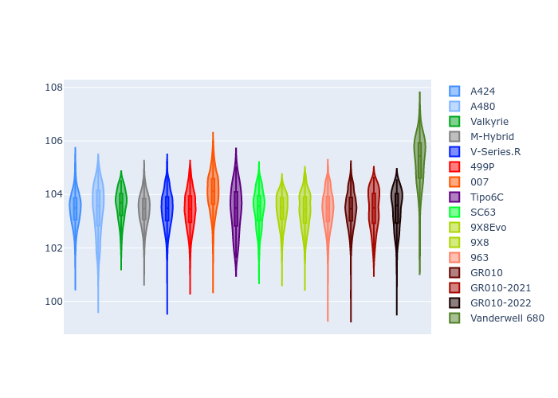
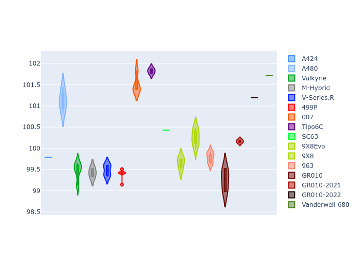

# Combined Plots

## Metadata

- BoP Accuracy: 99.50%
- Overall BoP Grade: A1
- Track: QATAR
- Threshhold: 210.0kph

## BoP Table
| Manufacturer     | Car            | Weight   | Power   | PINC   | E/Stint   | FDS    |
|:-----------------|:---------------|:---------|:--------|:-------|:----------|:-------|
| Alpine           | A424           | 1067kg   | 480.0kw | -      | 887MJ     | -      |
| Alpine           | A480           | 1052kg   | 410.0kw | +0.10% | 747MJ     | -      |
| Aston Martin     | Valkyrie       | 1038kg   | 484.0kw | -0.80% | 878MJ     | -      |
| BMW              | M-Hybrid       | 1071kg   | 480.0kw | +1.50% | 884MJ     | -      |
| Cadillac         | V-Series.R     | 1086kg   | 480.0kw | +6.80% | 889MJ     | -      |
| Ferrari          | 499P           | 1086kg   | 480.0kw | -      | 883MJ     | 190kph |
| Glickenhaus      | 007            | 1045kg   | 481.0kw | +4.60% | 885MJ     | -      |
| Isotta Fraschini | Tipo6C         | 1086kg   | 520.0kw | -2.50% | 917MJ     | 190kph |
| Lamborghini      | SC63           | 1083kg   | 512.0kw | -3.10% | 902MJ     | -      |
| Peugeot          | 9X8Evo         | 1053kg   | 480.0kw | -      | 888MJ     | 190kph |
| Peugeot          | 9X8            | 1086kg   | 495.0kw | +5.00% | 897MJ     | 150kph |
| Porsche          | 963            | 1071kg   | 480.0kw | +1.30% | 884MJ     | -      |
| Toyota           | GR010          | 1085kg   | 480.0kw | -      | 882MJ     | 190kph |
| Toyota           | GR010OLD       | 1100kg   | 480.0kw | +3.00% | 938MJ     | 190kph |
| Vanwall          | Vanderwell 680 | 1045kg   | 520.0kw | -      | 905MJ     | -      |

## Performance Table
| Manufacturer     | Car            | RP      | QP      | Vavg      |   RDLC | BOP-Grade   | Match   |
|:-----------------|:---------------|:--------|:--------|:----------|-------:|:------------|:--------|
| Alpine           | A424           | 1:44.99 | 1:41.69 | 293.13kph |   1.03 | ~A1         | 99.39%  |
| Alpine           | A480           | 1:44.46 | 1:42.26 | 287.19kph |   1.02 | ~A1         | 99.44%  |
| Aston Martin     | Valkyrie       | 1:44.97 | 1:40.95 | 295.36kph |   1.04 | ~A1         | 100.00% |
| BMW              | M-Hybrid       | 1:45.00 | 1:41.36 | 292.81kph |   1.04 | ~A1         | 100.00% |
| Cadillac         | V-Series.R     | 1:44.99 | 1:41.44 | 291.98kph |   1.03 | ~A1         | 99.96%  |
| Ferrari          | 499P           | 1:44.98 | 1:41.25 | 293.80kph |   1.04 | ~A1         | 99.98%  |
| Glickenhaus      | 007            | 1:44.98 | 1:42.46 | 294.07kph |   1.02 | ~A1         | 97.16%  |
| Isotta Fraschini | Tipo6C         | 1:44.99 | 1:43.47 | 295.66kph |   1.01 | ~A1         | 100.00% |
| Lamborghini      | SC63           | 1:44.99 | 1:42.22 | 293.85kph |   1.03 | ~A1         | 99.52%  |
| Peugeot          | 9X8Evo         | 1:45.00 | 1:41.38 | 296.39kph |   1.04 | ~A1         | 98.54%  |
| Peugeot          | 9X8            | 1:44.97 | 1:41.73 | 289.61kph |   1.03 | ~A1         | 99.96%  |
| Porsche          | 963            | 1:44.97 | 1:41.40 | 292.83kph |   1.04 | ~A1         | 99.89%  |
| Toyota           | GR010          | 1:45.00 | 1:41.18 | 294.40kph |   1.04 | ~A1         | 100.00% |
| Toyota           | GR010OLD       | 1:44.98 | 1:42.44 | 289.67kph |   1.02 | ~A1         | 100.00% |
| Vanwall          | Vanderwell 680 | 1:45.00 | 1:41.17 | 293.09kph |   1.04 | ~A1         | 98.66%  |

## Race Laptimes

## Quali Laptimes

## Topspeeds

## Laptimes Lineplot

