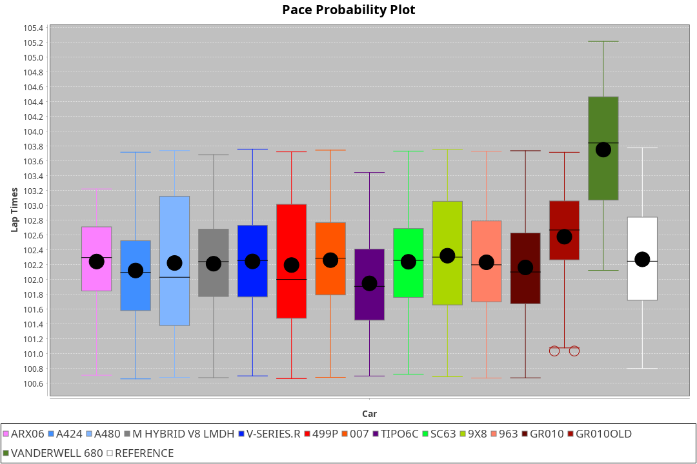
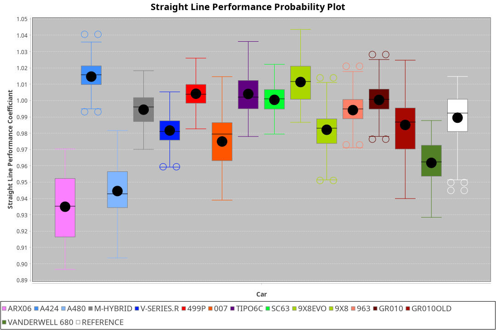
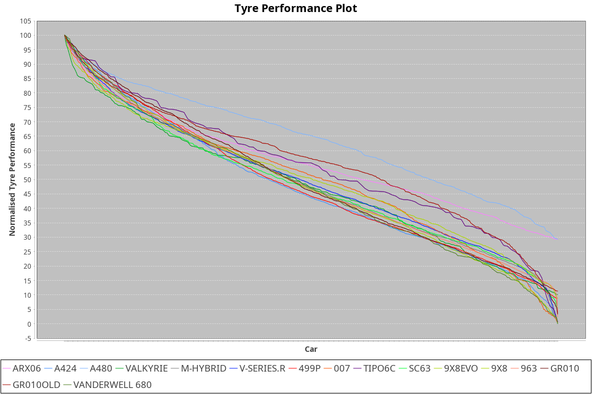

| Manufacturer     | Car            | Weight | Power   | PINC    | E/Stint | FDS     |
|:-|:-|:-|:-|:-|:-|:-|
| Acura            | ARX06          | 1100kg | 480.0kw | 5.90%   | 900MJ   |    -    |
| Alpine           | A424           | 1100kg | 480.0kw | 5.00%   | 903MJ   |    -    |
| Alpine           | A480           | 952kg  | 410.0kw | 0.10%   | 747MJ   |    -    |
| Aston Martin     | Valkyrie       | 1090kg | 480.0kw | 8.30%   | 901MJ   |    -    |
| BMW              | M-Hybrid       | 1100kg | 480.0kw | 8.30%   | 904MJ   |    -    |
| Cadillac         | V-Series.R     | 1100kg | 480.0kw | 7.00%   | 894MJ   |    -    |
| Ferrari          | 499P           | 1100kg | 480.0kw | 0.60%   | 886MJ   | 200kph  |
| Glickenhaus      | 007            | 1040kg | 480.0kw | 1.70%   | 879MJ   |    -    |
| Isotta Fraschini | Tipo6C         | 1101kg | 520.0kw |    -    | 924MJ   | 190kph  |
| Lamborghini      | SC63           | 1100kg | 500.0kw | 4.00%   | 909MJ   |    -    |
| Peugeot          | 9X8Evo         | 1074kg | 480.0kw |    -    | 890MJ   | 190kph  |
| Peugeot          | 9X8            | 1090kg | 488.0kw | 6.50%   | 897MJ   | 150kph  |
| Porsche          | 963            | 1100kg | 480.0kw | 8.30%   | 904MJ   |    -    |
| Toyota           | GR010          | 1100kg | 480.0kw | 2.90%   | 890MJ   | 200kph  |
| Toyota           | GR010OLD       | 1100kg | 480.0kw | 0.50%   | 934MJ   | 200kph  |
| Vanwall          | Vanderwell 680 | 1030kg | 520.0kw |    -    | 903MJ   |    -    |

### BoP Accuracy: 84.84%; Overall BoP Grade: B2
| Manufacturer     | Car            | Type  | RP      | QP      | Weight | Power¹  | Threshhold | PINC    | Power²   | E/Stint | AVG Vmax  | FDS     | RDLC | L/Stint | BOP-Grade | Model Accuracy | Model Points | Match% | SimDiff |
|:-|:-|:-|:-|:-|:-|:-|:-|:-|:-|:-|:-|:-|:-|:-|:-|:-|:-|:-|:-|
| Acura            | ARX06          | LMDH  | 1:43.88 | 1:40.04 | 1100kg | 480.0kw | 250.0kph   | 5.90%   | 508.30kw |  900MJ  | 300.81kph |    -    | 0.98 | 33      | -C1       | 100.00%        | 996          | 79.18% | #       |
| Alpine           | A424           | LMDH  | 1:44.13 | 1:40.47 | 1100kg | 480.0kw | 250.0kph   | 5.00%   | 504.00kw |  903MJ  | 300.72kph |    -    | 0.98 | 33      | ~A1       | 99.58%         | 1429         | 99.34% | +0.66   |
| Alpine           | A480           | LMP1  | 1:43.08 | 1:40.73 |  952kg | 410.0kw | 250.0kph   | 0.10%   | 410.40kw |  747MJ  | 298.86kph |    -    | 0.98 | 31      | -E2       | 94.94%         | 1689         | 50.34% | #       |
| Aston Martin     | Valkyrie       | LMHNH | 1:44.39 | 1:40.62 | 1090kg | 480.0kw | 250.0kph   | 8.30%   | 519.80kw |  901MJ  | 290.07kph |    -    | 1.01 | 33      | +D1       | 100.00%        | 247          | 69.40% | +0.61   |
| BMW              | M-Hybrid       | LMDH  | 1:44.02 | 1:40.24 | 1100kg | 480.0kw | 250.0kph   | 8.30%   | 519.80kw |  904MJ  | 298.14kph |    -    | 0.98 | 33      | ~A1       | 99.97%         | 2912         | 98.85% | +0.40   |
| Cadillac         | V-Series.R     | LMDH  | 1:44.08 | 1:40.47 | 1100kg | 480.0kw | 250.0kph   | 7.00%   | 513.60kw |  894MJ  | 300.94kph |    -    | 0.98 | 33      | ~A1       | 99.49%         | 5225         | 97.83% | +0.96   |
| Ferrari          | 499P           | LMHHU | 1:44.11 | 1:40.18 | 1100kg | 480.0kw | 250.0kph   | 0.60%   | 482.90kw |  886MJ  | 302.87kph | 200kph  | 1.00 | 33      | ~A1       | 100.00%        | 5378         | 98.73% | +0.83   |
| Glickenhaus      | 007            | LMHNH | 1:44.38 | 1:41.69 | 1040kg | 480.0kw | 250.0kph   | 1.70%   | 488.20kw |  879MJ  | 304.84kph |    -    | 0.96 | 33      | +B2       | 93.90%         | 2170         | 83.52% | #       |
| Isotta Fraschini | Tipo6C         | LMHHU | 1:44.39 | 1:42.47 | 1101kg | 520.0kw | 250.0kph   |    -    | 520.00kw |  924MJ  | 299.65kph | 190kph  | 1.02 | 33      | +D1       | 100.00%        | 132          | 67.02% | -0.69   |
| Lamborghini      | SC63           | LMDH  | 1:44.26 | 1:41.50 | 1100kg | 500.0kw | 250.0kph   | 4.00%   | 520.00kw |  909MJ  | 297.68kph |    -    | 1.01 | 33      | ~A1       | 100.00%        | 784          | 97.52% | -0.48   |
| Peugeot          | 9X8Evo         | LMHHU | 1:44.39 | 1:40.77 | 1074kg | 480.0kw | 250.0kph   |    -    | 480.00kw |  890MJ  | 306.16kph | 190kph  | 0.99 | 33      | +B1       | 100.00%        | 1459         | 86.94% | +0.95   |
| Peugeot          | 9X8            | LMHHE | 1:44.40 | 1:41.24 | 1090kg | 488.0kw | 250.0kph   | 6.50%   | 519.70kw |  897MJ  | 297.64kph | 150kph  | 1.00 | 33      | +B2       | 99.18%         | 4817         | 83.07% | -0.28   |
| Porsche          | 963            | LMDH  | 1:43.76 | 1:39.90 | 1100kg | 480.0kw | 250.0kph   | 8.30%   | 519.80kw |  904MJ  | 299.51kph |    -    | 0.98 | 33      | -B2       | 99.92%         | 14207        | 82.91% | +0.70   |
| Toyota           | GR010          | LMHHU | 1:43.73 | 1:39.71 | 1100kg | 480.0kw | 250.0kph   | 2.90%   | 493.90kw |  890MJ  | 303.17kph | 200kph  | 1.00 | 33      | -B2       | 99.86%         | 4280         | 83.35% | +1.02   |
| Toyota           | GR010OLD       | LMHHE | 1:44.09 | 1:41.48 | 1100kg | 480.0kw | 250.0kph   | 0.50%   | 482.40kw |  934MJ  | 302.90kph | 200kph  | 1.00 | 33      | +B1       | 99.46%         | 925          | 86.86% | #       |
| Vanwall          | Vanderwell 680 | LMHNH | 1:44.51 | 1:40.55 | 1030kg | 520.0kw | 0.0kph     |    -    | 520.00kw |  903MJ  | 308.45kph |    -    | 1.01 | 33      | +A2       | 95.82%         | 642          | 92.54% | #       |

## Power below Threshhold
| N/Nmax    | ARX06   | A424    | VALKYRIE | M-HYBRID | V-SERIES.R | 499P    | 007     | TIPO6C  | SC63    | 9X8EVO  | 9X8     | 963     | GR010   | GR010OLD | VANDERWELL 680 | ​     | RPM      | A480       |
|:-|:-|:-|:-|:-|:-|:-|:-|:-|:-|:-|:-|:-|:-|:-|:-|:-|:-|:-|
|  0.550    |  236    |  236    |  236     |  236     |  236       |  236    |  236    |  256    |  246    |  236    |  240    |  236    |  236    |  236     |  256           |  ​    |   --     |  0.00      |
|  0.575    |  258    |  258    |  258     |  258     |  258       |  258    |  258    |  279    |  269    |  258    |  262    |  258    |  258    |  258     |  279           |  ​    |   --     |  0.00      |
|  0.600    |  277    |  277    |  277     |  277     |  277       |  277    |  277    |  300    |  289    |  277    |  282    |  277    |  277    |  277     |  300           |  ​    |   --     |  0.00      |
|  0.625    |  297    |  297    |  297     |  297     |  297       |  297    |  297    |  322    |  309    |  297    |  302    |  297    |  297    |  297     |  322           |  ​    |   --     |  0.00      |
|  0.650    |  317    |  317    |  317     |  317     |  317       |  317    |  317    |  343    |  330    |  317    |  322    |  317    |  317    |  317     |  343           |  ​    |   --     |  0.00      |
|  0.675    |  337    |  337    |  337     |  337     |  337       |  337    |  337    |  365    |  351    |  337    |  343    |  337    |  337    |  337     |  365           |  ​    |   --     |  0.00      |
|  0.700    |  358    |  358    |  358     |  358     |  358       |  358    |  358    |  387    |  372    |  358    |  364    |  358    |  358    |  358     |  387           |  ​    |   --     |  0.00      |
|  0.725    |  378    |  378    |  378     |  378     |  378       |  378    |  378    |  409    |  393    |  378    |  384    |  378    |  378    |  378     |  409           |  ​    |   --     |  0.00      |
|  0.750    |  397    |  397    |  397     |  397     |  397       |  397    |  397    |  430    |  413    |  397    |  403    |  397    |  397    |  397     |  430           |  ​    |   --     |  0.00      |
|  0.775    |  415    |  415    |  415     |  415     |  415       |  415    |  415    |  449    |  432    |  415    |  422    |  415    |  415    |  415     |  449           |  ​    |  5000    |  241.13    |
|  0.800    |  431    |  431    |  431     |  431     |  431       |  431    |  431    |  467    |  449    |  431    |  438    |  431    |  431    |  431     |  467           |  ​    |  5500    |  284.15    |
|  0.825    |  445    |  445    |  445     |  445     |  445       |  445    |  445    |  482    |  464    |  445    |  453    |  445    |  445    |  445     |  482           |  ​    |  6000    |  318.17    |
|  0.850    |  456    |  456    |  456     |  456     |  456       |  456    |  456    |  494    |  475    |  456    |  464    |  456    |  456    |  456     |  494           |  ​    |  6500    |  359.19    |
|  0.875    |  466    |  466    |  466     |  466     |  466       |  466    |  466    |  505    |  485    |  466    |  474    |  466    |  466    |  466     |  505           |  ​    |  7000    |  401.22    |
|  0.900    |  472    |  472    |  472     |  472     |  472       |  472    |  472    |  512    |  492    |  472    |  480    |  472    |  472    |  472     |  512           |  ​    |  7500    |  411.22    |
|  0.925    |  477    |  477    |  477     |  477     |  477       |  477    |  477    |  517    |  497    |  477    |  485    |  477    |  477    |  477     |  517           |  ​    |  8000    |  407.22    |
| **0.950** | **480** | **480** | **480**  | **480**  | **480**    | **480** | **480** | **520** | **500** | **480** | **488** | **480** | **480** | **480**  | **520**        | **​** | **8500** | **410.22** |
|  0.975    |  478    |  478    |  478     |  478     |  478       |  478    |  478    |  518    |  498    |  478    |  486    |  478    |  478    |  478     |  518           |  ​    |  9000    |  205.11    |
|  1.000    |  475    |  475    |  475     |  475     |  475       |  475    |  475    |  514    |  495    |  475    |  483    |  475    |  475    |  475     |  514           |  ​    |   --     |  0.00      |
|  1.025    |  410    |  410    |  410     |  410     |  410       |  410    |  410    |  444    |  427    |  410    |  417    |  410    |  410    |  410     |  444           |  ​    |   --     |  0.00      |

## Power above Threshhold
| N/Nmax    | ARX06      | A424    | VALKYRIE   | M-HYBRID   | V-SERIES.R | 499P       | 007        | TIPO6C  | SC63    | 9X8EVO  | 9X8        | 963        | GR010      | GR010OLD   | VANDERWELL 680 | ​     | RPM      | A480       |
|:-|:-|:-|:-|:-|:-|:-|:-|:-|:-|:-|:-|:-|:-|:-|:-|:-|:-|:-|
|  0.550    |  250.16    |  248    |  256.41    |  256.41    |  253.30    |  237.43    |  240.08    |  256    |  256    |  236    |  256.36    |  256.41    |  243.45    |  237.20    |  256           |  ​    |   --     |  0.00      |
|  0.575    |  273.17    |  271    |  279.45    |  279.45    |  276.32    |  259.47    |  262.09    |  279    |  279    |  258    |  279.39    |  279.45    |  265.49    |  259.21    |  279           |  ​    |   --     |  0.00      |
|  0.600    |  293.18    |  291    |  299.48    |  299.48    |  296.35    |  278.51    |  282.09    |  300    |  300    |  277    |  299.41    |  299.48    |  285.53    |  278.23    |  300           |  ​    |   --     |  0.00      |
|  0.625    |  314.20    |  312    |  321.52    |  321.52    |  317.37    |  298.54    |  302.10    |  322    |  322    |  297    |  321.45    |  321.52    |  305.57    |  298.25    |  322           |  ​    |   --     |  0.00      |
|  0.650    |  335.21    |  333    |  342.55    |  342.55    |  338.40    |  318.58    |  322.11    |  343    |  343    |  317    |  342.47    |  342.55    |  325.61    |  318.26    |  343           |  ​    |   --     |  0.00      |
|  0.675    |  357.22    |  354    |  364.59    |  364.59    |  360.42    |  338.62    |  343.11    |  365    |  365    |  337    |  364.50    |  364.59    |  346.65    |  338.28    |  365           |  ​    |   --     |  0.00      |
|  0.700    |  378.24    |  375    |  386.62    |  386.62    |  382.45    |  359.66    |  364.12    |  387    |  387    |  358    |  386.54    |  386.62    |  367.68    |  359.30    |  387           |  ​    |   --     |  0.00      |
|  0.725    |  399.25    |  396    |  408.66    |  408.66    |  403.47    |  380.69    |  384.13    |  409    |  409    |  378    |  408.57    |  408.66    |  388.72    |  380.32    |  409           |  ​    |   --     |  0.00      |
|  0.750    |  420.26    |  416    |  429.69    |  429.69    |  424.50    |  399.73    |  403.13    |  430    |  430    |  397    |  429.60    |  429.69    |  407.76    |  399.33    |  430           |  ​    |   --     |  0.00      |
|  0.775    |  439.28    |  435    |  448.73    |  448.73    |  443.52    |  417.76    |  422.14    |  449    |  449    |  415    |  448.62    |  448.73    |  426.79    |  417.35    |  449           |  ​    |  5000    |  241.13    |
|  0.800    |  456.29    |  453    |  466.75    |  466.75    |  461.54    |  433.79    |  438.14    |  467    |  467    |  431    |  466.65    |  466.75    |  443.83    |  433.36    |  467           |  ​    |  5500    |  284.15    |
|  0.825    |  471.30    |  468    |  481.78    |  481.78    |  476.56    |  447.82    |  453.15    |  482    |  482    |  445    |  481.67    |  481.78    |  457.85    |  447.37    |  482           |  ​    |  6000    |  318.17    |
|  0.850    |  483.30    |  479    |  493.80    |  493.80    |  487.57    |  458.84    |  464.15    |  494    |  494    |  456    |  493.68    |  493.80    |  468.87    |  458.38    |  494           |  ​    |  6500    |  359.19    |
|  0.875    |  493.31    |  489    |  504.82    |  504.82    |  498.58    |  468.85    |  474.16    |  505    |  505    |  466    |  504.70    |  504.82    |  478.89    |  468.39    |  505           |  ​    |  7000    |  401.22    |
|  0.900    |  500.31    |  496    |  511.83    |  511.83    |  505.59    |  474.87    |  480.16    |  512    |  512    |  472    |  511.71    |  511.83    |  485.91    |  474.39    |  512           |  ​    |  7500    |  411.22    |
|  0.925    |  505.32    |  501    |  516.84    |  516.84    |  510.60    |  479.87    |  485.16    |  517    |  517    |  477    |  516.72    |  516.84    |  490.91    |  479.40    |  517           |  ​    |  8000    |  407.22    |
| **0.950** | **508.32** | **504** | **519.84** | **519.84** | **513.60** | **482.88** | **488.16** | **520** | **520** | **480** | **519.72** | **519.84** | **493.92** | **482.40** | **520**        | **​** | **8500** | **410.22** |
|  0.975    |  506.32    |  502    |  517.84    |  517.84    |  511.60    |  480.88    |  486.16    |  518    |  518    |  478    |  517.72    |  517.84    |  491.92    |  480.40    |  518           |  ​    |  9000    |  205.11    |
|  1.000    |  503.32    |  499    |  513.83    |  513.83    |  507.59    |  477.87    |  483.16    |  514    |  514    |  475    |  513.71    |  513.83    |  488.91    |  477.40    |  514           |  ​    |   --     |  0.00      |
|  1.025    |  434.27    |  430    |  443.72    |  443.72    |  438.51    |  412.75    |  417.14    |  444    |  444    |  410    |  443.61    |  443.72    |  421.79    |  412.34    |  444           |  ​    |   --     |  0.00      |
