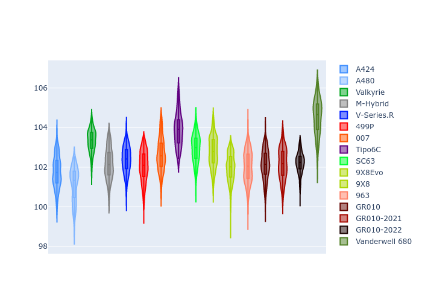
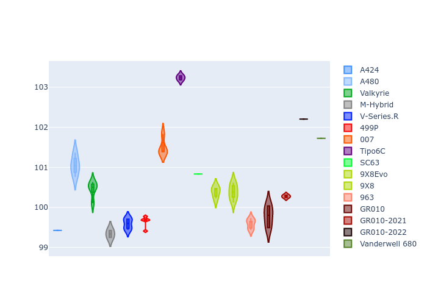
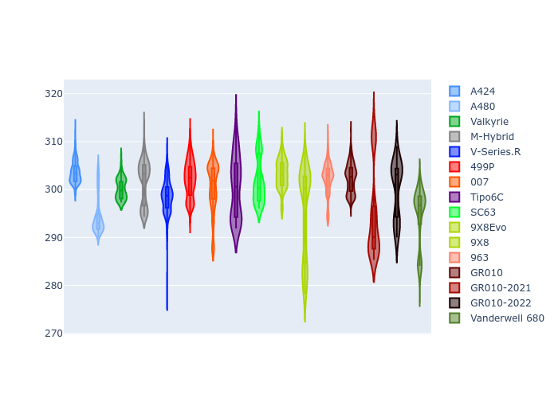
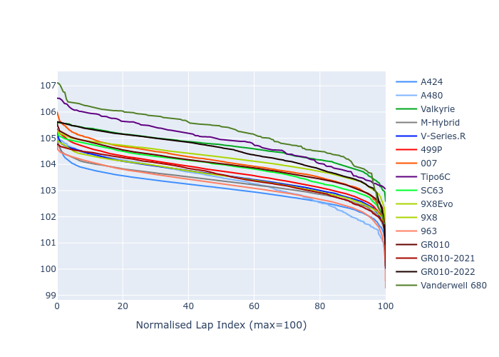

# Combined Plots

## Metadata

- BoP Accuracy: 93.57%
- Overall BoP Grade: A2
- Track: QATAR
- Threshhold: 210.0kph

## BoP Table
| Manufacturer     | Car            | Weight   | Power   | PINC   | E/Stint   | FDS    |
|:-----------------|:---------------|:---------|:--------|:-------|:----------|:-------|
| Alpine           | A424           | 1047kg   | 520.0kw | -      | 921MJ     | -      |
| Alpine           | A480           | 1052kg   | 432.0kw | -      | 766MJ     | -      |
| Aston Martin     | Valkyrie       | 1042kg   | 504.0kw | +0.40% | 899MJ     | -      |
| BMW              | M-Hybrid       | 1041kg   | 512.0kw | -      | 907MJ     | -      |
| Cadillac         | V-Series.R     | 1034kg   | 510.0kw | -      | 898MJ     | -      |
| Ferrari          | 499P           | 1063kg   | 508.0kw | -      | 906MJ     | 190kph |
| Glickenhaus      | 007            | 1030kg   | 520.0kw | -      | 910MJ     | -      |
| Isotta Fraschini | Tipo6C         | 1059kg   | 520.0kw | -      | 920MJ     | 190kph |
| Lamborghini      | SC63           | 1042kg   | 519.0kw | -      | 910MJ     | -      |
| Peugeot          | 9X8Evo         | 1050kg   | 510.0kw | -      | 915MJ     | 190kph |
| Peugeot          | 9X8            | 1030kg   | 520.0kw | -      | 904MJ     | 150kph |
| Porsche          | 963            | 1047kg   | 516.0kw | -      | 912MJ     | -      |
| Toyota           | GR010          | 1080kg   | 512.0kw | -      | 911MJ     | 190kph |
| Toyota           | GR010OLD       | 1065kg   | 513.0kw | -      | 960MJ     | 150kph |
| Vanwall          | Vanderwell 680 | 1030kg   | 520.0kw | -      | 903MJ     | -      |

## Performance Table
| Manufacturer     | Car            | RP      | QP      | Vavg      |   RDLC | BOP-Grade   | Match   |
|:-----------------|:---------------|:--------|:--------|:----------|-------:|:------------|:--------|
| Alpine           | A424           | 1:41.66 | 1:38.56 | 303.83kph |   1.03 | ~A1         | 97.43%  |
| Alpine           | A480           | 1:42.72 | 1:40.59 | 292.61kph |   1.02 | ~A1         | 95.97%  |
| Aston Martin     | Valkyrie       | 1:43.45 | 1:39.53 | 300.26kph |   1.04 | ~A1         | 96.39%  |
| BMW              | M-Hybrid       | 1:42.13 | 1:38.68 | 301.67kph |   1.03 | ~A1         | 99.49%  |
| Cadillac         | V-Series.R     | 1:42.41 | 1:39.02 | 298.63kph |   1.03 | ~A1         | 99.94%  |
| Ferrari          | 499P           | 1:42.35 | 1:38.81 | 302.23kph |   1.04 | ~A1         | 99.79%  |
| Glickenhaus      | 007            | 1:42.56 | 1:40.16 | 300.54kph |   1.02 | ~A1         | 98.58%  |
| Isotta Fraschini | Tipo6C         | 1:43.82 | 1:42.34 | 300.33kph |   1.01 | +B2         | 80.60%  |
| Lamborghini      | SC63           | 1:42.86 | 1:40.19 | 301.90kph |   1.03 | ~A1         | 98.55%  |
| Peugeot          | 9X8Evo         | 1:42.79 | 1:39.32 | 303.29kph |   1.03 | ~A1         | 98.08%  |
| Peugeot          | 9X8            | 1:42.37 | 1:39.28 | 296.73kph |   1.03 | ~A1         | 99.93%  |
| Porsche          | 963            | 1:41.98 | 1:38.60 | 302.07kph |   1.03 | ~A1         | 99.48%  |
| Toyota           | GR010          | 1:42.60 | 1:38.95 | 301.87kph |   1.04 | ~A1         | 99.97%  |
| Toyota           | GR010OLD       | 1:41.63 | 1:39.25 | 297.93kph |   1.02 | ~A1         | 97.10%  |
| Vanwall          | Vanderwell 680 | 1:44.53 | 1:40.73 | 294.63kph |   1.04 | +Ω1         | 42.26%  |

## Race Laptimes

## Quali Laptimes

## Topspeeds

## Laptimes Lineplot

