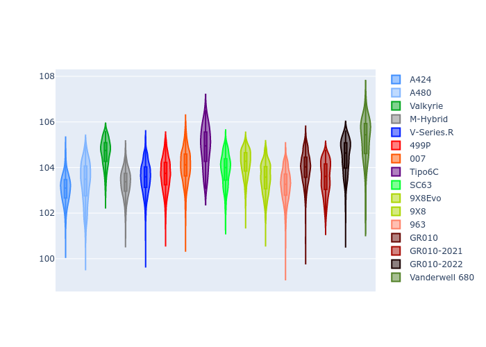
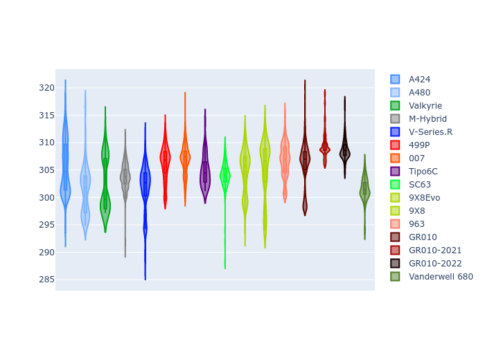

# Combined Plots

## Metadata

- BoP Accuracy: 94.04%
- Overall BoP Grade: A2
- Track: QATAR
- Threshhold: 210.0kph
- Average Laptime: 1:43.92
- Average Quali Laptime: 1:40.59
- Average Topspeed: 304.95kph

## BoP Table
| Manufacturer     | Car            | Weight   | Power   | PINC   | E/Stint   | FDS    | RDP    | QDP    | TDP    |
|:-----------------|:---------------|:---------|:--------|:-------|:----------|:-------|:-------|:-------|:-------|
| Alpine           | A424           | 1047kg   | 520.0kw | -      | 922MJ     | -      | 51.64% | 59.31% | 26.80% |
| Alpine           | A480           | 952kg    | 432.0kw | -      | 766MJ     | -      | 53.05% | 74.07% | 48.97% |
| Aston Martin     | Valkyrie       | 1042kg   | 504.0kw | +0.40% | 899MJ     | -      | 53.50% | 53.33% | 21.51% |
| BMW              | M-Hybrid       | 1041kg   | 512.0kw | -      | 907MJ     | -      | 52.89% | 56.22% | 33.41% |
| Cadillac         | V-Series.R     | 1034kg   | 510.0kw | -      | 897MJ     | -      | 48.63% | 60.80% | 19.01% |
| Ferrari          | 499P           | 1063kg   | 508.0kw | -      | 906MJ     | 190kph | 51.38% | 44.98% | 9.83%  |
| Glickenhaus      | 007            | 1030kg   | 520.0kw | -      | 910MJ     | -      | 46.15% | 49.30% | 41.45% |
| Isotta Fraschini | Tipo6C         | 1059kg   | 520.0kw | -      | 920MJ     | 190kph | 43.95% | 47.22% | 31.53% |
| Lamborghini      | SC63           | 1042kg   | 519.0kw | -      | 910MJ     | -      | 48.33% | 60.95% | 28.65% |
| Peugeot          | 9X8Evo         | 1050kg   | 510.0kw | -      | 915MJ     | 190kph | 48.87% | 52.78% | 15.41% |
| Peugeot          | 9X8            | 1030kg   | 520.0kw | -      | 904MJ     | 150kph | 54.54% | 58.39% | 9.69%  |
| Porsche          | 963            | 1047kg   | 516.0kw | -      | 912MJ     | -      | 50.70% | 44.30% | 29.51% |
| Toyota           | GR010          | 1080kg   | 512.0kw | -      | 910MJ     | 190kph | 51.09% | 52.71% | 11.46% |
| Toyota           | GR010-2021     | 1065kg   | 513.0kw | -      | 906MJ     | 150kph | 54.08% | 54.81% | 9.72%  |
| Toyota           | GR010-2022     | 1080kg   | 512.0kw | -      | 904MJ     | 190kph | 53.45% | 68.83% | 9.58%  |
| Vanwall          | Vanderwell 680 | 1030kg   | 520.0kw | -      | 908MJ     | -      | 49.68% | 60.93% | 34.43% |

## Performance Table
| Manufacturer     | Car            | RP      | QP      | Vavg      |   RDLC | BOP-Grade   | Match   |
|:-----------------|:---------------|:--------|:--------|:----------|-------:|:------------|:--------|
| Alpine           | A424           | 1:43.05 | 1:39.43 | 305.52kph |   1.04 | ~A1         | 99.91%  |
| Alpine           | A480           | 1:43.34 | 1:41.05 | 301.19kph |   1.02 | ~A1         | 99.33%  |
| Aston Martin     | Valkyrie       | 1:44.66 | 1:40.46 | 302.41kph |   1.04 | +A2         | 94.35%  |
| BMW              | M-Hybrid       | 1:43.33 | 1:39.34 | 303.85kph |   1.04 | ~A1         | 99.94%  |
| Cadillac         | V-Series.R     | 1:43.55 | 1:39.59 | 301.67kph |   1.04 | ~A1         | 99.84%  |
| Ferrari          | 499P           | 1:43.71 | 1:39.65 | 306.23kph |   1.04 | ~A1         | 99.94%  |
| Glickenhaus      | 007            | 1:44.07 | 1:41.50 | 306.90kph |   1.03 | ~A1         | 97.21%  |
| Isotta Fraschini | Tipo6C         | 1:44.86 | 1:43.24 | 304.82kph |   1.02 | +C2         | 70.90%  |
| Lamborghini      | SC63           | 1:43.91 | 1:40.84 | 304.12kph |   1.03 | ~A1         | 100.00% |
| Peugeot          | 9X8Evo         | 1:44.20 | 1:40.38 | 304.78kph |   1.04 | ~A1         | 100.00% |
| Peugeot          | 9X8            | 1:43.53 | 1:40.39 | 305.19kph |   1.03 | ~A1         | 99.96%  |
| Porsche          | 963            | 1:43.22 | 1:39.59 | 306.75kph |   1.04 | ~A1         | 99.46%  |
| Toyota           | GR010          | 1:43.99 | 1:39.78 | 306.08kph |   1.04 | ~A1         | 99.56%  |
| Toyota           | GR010-2021     | 1:43.55 | 1:40.28 | 309.46kph |   1.03 | ~A1         | 100.00% |
| Toyota           | GR010-2022     | 1:44.49 | 1:42.20 | 308.72kph |   1.02 | -A2         | 94.07%  |
| Vanwall          | Vanderwell 680 | 1:45.24 | 1:41.72 | 301.49kph |   1.03 | +E2         | 50.24%  |

## Race Laptimes

## Quali Laptimes

## Topspeeds

## Laptimes Lineplot

