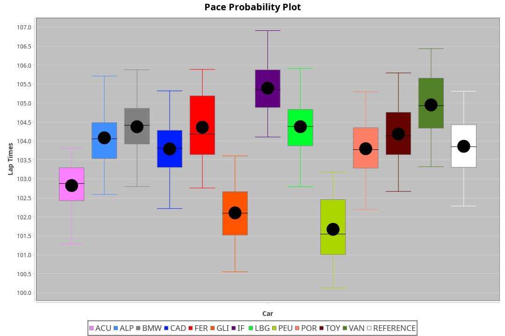
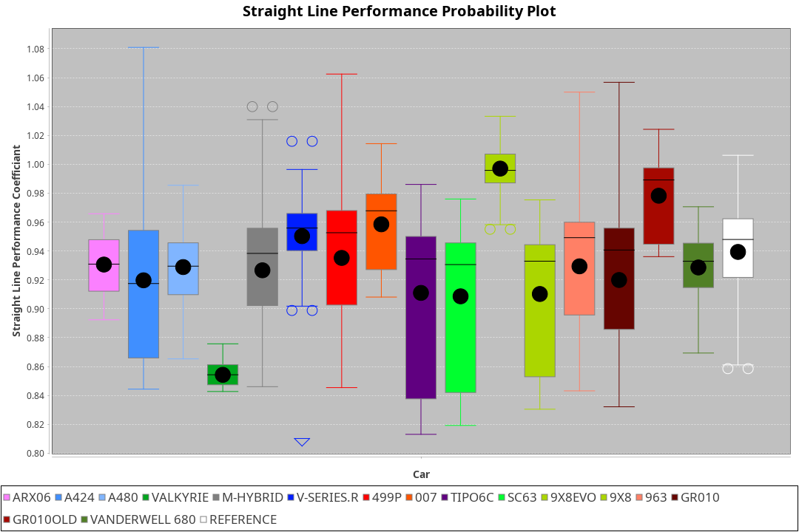
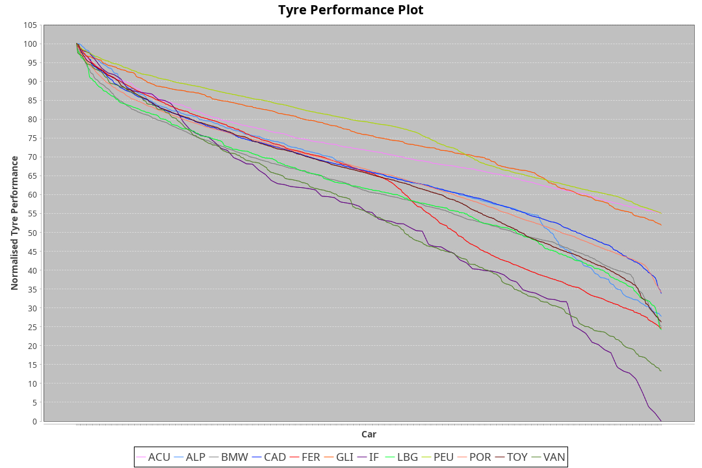

|Manufacturer|Car|Weight|Power|PINC|E/Stint|FDS|
|:-|:-|:-|:-|:-|:-|:-|
|Acura|ARX06|1070kg|512kw|-|909MJ|-|
|Alpine|A424|1070kg|510kw|-|905MJ|-|
|BMW|M Hybrid V8 LMDh|1060kg|506kw|-|892MJ|-|
|Cadillac|V-Series.R|1032kg|499kw|-|873MJ|-|
|Ferrari|499P|1075kg|503kw|-|887MJ|190kph|
|Glickenhaus|007|1030kg|520kw|-|913MJ|-|
|Issotta Fraschini|Tipo6C|1085kg|514kw|-|918MJ|190kph|
|Lamborghini|SC63|1041kg|502kw|-|883MJ|-|
|Peugeot|9X8|1030kg|520kw|-|910MJ|150kph|
|Porsche|963|1048kg|505kw|-|889MJ|-|
|Toyota|GR010 - Hybrid|1089kg|510kw|-|905MJ|190kph|
|Vanwall|Vanderwell 680|1030kg|520kw|-|908MJ|-|

### BoP Accuracy: 60.92%; Overall BoP Grade: D2

|Manufacturer|Car|Type|RP|QP|Weight|Power¹|Threshhold|PINC|Power²|E/Stint|AVG Vmax|FDS|RDLC|L/Stint|BOP-Grade|ModelAccuracy|ModelPoints|Match%|
|:-|:-|:-|:-|:-|:-|:-|:-|:-|:-|:-|:-|:-|:-|:-|:-|:-|:-|:-|
|Acura|ARX06|LMDH|1:43.65|1:41.54|1070kg|512kw|210.0kph|-|512kw|909MJ|293.83kph|-|1.00|33|-B2|100.00%|995|80.10%|
|Alpine|A424|LMDH|1:44.16|1:41.62|1070kg|510kw|210.0kph|-|510kw|905MJ|294.18kph|-|1.00|33|+B2|81.46%|523|84.51%|
|BMW|M Hybrid V8 LMDh|LMDH|1:44.35|1:41.78|1060kg|506kw|210.0kph|-|506kw|892MJ|290.03kph|-|1.02|33|+C1|98.60%|1690|75.08%|
|Cadillac|V-Series.R|LMDH|1:43.77|1:41.51|1032kg|499kw|210.0kph|-|499kw|873MJ|295.09kph|-|1.03|33|~A1|98.38%|1765|98.03%|
|Ferrari|499P|LMHHU|1:44.33|1:42.01|1075kg|503kw|210.0kph|-|503kw|887MJ|295.83kph|190kph|1.02|33|+B1|92.24%|2247|86.30%|
|Glickenhaus|007|LMHNH|1:42.08|1:40.49|1030kg|520kw|210.0kph|-|520kw|913MJ|300.80kph|-|0.95|33|-Ω1|96.18%|554|10.49%|
|Issotta Fraschini|Tipo6C|LMHHU|1:45.69|1:43.90|1085kg|514kw|210.0kph|-|514kw|918MJ|292.96kph|190kph|1.02|33|+Ω2|66.67%|96|-21.30%|
|Lamborghini|SC63|LMDH|1:44.36|1:41.70|1041kg|502kw|210.0kph|-|502kw|883MJ|292.49kph|-|1.05|33|+D2|96.77%|419|64.71%|
|Peugeot|9X8|LMHHE|1:41.66|1:39.72|1030kg|520kw|210.0kph|-|520kw|910MJ|297.50kph|150kph|1.03|33|-Ω2|87.65%|1795|-13.23%|
|Porsche|963|LMDH|1:43.75|1:41.52|1048kg|505kw|210.0kph|-|505kw|889MJ|295.11kph|-|1.02|33|~A1|96.81%|5438|100.00%|
|Toyota|GR010 - Hybrid|LMHHU|1:44.23|1:41.75|1089kg|510kw|210.0kph|-|510kw|905MJ|293.63kph|190kph|1.01|33|+C1|86.04%|1751|78.61%|
|Vanwall|Vanderwell 680|LMHNH|1:43.45|1:41.34|1030kg|520kw|210.0kph|-|520kw|908MJ|292.26kph|-|1.01|33|-B1|91.42%|501|87.80%|

## Power below Threshhold
|N/Nmax|ACU|ALP|BMW|CAD|FER|GLI|IF|LBG|PEU|POR|TOY|VAN|
|:-|:-|:-|:-|:-|:-|:-|:-|:-|:-|:-|:-|:-|
|0.550|252|251|249|246|248|256|253|247|256|249|251|256|
|0.575|275|274|272|268|271|279|276|270|279|272|274|279|
|0.600|296|295|292|288|291|300|297|290|300|292|295|300|
|0.625|317|316|313|308|311|322|318|310|322|312|316|322|
|0.650|338|337|334|329|332|343|339|331|343|333|337|343|
|0.675|359|358|355|350|353|365|361|352|365|355|358|365|
|0.700|381|380|377|371|374|387|383|374|387|376|380|387|
|0.725|403|401|398|392|395|409|404|395|409|397|401|409|
|0.750|423|422|418|412|416|430|425|415|430|417|422|430|
|0.775|442|441|437|431|435|449|444|434|449|436|441|449|
|0.800|460|458|454|448|452|467|462|451|467|454|458|467|
|0.825|475|473|469|463|467|482|477|466|482|469|473|482|
|0.850|486|485|481|474|478|494|488|477|494|480|485|494|
|0.875|497|495|491|484|488|505|499|487|505|490|495|505|
|0.900|504|502|498|491|495|512|506|494|512|497|502|512|
|0.925|509|507|503|496|500|517|511|499|517|502|507|517|
|**0.950**|**512**|**510**|**506**|**499**|**503**|**520**|**514**|**502**|**520**|**505**|**510**|**520**|
|0.975|510|508|504|497|501|518|512|500|518|503|508|518|
|1.000|506|505|501|494|498|514|508|497|514|500|505|514|
|1.025|437|436|432|426|430|444|439|429|444|431|436|444|

## Power above Threshhold
|N/Nmax|ACU|ALP|BMW|CAD|FER|GLI|IF|LBG|PEU|POR|TOY|VAN|
|:-|:-|:-|:-|:-|:-|:-|:-|:-|:-|:-|:-|:-|
|0.550|252|251|249|246|248|256|253|247|256|249|251|256|
|0.575|275|274|272|268|271|279|276|270|279|272|274|279|
|0.600|296|295|292|288|291|300|297|290|300|292|295|300|
|0.625|317|316|313|308|311|322|318|310|322|312|316|322|
|0.650|338|337|334|329|332|343|339|331|343|333|337|343|
|0.675|359|358|355|350|353|365|361|352|365|355|358|365|
|0.700|381|380|377|371|374|387|383|374|387|376|380|387|
|0.725|403|401|398|392|395|409|404|395|409|397|401|409|
|0.750|423|422|418|412|416|430|425|415|430|417|422|430|
|0.775|442|441|437|431|435|449|444|434|449|436|441|449|
|0.800|460|458|454|448|452|467|462|451|467|454|458|467|
|0.825|475|473|469|463|467|482|477|466|482|469|473|482|
|0.850|486|485|481|474|478|494|488|477|494|480|485|494|
|0.875|497|495|491|484|488|505|499|487|505|490|495|505|
|0.900|504|502|498|491|495|512|506|494|512|497|502|512|
|0.925|509|507|503|496|500|517|511|499|517|502|507|517|
|**0.950**|**512**|**510**|**506**|**499**|**503**|**520**|**514**|**502**|**520**|**505**|**510**|**520**|
|0.975|510|508|504|497|501|518|512|500|518|503|508|518|
|1.000|506|505|501|494|498|514|508|497|514|500|505|514|
|1.025|437|436|432|426|430|444|439|429|444|431|436|444|
