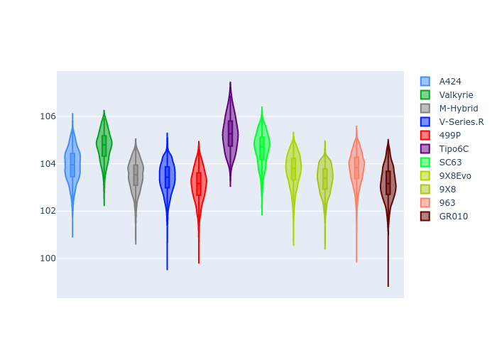
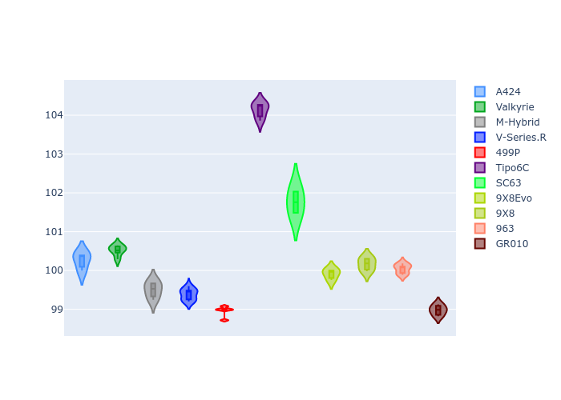
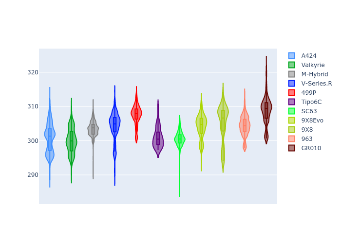
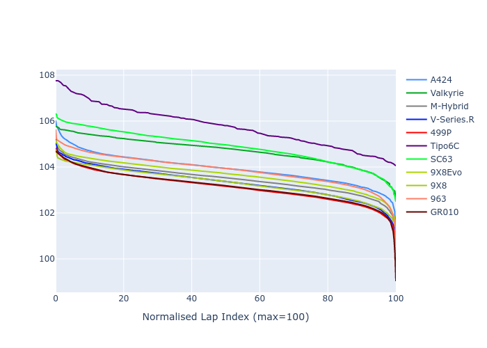

# Combined Plots

## Metadata

- BoP Accuracy: 92.67%
- Overall BoP Grade: A2
- Track: QATAR
- Threshhold: 250.0kph
- Average Laptime: 1:43.83
- Average Quali Laptime: 1:40.34
- Laptime Std Dev: 0.73 seconds
- Filtered Average Topspeed: 303.62kph

## BoP Table
| Manufacturer     | Car        | Weight   | Power   | PINC   | E/Stint   | FDS    | RDP    | QDP    | TDP    |
|:-----------------|:-----------|:---------|:--------|:-------|:----------|:-------|:-------|:-------|:-------|
| Alpine           | A424       | 1044kg   | 508.0kw | -2.60% | 904MJ     | -      | 52.20% | 54.51% | 24.58% |
| Aston Martin     | Valkyrie   | 1042kg   | 504.0kw | +0.40% | 899MJ     | -      | 53.39% | 54.11% | 23.71% |
| BMW              | M-Hybrid   | 1037kg   | 505.0kw | +0.80% | 902MJ     | -      | 53.47% | 52.95% | 33.73% |
| Cadillac         | V-Series.R | 1030kg   | 503.0kw | +3.40% | 899MJ     | -      | 49.22% | 60.31% | 18.04% |
| Ferrari          | 499P       | 1037kg   | 501.0kw | -      | 897MJ     | 190kph | 51.56% | 44.72% | 9.86%  |
| Isotta Fraschini | Tipo6C     | 1085kg   | 514.0kw | -      | 917MJ     | 190kph | 43.95% | 47.22% | 31.53% |
| Lamborghini      | SC63       | 1041kg   | 502.0kw | -      | 895MJ     | -      | 48.25% | 60.95% | 28.65% |
| Peugeot          | 9X8Evo     | 1031kg   | 520.0kw | -5.20% | 909MJ     | 190kph | 50.17% | 49.36% | 17.73% |
| Peugeot          | 9X8        | 1030kg   | 520.0kw | -      | 904MJ     | 150kph | 54.54% | 58.39% | 9.69%  |
| Porsche          | 963        | 1064kg   | 508.0kw | +1.00% | 909MJ     | -      | 50.78% | 41.25% | 27.61% |
| Toyota           | GR010      | 1065kg   | 503.0kw | +3.40% | 909MJ     | 190kph | 51.68% | 51.25% | 14.48% |

## Performance Table
| Manufacturer     | Car        | RP      | QP      | Vavg      |   RDLC | BOP-Grade   | Match   |
|:-----------------|:-----------|:--------|:--------|:----------|-------:|:------------|:--------|
| Alpine           | A424       | 1:43.89 | 1:40.23 | 300.79kph |   1.04 | ~A1         | 99.64%  |
| Aston Martin     | Valkyrie   | 1:44.84 | 1:41.14 | 299.99kph |   1.04 | +C1         | 77.88%  |
| BMW              | M-Hybrid   | 1:43.49 | 1:39.61 | 303.53kph |   1.04 | ~A1         | 99.96%  |
| Cadillac         | V-Series.R | 1:43.28 | 1:39.43 | 304.13kph |   1.04 | ~A1         | 99.83%  |
| Ferrari          | 499P       | 1:42.98 | 1:39.09 | 307.55kph |   1.04 | ~A1         | 99.55%  |
| Isotta Fraschini | Tipo6C     | 1:45.25 | 1:43.60 | 300.88kph |   1.02 | +E1         | 59.70%  |
| Lamborghini      | SC63       | 1:44.64 | 1:41.60 | 300.58kph |   1.03 | +B2         | 83.75%  |
| Peugeot          | 9X8Evo     | 1:43.67 | 1:39.98 | 304.10kph |   1.04 | ~A1         | 100.00% |
| Peugeot          | 9X8        | 1:43.28 | 1:40.06 | 305.19kph |   1.03 | ~A1         | 99.92%  |
| Porsche          | 963        | 1:43.76 | 1:39.96 | 304.35kph |   1.04 | ~A1         | 99.90%  |
| Toyota           | GR010      | 1:43.00 | 1:39.00 | 308.70kph |   1.04 | ~A1         | 99.29%  |

## Race Laptimes

## Quali Laptimes

## Topspeeds

## Laptimes Lineplot

