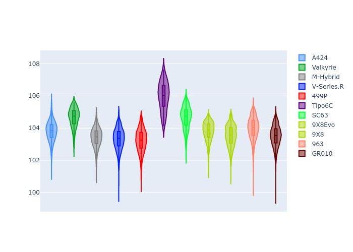

# Combined Plots

## Metadata

- BoP Accuracy: 91.77%
- Overall BoP Grade: A2
- Track: QATAR
- Threshhold: 250.0kph

## BoP Table
| Manufacturer     | Car        | Weight   | Power   | PINC   | E/Stint   | FDS    |
|:-----------------|:-----------|:---------|:--------|:-------|:----------|:-------|
| Alpine           | A424       | 1044kg   | 508.0kw | -2.60% | 904MJ     | -      |
| Aston Martin     | Valkyrie   | 1042kg   | 504.0kw | +0.40% | 899MJ     | -      |
| BMW              | M-Hybrid   | 1037kg   | 505.0kw | +0.80% | 902MJ     | -      |
| Cadillac         | V-Series.R | 1030kg   | 503.0kw | +3.40% | 899MJ     | -      |
| Ferrari          | 499P       | 1037kg   | 501.0kw | -      | 897MJ     | 190kph |
| Isotta Fraschini | Tipo6C     | 1085kg   | 514.0kw | -      | 917MJ     | 190kph |
| Lamborghini      | SC63       | 1041kg   | 502.0kw | -      | 895MJ     | -      |
| Peugeot          | 9X8Evo     | 1031kg   | 520.0kw | -5.20% | 909MJ     | 190kph |
| Peugeot          | 9X8        | 1030kg   | 520.0kw | -      | 904MJ     | 150kph |
| Porsche          | 963        | 1064kg   | 508.0kw | +1.00% | 909MJ     | -      |
| Toyota           | GR010      | 1065kg   | 503.0kw | +3.40% | 909MJ     | 190kph |

## Performance Table
| Manufacturer     | Car        | RP      | QP      | Vavg      |   RDLC | BOP-Grade   | Match   |
|:-----------------|:-----------|:--------|:--------|:----------|-------:|:------------|:--------|
| Alpine           | A424       | 1:42.83 | 1:39.66 | 299.41kph |   1.03 | ~A1         | 99.69%  |
| Aston Martin     | Valkyrie   | 1:43.45 | 1:39.53 | 300.26kph |   1.04 | ~A1         | 98.43%  |
| BMW              | M-Hybrid   | 1:42.34 | 1:38.88 | 301.25kph |   1.03 | ~A1         | 99.34%  |
| Cadillac         | V-Series.R | 1:42.16 | 1:38.79 | 300.32kph |   1.03 | ~A1         | 98.97%  |
| Ferrari          | 499P       | 1:42.13 | 1:38.60 | 303.42kph |   1.04 | ~A1         | 98.09%  |
| Isotta Fraschini | Tipo6C     | 1:44.98 | 1:43.46 | 296.45kph |   1.01 | +Ω1         | 35.82%  |
| Lamborghini      | SC63       | 1:44.03 | 1:41.31 | 298.39kph |   1.03 | +B2         | 81.54%  |
| Peugeot          | 9X8Evo     | 1:42.52 | 1:39.06 | 302.99kph |   1.03 | ~A1         | 99.96%  |
| Peugeot          | 9X8        | 1:42.37 | 1:39.28 | 296.73kph |   1.03 | ~A1         | 99.32%  |
| Porsche          | 963        | 1:42.82 | 1:39.39 | 299.44kph |   1.03 | ~A1         | 99.89%  |
| Toyota           | GR010      | 1:42.19 | 1:38.57 | 304.26kph |   1.04 | ~A1         | 98.45%  |

## Race Laptimes

## Quali Laptimes

## Topspeeds

## Laptimes Lineplot

