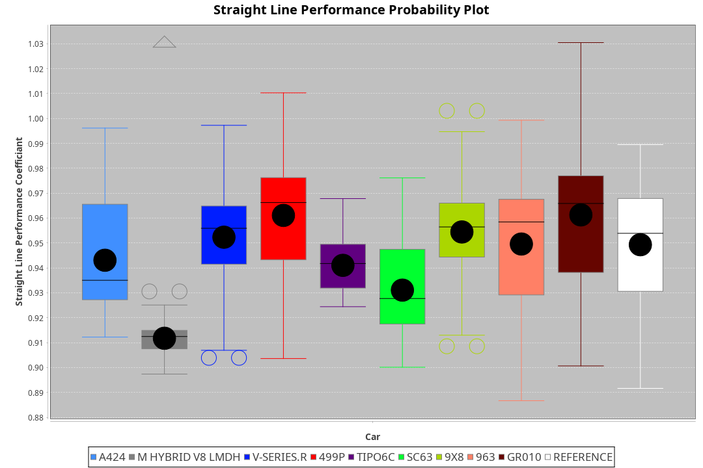
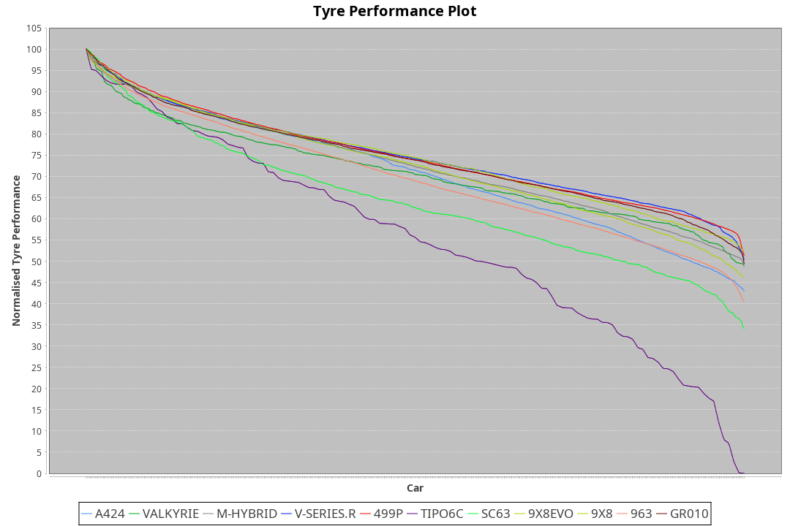

|Manufacturer|Car|Weight|Power|PINC|E/Stint|FDS|
|:-|:-|:-|:-|:-|:-|:-|
|Alpine|A424|1070kg|510kw|-|905MJ|-|
|BMW|M Hybrid V8 LMDh|1060kg|506kw|-|892MJ|-|
|Cadillac|V-Series.R|1032kg|499kw|-|873MJ|-|
|Ferrari|499P|1075kg|503kw|-|887MJ|190kph|
|Issotta Fraschini|Tipo6C|1085kg|514kw|-|918MJ|190kph|
|Lamborghini|SC63|1041kg|502kw|-|883MJ|-|
|Peugeot|9X8|1030kg|520kw|-|910MJ|150kph|
|Porsche|963|1048kg|505kw|-|889MJ|-|
|Toyota|GR010 - Hybrid|1089kg|510kw|-|905MJ|190kph|

### BoP Accuracy: 66.78%; Overall BoP Grade: D1
|Manufacturer|Car|Type|RP|QP|Weight|Power¹|Threshhold|PINC|Power²|E/Stint|AVG Vmax|FDS|RDLC|L/Stint|BOP-Grade|ModelAccuracy|ModelPoints|Match%|
|:-|:-|:-|:-|:-|:-|:-|:-|:-|:-|:-|:-|:-|:-|:-|:-|:-|:-|:-|
|Alpine|A424|LMDH|1:44.16|1:41.62|1070kg|510kw|0.0kph|-|510kw|905MJ|294.18kph|-|1.00|33|~A1|81.46%|523|98.60%|
|BMW|M Hybrid V8 LMDh|LMDH|1:44.35|1:41.78|1060kg|506kw|0.0kph|-|506kw|892MJ|290.03kph|-|1.02|33|+B1|98.60%|1690|87.91%|
|Cadillac|V-Series.R|LMDH|1:43.77|1:41.51|1032kg|499kw|0.0kph|-|499kw|873MJ|295.09kph|-|1.03|33|-B1|98.38%|1765|87.86%|
|Ferrari|499P|LMHHU|1:44.33|1:42.01|1075kg|503kw|0.0kph|-|503kw|887MJ|295.83kph|190kph|1.02|33|~A1|92.24%|2247|99.44%|
|Issotta Fraschini|Tipo6C|LMHHU|1:45.69|1:43.90|1085kg|514kw|0.0kph|-|514kw|918MJ|292.96kph|190kph|1.02|33|+Ω2|66.67%|96|-4.14%|
|Lamborghini|SC63|LMDH|1:44.36|1:41.70|1041kg|502kw|0.0kph|-|502kw|883MJ|292.49kph|-|1.05|33|+C1|96.77%|419|77.81%|
|Peugeot|9X8|LMHHE|1:41.66|1:39.72|1030kg|520kw|0.0kph|-|520kw|910MJ|297.50kph|150kph|1.03|33|-Ω2|87.65%|1795|-26.28%|
|Porsche|963|LMDH|1:43.75|1:41.52|1048kg|505kw|0.0kph|-|505kw|889MJ|295.11kph|-|1.02|33|-B1|96.81%|5438|87.50%|
|Toyota|GR010 - Hybrid|LMHHU|1:44.23|1:41.75|1089kg|510kw|0.0kph|-|510kw|905MJ|293.63kph|190kph|1.01|33|+A2|86.04%|1751|92.36%|

## Power below Threshhold
|N/Nmax|ALP|BMW|CAD|FER|IF|LBG|PEU|POR|TOY|
|:-|:-|:-|:-|:-|:-|:-|:-|:-|:-|
|0.550|251|249|246|248|253|247|256|249|251|
|0.575|274|272|268|271|276|270|279|272|274|
|0.600|295|292|288|291|297|290|300|292|295|
|0.625|316|313|308|311|318|310|322|312|316|
|0.650|337|334|329|332|339|331|343|333|337|
|0.675|358|355|350|353|361|352|365|355|358|
|0.700|380|377|371|374|383|374|387|376|380|
|0.725|401|398|392|395|404|395|409|397|401|
|0.750|422|418|412|416|425|415|430|417|422|
|0.775|441|437|431|435|444|434|449|436|441|
|0.800|458|454|448|452|462|451|467|454|458|
|0.825|473|469|463|467|477|466|482|469|473|
|0.850|485|481|474|478|488|477|494|480|485|
|0.875|495|491|484|488|499|487|505|490|495|
|0.900|502|498|491|495|506|494|512|497|502|
|0.925|507|503|496|500|511|499|517|502|507|
|**0.950**|**510**|**506**|**499**|**503**|**514**|**502**|**520**|**505**|**510**|
|0.975|508|504|497|501|512|500|518|503|508|
|1.000|505|501|494|498|508|497|514|500|505|
|1.025|436|432|426|430|439|429|444|431|436|

## Power above Threshhold
|N/Nmax|ALP|BMW|CAD|FER|IF|LBG|PEU|POR|TOY|
|:-|:-|:-|:-|:-|:-|:-|:-|:-|:-|
|0.550|251|249|246|248|253|247|256|249|251|
|0.575|274|272|268|271|276|270|279|272|274|
|0.600|295|292|288|291|297|290|300|292|295|
|0.625|316|313|308|311|318|310|322|312|316|
|0.650|337|334|329|332|339|331|343|333|337|
|0.675|358|355|350|353|361|352|365|355|358|
|0.700|380|377|371|374|383|374|387|376|380|
|0.725|401|398|392|395|404|395|409|397|401|
|0.750|422|418|412|416|425|415|430|417|422|
|0.775|441|437|431|435|444|434|449|436|441|
|0.800|458|454|448|452|462|451|467|454|458|
|0.825|473|469|463|467|477|466|482|469|473|
|0.850|485|481|474|478|488|477|494|480|485|
|0.875|495|491|484|488|499|487|505|490|495|
|0.900|502|498|491|495|506|494|512|497|502|
|0.925|507|503|496|500|511|499|517|502|507|
|**0.950**|**510**|**506**|**499**|**503**|**514**|**502**|**520**|**505**|**510**|
|0.975|508|504|497|501|512|500|518|503|508|
|1.000|505|501|494|498|508|497|514|500|505|
|1.025|436|432|426|430|439|429|444|431|436|
