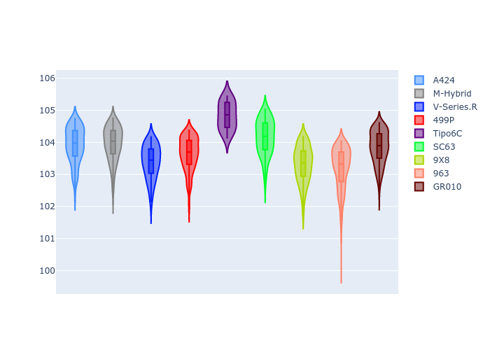
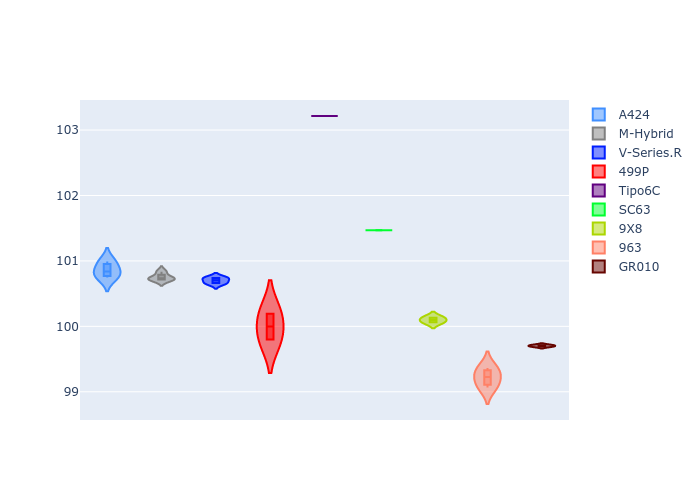

# Combined Plots

## Metadata

- BoP Accuracy: 87.20%
- Overall BoP Grade: B1
- Track: QATAR
- Threshhold: 0.0kph
- Average Laptime: 1:43.81
- Average Quali Laptime: 1:41.79
- Average Topspeed: 306.10kph

## BoP Table
| Manufacturer     | Car        | Weight   | Power   | PINC   | E/Stint   | FDS    | RDP    | QDP     | TDP    |
|:-----------------|:-----------|:---------|:--------|:-------|:----------|:-------|:-------|:--------|:-------|
| Alpine           | A424       | 1070kg   | 510.0kw | -      | 909MJ     | -      | 59.85% | 75.00%  | 8.48%  |
| BMW              | M-Hybrid   | 1060kg   | 506.0kw | -      | 904MJ     | -      | 59.03% | 100.00% | 45.81% |
| Cadillac         | V-Series.R | 1032kg   | 499.0kw | -      | 890MJ     | -      | 58.08% | 80.00%  | 6.60%  |
| Ferrari          | 499P       | 1075kg   | 503.0kw | -      | 902MJ     | 190kph | 58.46% | 40.00%  | 7.62%  |
| Isotta Fraschini | Tipo6C     | 1085kg   | 514.0kw | -      | 917MJ     | 190kph | 52.63% | 33.33%  | 41.30% |
| Lamborghini      | SC63       | 1041kg   | 502.0kw | -      | 895MJ     | -      | 57.58% | 25.00%  | 44.67% |
| Peugeot          | 9X8        | 1030kg   | 520.0kw | -      | 904MJ     | 150kph | 55.69% | 40.00%  | 7.37%  |
| Porsche          | 963        | 1048kg   | 505.0kw | -      | 900MJ     | -      | 53.07% | 100.00% | 7.76%  |
| Toyota           | GR010      | 1089kg   | 510.0kw | -      | 914MJ     | 190kph | 59.22% | 66.67%  | 14.83% |

## Performance Table
| Manufacturer     | Car        | RP      | QP      | Vavg      |   RDLC | BOP-Grade   | Match   |
|:-----------------|:-----------|:--------|:--------|:----------|-------:|:------------|:--------|
| Alpine           | A424       | 1:43.92 | 1:41.95 | 309.59kph |   1.02 | +A2         | 90.95%  |
| BMW              | M-Hybrid   | 1:43.96 | 1:41.86 | 302.55kph |   1.02 | +A2         | 91.26%  |
| Cadillac         | V-Series.R | 1:43.39 | 1:41.78 | 305.62kph |   1.02 | ~A1         | 99.48%  |
| Ferrari          | 499P       | 1:43.64 | 1:41.17 | 308.22kph |   1.02 | ~A1         | 99.14%  |
| Isotta Fraschini | Tipo6C     | 1:44.83 | 1:44.37 | 300.41kph |   1    | +Ω1         | 36.67%  |
| Lamborghini      | SC63       | 1:44.17 | 1:42.55 | 303.58kph |   1.02 | +C1         | 76.32%  |
| Peugeot          | 9X8        | 1:43.32 | 1:41.24 | 310.06kph |   1.02 | ~A1         | 97.24%  |
| Porsche          | 963        | 1:43.19 | 1:40.31 | 308.70kph |   1.03 | -A2         | 94.28%  |
| Toyota           | GR010      | 1:43.84 | 1:40.84 | 306.14kph |   1.03 | ~A1         | 99.49%  |

## Race Laptimes

## Quali Laptimes

## Topspeeds

## Laptimes Lineplot

