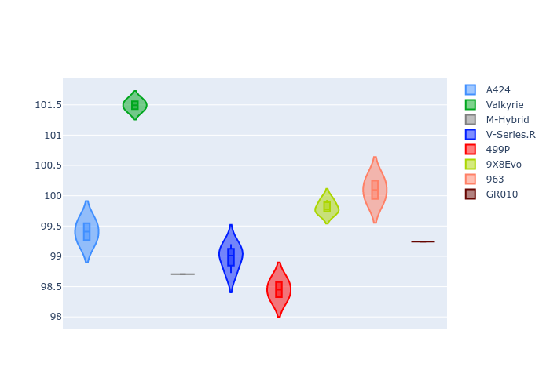

# Combined Plots

## Metadata

- BoP Accuracy: 90.89%
- Overall BoP Grade: A2
- Track: QATAR
- Threshhold: 250.0kph

## BoP Table
| Manufacturer   | Car        | Weight   | Power   | PINC   | E/Stint   | FDS    |
|:---------------|:-----------|:---------|:--------|:-------|:----------|:-------|
| Alpine         | A424       | 1044kg   | 508.0kw | -2.60% | 904MJ     | -      |
| Aston Martin   | Valkyrie   | 1042kg   | 504.0kw | +0.40% | 899MJ     | -      |
| BMW            | M-Hybrid   | 1037kg   | 505.0kw | +0.80% | 902MJ     | -      |
| Cadillac       | V-Series.R | 1030kg   | 503.0kw | +3.40% | 899MJ     | -      |
| Ferrari        | 499P       | 1037kg   | 501.0kw | -      | 897MJ     | 190kph |
| Peugeot        | 9X8Evo     | 1031kg   | 520.0kw | -5.20% | 909MJ     | 190kph |
| Porsche        | 963        | 1064kg   | 508.0kw | +1.00% | 909MJ     | -      |
| Toyota         | GR010      | 1065kg   | 503.0kw | +3.40% | 909MJ     | 190kph |

## Performance Table
| Manufacturer   | Car        | RP      | QP      | Vavg      |   RDLC | BOP-Grade   | Match   |
|:---------------|:-----------|:--------|:--------|:----------|-------:|:------------|:--------|
| Alpine         | A424       | 1:42.67 | 1:37.74 | 299.32kph |   1.05 | +A2         | 93.73%  |
| Aston Martin   | Valkyrie   | 1:43.23 | 1:39.77 | 298.96kph |   1.03 | +E2         | 52.61%  |
| BMW            | M-Hybrid   | 1:42.25 | 1:37.00 | 304.37kph |   1.05 | ~A1         | 98.59%  |
| Cadillac       | V-Series.R | 1:42.33 | 1:37.36 | 299.87kph |   1.05 | ~A1         | 100.00% |
| Ferrari        | 499P       | 1:42.04 | 1:36.87 | 304.61kph |   1.05 | ~A1         | 97.34%  |
| Peugeot        | 9X8Evo     | 1:42.63 | 1:38.18 | 302.89kph |   1.05 | ~A1         | 95.09%  |
| Porsche        | 963        | 1:42.70 | 1:38.47 | 300.95kph |   1.04 | +A2         | 90.36%  |
| Toyota         | GR010      | 1:42.18 | 1:37.62 | 301.95kph |   1.05 | ~A1         | 99.43%  |

## Race Laptimes

## Quali Laptimes

## Topspeeds

## Laptimes Lineplot

