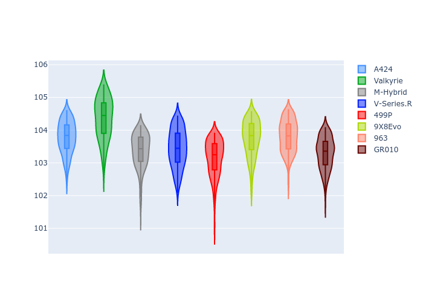

# Combined Plots

## Metadata

- BoP Accuracy: 90.98%
- Overall BoP Grade: A2
- Track: QATAR
- Threshhold: 250.0kph
- Average Laptime: 1:43.62
- Average Quali Laptime: 1:39.12
- Average Topspeed: 299.81kph

## BoP Table
| Manufacturer   | Car        | Weight   | Power   | PINC   | E/Stint   | FDS    | RDP    | QDP    | TDP    |
|:---------------|:-----------|:---------|:--------|:-------|:----------|:-------|:-------|:-------|:-------|
| Alpine         | A424       | 1044kg   | 508.0kw | -2.60% | 904MJ     | -      | 55.21% | 66.67% | 45.96% |
| Aston Martin   | Valkyrie   | 1042kg   | 504.0kw | +0.40% | 899MJ     | -      | 52.31% | 50.00% | 24.40% |
| BMW            | M-Hybrid   | 1037kg   | 505.0kw | +0.80% | 902MJ     | -      | 55.82% | 25.00% | 11.44% |
| Cadillac       | V-Series.R | 1030kg   | 503.0kw | +3.40% | 899MJ     | -      | 52.96% | 66.67% | 14.05% |
| Ferrari        | 499P       | 1037kg   | 501.0kw | -      | 897MJ     | 190kph | 55.24% | 28.57% | 4.97%  |
| Peugeot        | 9X8Evo     | 1031kg   | 520.0kw | -5.20% | 909MJ     | 190kph | 51.18% | 60.00% | 11.73% |
| Porsche        | 963        | 1064kg   | 508.0kw | +1.00% | 909MJ     | -      | 55.91% | 40.00% | 13.78% |
| Toyota         | GR010      | 1065kg   | 503.0kw | +3.40% | 909MJ     | 190kph | 55.35% | 50.00% | 12.01% |

## Performance Table
| Manufacturer   | Car        | RP      | QP      | Vavg      |   RDLC | BOP-Grade   | Match   |
|:---------------|:-----------|:--------|:--------|:----------|-------:|:------------|:--------|
| Alpine         | A424       | 1:43.78 | 1:38.98 | 297.53kph |   1.05 | +A2         | 94.00%  |
| Aston Martin   | Valkyrie   | 1:44.35 | 1:41.04 | 297.17kph |   1.03 | +E2         | 52.61%  |
| BMW            | M-Hybrid   | 1:43.36 | 1:38.23 | 302.55kph |   1.05 | ~A1         | 98.59%  |
| Cadillac       | V-Series.R | 1:43.45 | 1:38.60 | 298.08kph |   1.05 | ~A1         | 100.00% |
| Ferrari        | 499P       | 1:43.15 | 1:38.10 | 302.79kph |   1.05 | ~A1         | 97.34%  |
| Peugeot        | 9X8Evo     | 1:43.74 | 1:39.43 | 301.08kph |   1.04 | ~A1         | 95.69%  |
| Porsche        | 963        | 1:43.82 | 1:39.72 | 299.16kph |   1.04 | +A2         | 90.19%  |
| Toyota         | GR010      | 1:43.29 | 1:38.87 | 300.14kph |   1.04 | ~A1         | 99.43%  |

## Race Laptimes

## Quali Laptimes

## Topspeeds

## Laptimes Lineplot

