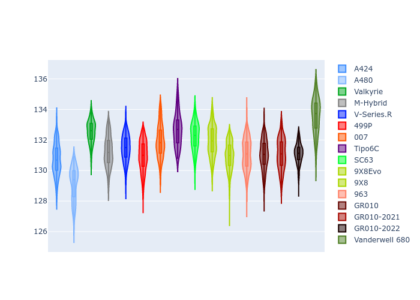
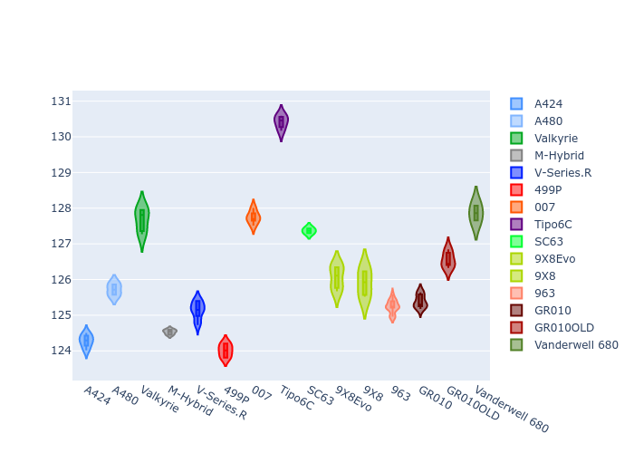
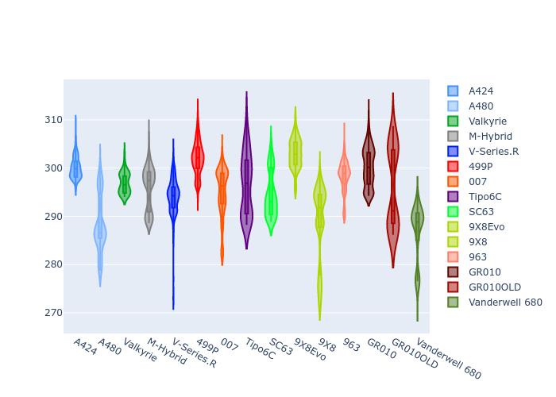
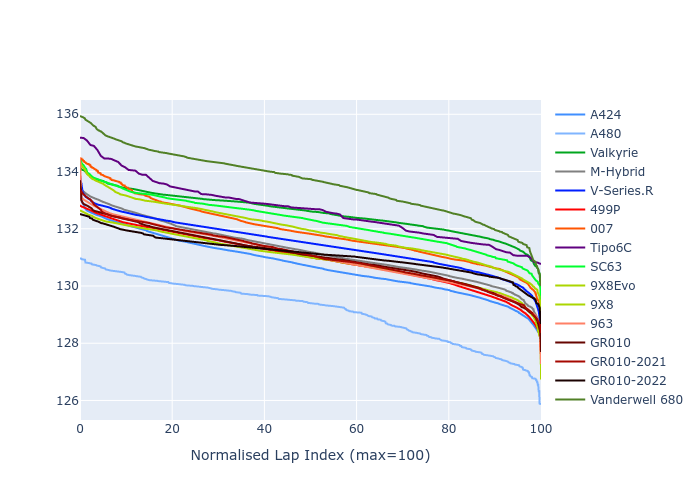

# Combined Plots

## Metadata

- BoP Accuracy: 95.39%
- Overall BoP Grade: A1
- Track: REFERENCETRACK
- Threshhold: 210.0kph

## BoP Table
| Manufacturer     | Car            | Weight   | Power   | PINC   | E/Stint   | FDS    |
|:-----------------|:---------------|:---------|:--------|:-------|:----------|:-------|
| Alpine           | A424           | 1067kg   | 520.0kw | -1.00% | 913MJ     | -      |
| Alpine           | A480           | 1052kg   | 432.0kw | +1.00% | 768MJ     | -      |
| Aston Martin     | Valkyrie       | 1060kg   | 504.0kw | +1.00% | 902MJ     | -      |
| BMW              | M-Hybrid       | 1061kg   | 512.0kw | -1.00% | 906MJ     | -      |
| Cadillac         | V-Series.R     | 1054kg   | 510.0kw | +1.00% | 902MJ     | -      |
| Ferrari          | 499P           | 1083kg   | 508.0kw | -1.00% | 895MJ     | 190kph |
| Glickenhaus      | 007            | 1050kg   | 520.0kw | -      | 912MJ     | -      |
| Isotta Fraschini | Tipo6C         | 1059kg   | 520.0kw | -      | 917MJ     | 190kph |
| Lamborghini      | SC63           | 1062kg   | 519.0kw | -1.00% | 908MJ     | -      |
| Peugeot          | 9X8Evo         | 1070kg   | 510.0kw | -1.00% | 899MJ     | 190kph |
| Peugeot          | 9X8            | 1050kg   | 520.0kw | -      | 906MJ     | 150kph |
| Porsche          | 963            | 1067kg   | 516.0kw | -1.00% | 908MJ     | -      |
| Toyota           | GR010          | 1100kg   | 512.0kw | -1.00% | 905MJ     | 190kph |
| Toyota           | GR010OLD       | 1085kg   | 513.0kw | +1.00% | 964MJ     | 150kph |
| Vanwall          | Vanderwell 680 | 1030kg   | 520.0kw | -      | 903MJ     | -      |

## Performance Table
| Manufacturer     | Car            | RP      | QP      | Vavg      |   RDLC | BOP-Grade   | Match   |
|:-----------------|:---------------|:--------|:--------|:----------|-------:|:------------|:--------|
| Alpine           | A424           | 2:10.70 | 2:06.83 | 305.07kph |   1.03 | ~A1         | 99.50%  |
| Alpine           | A480           | 2:10.78 | 2:08.22 | 297.34kph |   1.02 | ~A1         | 99.22%  |
| Aston Martin     | Valkyrie       | 2:12.53 | 2:07.65 | 302.90kph |   1.04 | ~A1         | 97.34%  |
| BMW              | M-Hybrid       | 2:11.23 | 2:06.91 | 302.89kph |   1.03 | ~A1         | 99.96%  |
| Cadillac         | V-Series.R     | 2:11.26 | 2:07.05 | 301.37kph |   1.03 | ~A1         | 99.92%  |
| Ferrari          | 499P           | 2:11.31 | 2:06.89 | 303.49kph |   1.03 | ~A1         | 99.86%  |
| Glickenhaus      | 007            | 2:11.81 | 2:08.85 | 302.51kph |   1.02 | ~A1         | 95.91%  |
| Isotta Fraschini | Tipo6C         | 2:12.52 | 2:10.77 | 304.41kph |   1.01 | +A2         | 94.03%  |
| Lamborghini      | SC63           | 2:12.24 | 2:08.94 | 303.13kph |   1.03 | ~A1         | 96.98%  |
| Peugeot          | 9X8Evo         | 2:11.96 | 2:07.62 | 304.53kph |   1.03 | ~A1         | 97.28%  |
| Peugeot          | 9X8            | 2:11.45 | 2:07.60 | 298.68kph |   1.03 | ~A1         | 99.96%  |
| Porsche          | 963            | 2:11.07 | 2:06.85 | 303.31kph |   1.03 | ~A1         | 99.83%  |
| Toyota           | GR010          | 2:11.62 | 2:07.06 | 303.17kph |   1.04 | ~A1         | 99.97%  |
| Toyota           | GR010OLD       | 2:10.12 | 2:07.21 | 300.72kph |   1.02 | ~A1         | 95.39%  |
| Vanwall          | Vanderwell 680 | 2:13.57 | 2:08.86 | 298.64kph |   1.04 | +E1         | 55.65%  |

## Race Laptimes

## Quali Laptimes

## Topspeeds

## Laptimes Lineplot

