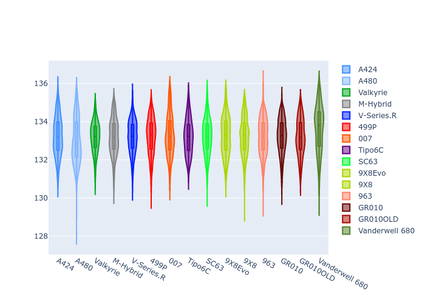
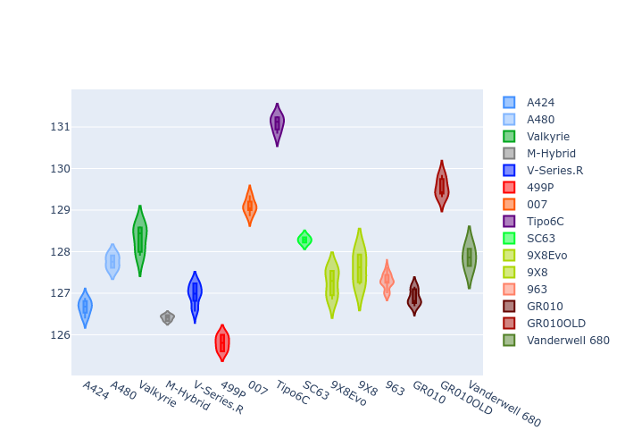
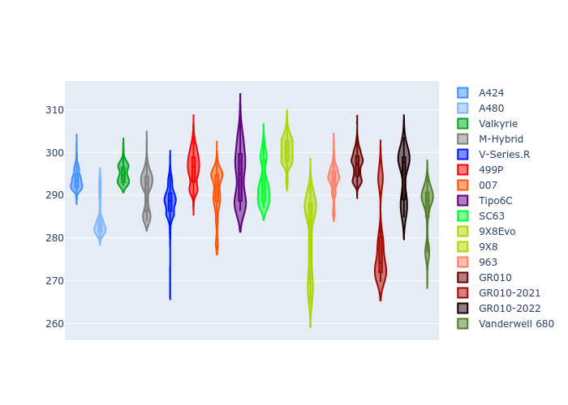
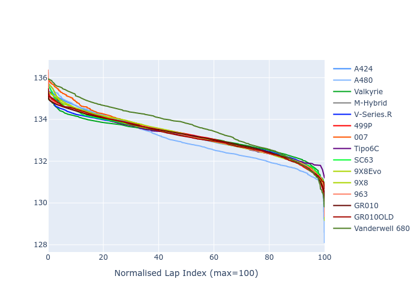

# Combined Plots

## Metadata

- BoP Accuracy: 97.61%
- Overall BoP Grade: A1
- Track: REFERENCETRACK
- Threshhold: 0.0kph

## BoP Table
| Manufacturer     | Car            | Weight   | Power   | PINC   | E/Stint   | FDS    | RDP    | QDP    | TDP    |
|:-----------------|:---------------|:---------|:--------|:-------|:----------|:-------|:-------|:-------|:-------|
| Alpine           | A424           | 1051kg   | 480.0kw | -      | 877MJ     | -      | 52.35% | 61.85% | 27.84% |
| Alpine           | A480           | 952kg    | 410.0kw | -      | 762MJ     | -      | 54.51% | 76.19% | 54.04% |
| Aston Martin     | Valkyrie       | 1030kg   | 485.0kw | -      | 880MJ     | -      | 53.59% | 53.33% | 21.51% |
| BMW              | M-Hybrid       | 1047kg   | 480.0kw | -      | 878MJ     | -      | 53.26% | 57.23% | 34.54% |
| Cadillac         | V-Series.R     | 1042kg   | 483.0kw | -      | 875MJ     | -      | 47.80% | 56.73% | 19.63% |
| Ferrari          | 499P           | 1085kg   | 480.0kw | -      | 876MJ     | 190kph | 53.02% | 42.32% | 9.88%  |
| Glickenhaus      | 007            | 1030kg   | 491.0kw | -      | 884MJ     | -      | 46.49% | 46.07% | 47.78% |
| Isotta Fraschini | Tipo6C         | 1078kg   | 520.0kw | -      | 919MJ     | 190kph | 43.95% | 47.22% | 31.53% |
| Lamborghini      | SC63           | 1059kg   | 505.0kw | -      | 898MJ     | -      | 46.33% | 59.50% | 29.33% |
| Peugeot          | 9X8Evo         | 1039kg   | 480.0kw | -      | 871MJ     | 190kph | 48.47% | 51.26% | 16.02% |
| Peugeot          | 9X8            | 1042kg   | 488.0kw | -      | 879MJ     | 150kph | 54.07% | 57.08% | 10.80% |
| Porsche          | 963            | 1049kg   | 480.0kw | -      | 876MJ     | -      | 50.87% | 45.25% | 30.77% |
| Toyota           | GR010          | 1091kg   | 480.0kw | -      | 878MJ     | 190kph | 52.43% | 57.12% | 12.82% |
| Toyota           | GR010-2021     | 1076kg   | 482.0kw | -      | 879MJ     | 150kph | 54.09% | 52.67% | 26.37% |
| Toyota           | GR010-2022     | 1087kg   | 480.0kw | -      | 876MJ     | 190kph | 53.48% | 69.44% | 7.86%  |
| Vanwall          | Vanderwell 680 | 1030kg   | 520.0kw | -      | 903MJ     | -      | 53.41% | 56.28% | 29.85% |

## Performance Table
| Manufacturer     | Car            | RP      | QP      | Vavg      |   RDLC | BOP-Grade   | Match   |
|:-----------------|:---------------|:--------|:--------|:----------|-------:|:------------|:--------|
| Alpine           | A424           | 2:13.23 | 2:09.03 | 298.54kph |   1.03 | ~A1         | 99.30%  |
| Alpine           | A480           | 2:11.08 | 2:08.20 | 292.76kph |   1.02 | -C1         | 77.98%  |
| Aston Martin     | Valkyrie       | 2:13.20 | 2:08.25 | 301.07kph |   1.04 | ~A1         | 100.00% |
| BMW              | M-Hybrid       | 2:13.22 | 2:08.56 | 298.04kph |   1.04 | ~A1         | 99.56%  |
| Cadillac         | V-Series.R     | 2:13.21 | 2:08.59 | 295.72kph |   1.04 | ~A1         | 99.79%  |
| Ferrari          | 499P           | 2:13.21 | 2:07.94 | 297.82kph |   1.04 | ~A1         | 99.83%  |
| Glickenhaus      | 007            | 2:13.20 | 2:10.18 | 298.36kph |   1.02 | ~A1         | 96.04%  |
| Isotta Fraschini | Tipo6C         | 2:13.20 | 2:11.56 | 302.46kph |   1.01 | ~A1         | 96.27%  |
| Lamborghini      | SC63           | 2:13.21 | 2:09.78 | 301.22kph |   1.03 | ~A1         | 100.00% |
| Peugeot          | 9X8Evo         | 2:13.21 | 2:08.76 | 301.88kph |   1.03 | ~A1         | 99.00%  |
| Peugeot          | 9X8            | 2:13.20 | 2:08.81 | 291.29kph |   1.03 | ~A1         | 99.94%  |
| Porsche          | 963            | 2:13.22 | 2:08.64 | 298.41kph |   1.04 | ~A1         | 99.81%  |
| Toyota           | GR010          | 2:13.20 | 2:07.79 | 298.23kph |   1.04 | ~A1         | 99.71%  |
| Toyota           | GR010-2021     | 2:13.23 | 2:09.08 | 290.76kph |   1.03 | ~A1         | 99.12%  |
| Toyota           | GR010-2022     | 2:13.22 | 2:10.07 | 296.39kph |   1.02 | ~A1         | 100.00% |
| Vanwall          | Vanderwell 680 | 2:13.52 | 2:08.86 | 298.64kph |   1.04 | ~A1         | 95.39%  |

## Race Laptimes

## Quali Laptimes

## Topspeeds

## Laptimes Lineplot

