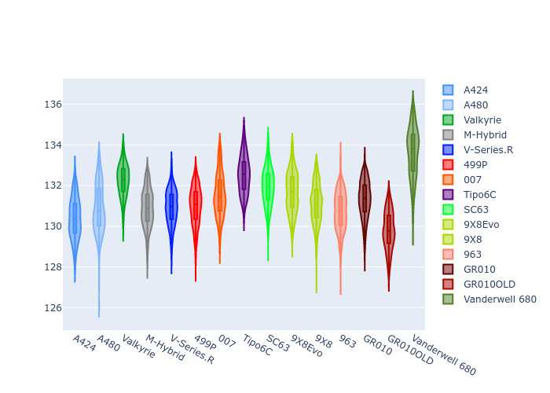
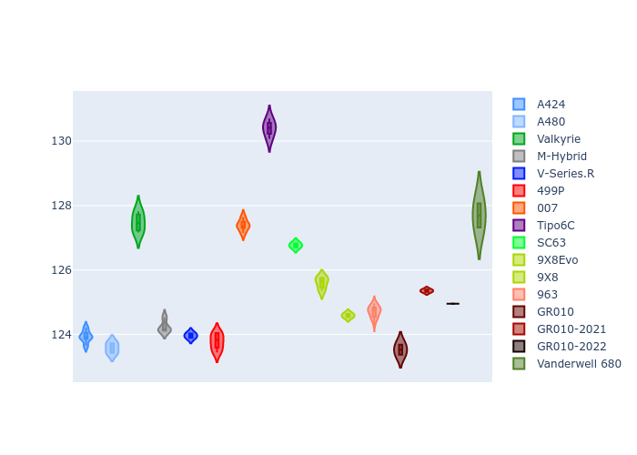
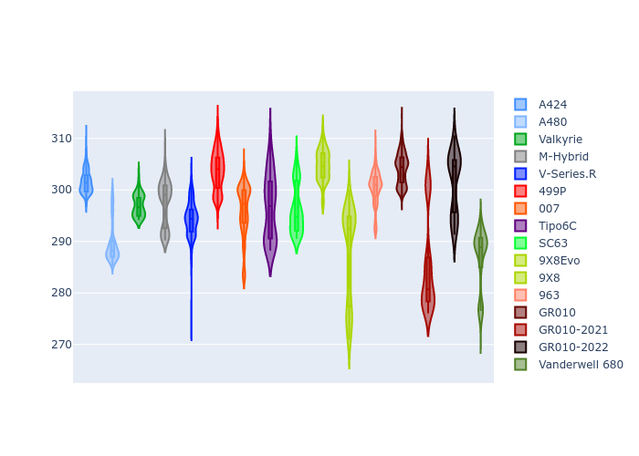
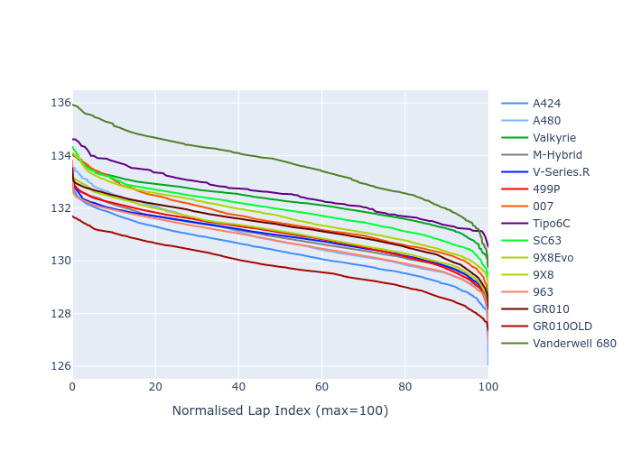

# Combined Plots

## Metadata

- BoP Accuracy: 92.45%
- Overall BoP Grade: A2
- Track: REFERENCETRACK
- Threshhold: 250.0kph

## BoP Table
| Manufacturer     | Car            | Weight   | Power   | PINC   | E/Stint   | FDS    | RDP    | QDP    | TDP    |
|:-----------------|:---------------|:---------|:--------|:-------|:----------|:-------|:-------|:-------|:-------|
| Alpine           | A424           | 1057kg   | 520.0kw | -0.10% | 914MJ     | -      | 52.35% | 61.85% | 27.84% |
| Alpine           | A480           | 952kg    | 432.0kw | +0.10% | 783MJ     | -      | 54.51% | 76.19% | 54.04% |
| Aston Martin     | Valkyrie       | 1052kg   | 504.0kw | +0.10% | 899MJ     | -      | 53.59% | 53.33% | 21.51% |
| BMW              | M-Hybrid       | 1051kg   | 512.0kw | -0.10% | 907MJ     | -      | 53.26% | 57.23% | 34.54% |
| Cadillac         | V-Series.R     | 1044kg   | 510.0kw | +0.10% | 899MJ     | -      | 47.80% | 56.73% | 19.63% |
| Ferrari          | 499P           | 1073kg   | 508.0kw | -0.10% | 900MJ     | 190kph | 53.02% | 42.32% | 9.88%  |
| Glickenhaus      | 007            | 1040kg   | 520.0kw | -      | 911MJ     | -      | 46.49% | 46.07% | 47.78% |
| Isotta Fraschini | Tipo6C         | 1059kg   | 520.0kw | -      | 917MJ     | 190kph | 43.95% | 47.22% | 31.53% |
| Lamborghini      | SC63           | 1052kg   | 519.0kw | -0.10% | 909MJ     | -      | 46.33% | 59.50% | 29.33% |
| Peugeot          | 9X8Evo         | 1060kg   | 510.0kw | -0.10% | 900MJ     | 190kph | 48.47% | 51.26% | 16.02% |
| Peugeot          | 9X8            | 1040kg   | 520.0kw | -      | 907MJ     | 150kph | 54.07% | 57.08% | 10.80% |
| Porsche          | 963            | 1057kg   | 516.0kw | -0.10% | 908MJ     | -      | 50.87% | 45.25% | 30.77% |
| Toyota           | GR010          | 1090kg   | 512.0kw | -0.10% | 906MJ     | 190kph | 52.43% | 57.12% | 12.82% |
| Toyota           | GR010-2021     | 1075kg   | 513.0kw | +0.10% | 907MJ     | 150kph | 54.09% | 52.67% | 26.37% |
| Toyota           | GR010-2022     | 1090kg   | 512.0kw | +0.10% | 906MJ     | 190kph | 53.48% | 69.44% | 7.86%  |
| Vanwall          | Vanderwell 680 | 1030kg   | 520.0kw | -      | 903MJ     | -      | 53.41% | 56.28% | 29.85% |

## Performance Table
| Manufacturer     | Car            | RP      | QP      | Vavg      |   RDLC | BOP-Grade   | Match   |
|:-----------------|:---------------|:--------|:--------|:----------|-------:|:------------|:--------|
| Alpine           | A424           | 2:10.36 | 2:06.33 | 306.61kph |   1.03 | ~A1         | 98.77%  |
| Alpine           | A480           | 2:09.14 | 2:06.35 | 298.43kph |   1.02 | -C1         | 76.19%  |
| Aston Martin     | Valkyrie       | 2:12.41 | 2:07.51 | 303.04kph |   1.04 | +A2         | 94.20%  |
| BMW              | M-Hybrid       | 2:10.86 | 2:06.36 | 304.59kph |   1.04 | ~A1         | 99.67%  |
| Cadillac         | V-Series.R     | 2:11.12 | 2:06.64 | 301.48kph |   1.04 | ~A1         | 99.94%  |
| Ferrari          | 499P           | 2:10.64 | 2:05.56 | 305.14kph |   1.04 | ~A1         | 99.13%  |
| Glickenhaus      | 007            | 2:11.44 | 2:08.49 | 303.56kph |   1.02 | +A2         | 94.88%  |
| Isotta Fraschini | Tipo6C         | 2:12.55 | 2:10.93 | 304.41kph |   1.01 | +C1         | 79.85%  |
| Lamborghini      | SC63           | 2:11.89 | 2:08.53 | 304.87kph |   1.03 | ~A1         | 97.35%  |
| Peugeot          | 9X8Evo         | 2:11.56 | 2:07.23 | 306.27kph |   1.03 | ~A1         | 97.95%  |
| Peugeot          | 9X8            | 2:10.61 | 2:06.39 | 298.28kph |   1.03 | ~A1         | 99.21%  |
| Porsche          | 963            | 2:10.71 | 2:06.29 | 305.41kph |   1.03 | ~A1         | 99.70%  |
| Toyota           | GR010          | 2:10.72 | 2:05.51 | 305.31kph |   1.04 | ~A1         | 99.74%  |
| Toyota           | GR010-2021     | 2:10.71 | 2:06.72 | 297.58kph |   1.03 | ~A1         | 99.78%  |
| Toyota           | GR010-2022     | 2:10.79 | 2:07.75 | 303.19kph |   1.02 | ~A1         | 100.00% |
| Vanwall          | Vanderwell 680 | 2:13.52 | 2:08.86 | 298.64kph |   1.04 | +Ω1         | 42.86%  |

## Race Laptimes

## Quali Laptimes

## Topspeeds

## Laptimes Lineplot

