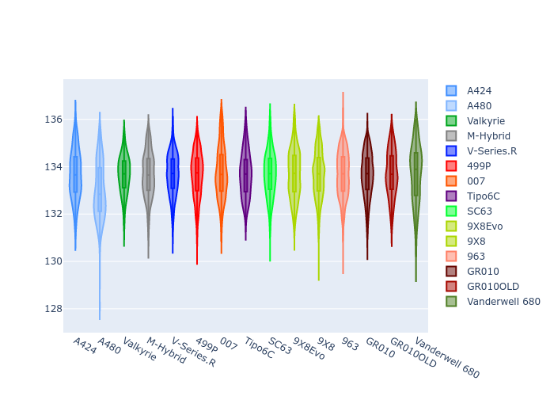
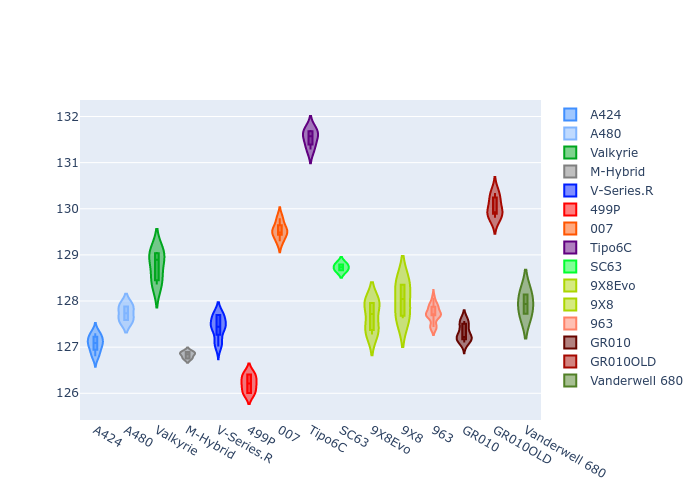
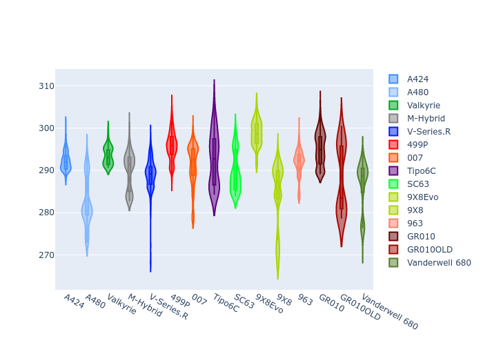
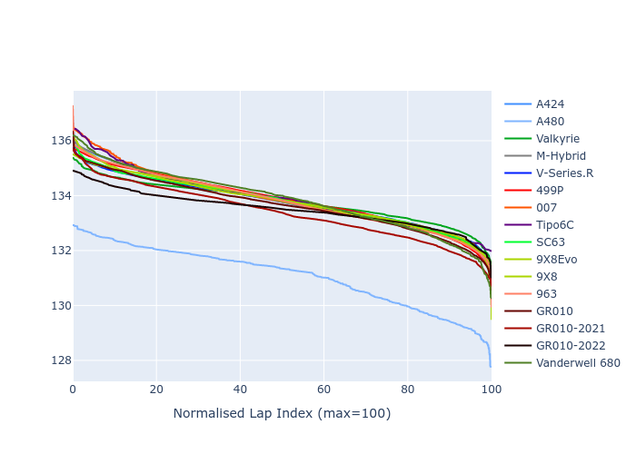

# Combined Plots

## Metadata

- BoP Accuracy: 96.94%
- Overall BoP Grade: A1
- Track: REFERENCETRACK
- Threshhold: 250.0kph

## BoP Table
| Manufacturer     | Car            | Weight   | Power   | PINC   | E/Stint   | FDS    | RDP    | QDP    | TDP    |
|:-----------------|:---------------|:---------|:--------|:-------|:----------|:-------|:-------|:-------|:-------|
| Alpine           | A424           | 1068kg   | 480.0kw | -      | 879MJ     | -      | 52.35% | 61.85% | 27.84% |
| Alpine           | A480           | 952kg    | 410.0kw | -      | 762MJ     | -      | 54.51% | 76.19% | 54.04% |
| Aston Martin     | Valkyrie       | 1041kg   | 485.0kw | -1.00% | 879MJ     | -      | 53.59% | 53.33% | 21.51% |
| BMW              | M-Hybrid       | 1071kg   | 480.0kw | +1.20% | 883MJ     | -      | 53.26% | 57.23% | 34.54% |
| Cadillac         | V-Series.R     | 1089kg   | 480.0kw | +6.40% | 891MJ     | -      | 47.80% | 56.73% | 19.63% |
| Ferrari          | 499P           | 1100kg   | 480.0kw | -      | 877MJ     | 200kph | 53.02% | 42.32% | 9.88%  |
| Glickenhaus      | 007            | 1050kg   | 480.0kw | +5.30% | 888MJ     | -      | 46.49% | 46.07% | 47.78% |
| Isotta Fraschini | Tipo6C         | 1078kg   | 520.0kw | -2.80% | 912MJ     | 190kph | 43.95% | 47.22% | 31.53% |
| Lamborghini      | SC63           | 1079kg   | 520.0kw | -5.20% | 901MJ     | -      | 46.33% | 59.50% | 29.33% |
| Peugeot          | 9X8Evo         | 1056kg   | 480.0kw | -      | 872MJ     | 190kph | 48.47% | 51.26% | 16.02% |
| Peugeot          | 9X8            | 1098kg   | 488.0kw | +6.50% | 899MJ     | 150kph | 54.07% | 57.08% | 10.80% |
| Porsche          | 963            | 1068kg   | 480.0kw | +0.30% | 878MJ     | -      | 50.87% | 45.25% | 30.77% |
| Toyota           | GR010          | 1100kg   | 480.0kw | -      | 879MJ     | 200kph | 52.43% | 57.12% | 12.82% |
| Toyota           | GR010-2021     | 1100kg   | 481.0kw | +8.10% | 898MJ     | 200kph | 54.09% | 52.67% | 26.37% |
| Toyota           | GR010-2022     | 1100kg   | 480.0kw | +1.50% | 881MJ     | 200kph | 53.48% | 69.44% | 7.86%  |
| Vanwall          | Vanderwell 680 | 1037kg   | 520.0kw | -      | 904MJ     | -      | 53.41% | 56.28% | 29.85% |

## Performance Table
| Manufacturer     | Car            | RP      | QP      | Vavg      |   RDLC | BOP-Grade   | Match   |
|:-----------------|:---------------|:--------|:--------|:----------|-------:|:------------|:--------|
| Alpine           | A424           | 2:13.79 | 2:09.55 | 296.81kph |   1.03 | ~A1         | 99.01%  |
| Alpine           | A480           | 2:11.08 | 2:08.20 | 292.76kph |   1.02 | -D1         | 68.25%  |
| Aston Martin     | Valkyrie       | 2:13.79 | 2:08.78 | 299.09kph |   1.04 | ~A1         | 100.00% |
| BMW              | M-Hybrid       | 2:13.78 | 2:09.08 | 296.57kph |   1.04 | ~A1         | 98.98%  |
| Cadillac         | V-Series.R     | 2:13.77 | 2:09.11 | 295.38kph |   1.04 | ~A1         | 99.66%  |
| Ferrari          | 499P           | 2:13.84 | 2:08.52 | 296.34kph |   1.04 | ~A1         | 99.93%  |
| Glickenhaus      | 007            | 2:13.80 | 2:10.74 | 298.07kph |   1.02 | +A2         | 94.92%  |
| Isotta Fraschini | Tipo6C         | 2:13.78 | 2:12.13 | 300.13kph |   1.01 | ~A1         | 95.52%  |
| Lamborghini      | SC63           | 2:13.78 | 2:10.32 | 298.02kph |   1.03 | ~A1         | 99.64%  |
| Peugeot          | 9X8Evo         | 2:13.77 | 2:09.29 | 300.11kph |   1.03 | ~A1         | 98.79%  |
| Peugeot          | 9X8            | 2:13.79 | 2:09.36 | 290.82kph |   1.03 | ~A1         | 99.94%  |
| Porsche          | 963            | 2:13.79 | 2:09.16 | 296.72kph |   1.04 | ~A1         | 99.83%  |
| Toyota           | GR010          | 2:13.65 | 2:08.20 | 297.35kph |   1.04 | ~A1         | 99.71%  |
| Toyota           | GR010-2021     | 2:13.33 | 2:09.18 | 294.49kph |   1.03 | ~A1         | 100.00% |
| Toyota           | GR010-2022     | 2:13.49 | 2:10.32 | 296.33kph |   1.02 | ~A1         | 100.00% |
| Vanwall          | Vanderwell 680 | 2:13.78 | 2:09.11 | 297.90kph |   1.04 | ~A1         | 96.88%  |

## Race Laptimes

## Quali Laptimes

## Topspeeds

## Laptimes Lineplot

