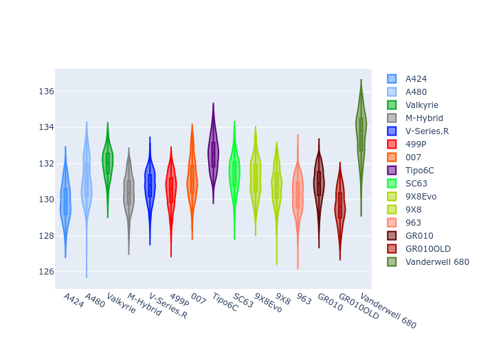
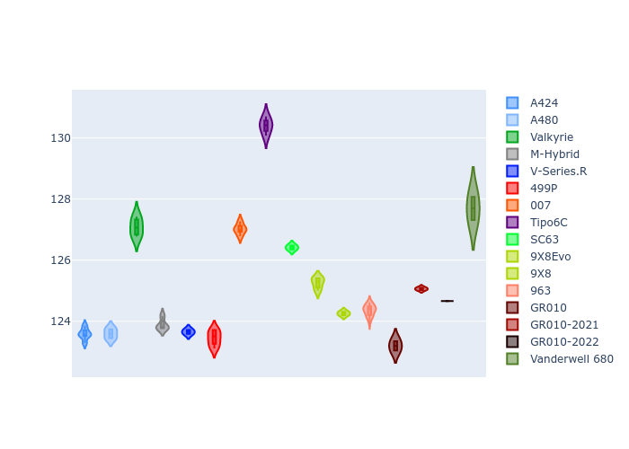
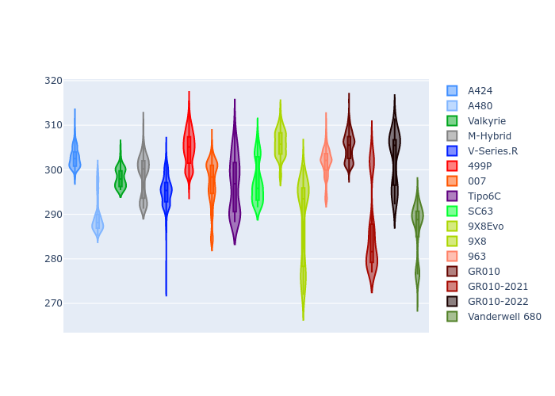
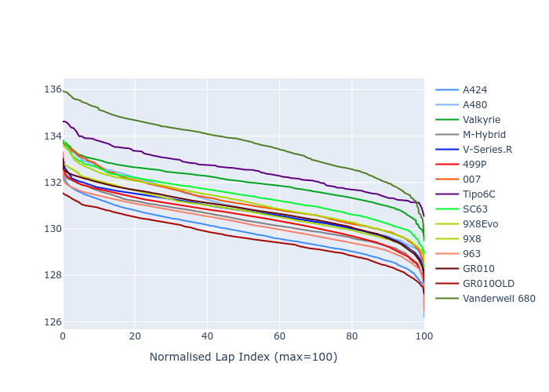

# Combined Plots

## Metadata

- BoP Accuracy: 92.08%
- Overall BoP Grade: A2
- Track: REFERENCETRACK
- Threshhold: 210.0kph

## BoP Table
| Manufacturer     | Car            | Weight   | Power   | PINC   | E/Stint   | FDS    | RDP    | QDP    | TDP    |
|:-----------------|:---------------|:---------|:--------|:-------|:----------|:-------|:-------|:-------|:-------|
| Alpine           | A424           | 1047kg   | 520.0kw | -      | 913MJ     | -      | 52.35% | 61.85% | 27.84% |
| Alpine           | A480           | 952kg    | 432.0kw | -      | 782MJ     | -      | 54.51% | 76.19% | 54.04% |
| Aston Martin     | Valkyrie       | 1042kg   | 504.0kw | +0.40% | 899MJ     | -      | 53.59% | 53.33% | 21.51% |
| BMW              | M-Hybrid       | 1041kg   | 512.0kw | -      | 906MJ     | -      | 53.26% | 57.23% | 34.54% |
| Cadillac         | V-Series.R     | 1034kg   | 510.0kw | -      | 898MJ     | -      | 47.80% | 56.73% | 19.63% |
| Ferrari          | 499P           | 1063kg   | 508.0kw | -      | 899MJ     | 190kph | 53.02% | 42.32% | 9.88%  |
| Glickenhaus      | 007            | 1030kg   | 520.0kw | -      | 910MJ     | -      | 46.49% | 46.07% | 47.78% |
| Isotta Fraschini | Tipo6C         | 1059kg   | 520.0kw | -      | 917MJ     | 190kph | 43.95% | 47.22% | 31.53% |
| Lamborghini      | SC63           | 1042kg   | 519.0kw | -      | 908MJ     | -      | 46.33% | 59.50% | 29.33% |
| Peugeot          | 9X8Evo         | 1050kg   | 510.0kw | -      | 899MJ     | 190kph | 48.47% | 51.26% | 16.02% |
| Peugeot          | 9X8            | 1030kg   | 520.0kw | -      | 906MJ     | 150kph | 54.07% | 57.08% | 10.80% |
| Porsche          | 963            | 1047kg   | 516.0kw | -      | 908MJ     | -      | 50.87% | 45.25% | 30.77% |
| Toyota           | GR010          | 1080kg   | 512.0kw | -      | 905MJ     | 190kph | 52.43% | 57.12% | 12.82% |
| Toyota           | GR010-2021     | 1065kg   | 513.0kw | -      | 906MJ     | 150kph | 54.09% | 52.67% | 26.37% |
| Toyota           | GR010-2022     | 1080kg   | 512.0kw | -      | 904MJ     | 190kph | 53.48% | 69.44% | 7.86%  |
| Vanwall          | Vanderwell 680 | 1030kg   | 520.0kw | -      | 903MJ     | -      | 53.41% | 56.28% | 29.85% |

## Performance Table
| Manufacturer     | Car            | RP      | QP      | Vavg      |   RDLC | BOP-Grade   | Match   |
|:-----------------|:---------------|:--------|:--------|:----------|-------:|:------------|:--------|
| Alpine           | A424           | 2:09.99 | 2:05.99 | 307.75kph |   1.03 | ~A1         | 98.38%  |
| Alpine           | A480           | 2:09.16 | 2:06.37 | 298.35kph |   1.02 | -B2         | 82.54%  |
| Aston Martin     | Valkyrie       | 2:12.01 | 2:07.14 | 304.34kph |   1.04 | ~A1         | 96.71%  |
| BMW              | M-Hybrid       | 2:10.50 | 2:06.02 | 305.73kph |   1.04 | ~A1         | 99.60%  |
| Cadillac         | V-Series.R     | 2:10.79 | 2:06.33 | 302.45kph |   1.04 | ~A1         | 99.91%  |
| Ferrari          | 499P           | 2:10.29 | 2:05.25 | 306.26kph |   1.04 | ~A1         | 98.93%  |
| Glickenhaus      | 007            | 2:11.06 | 2:08.13 | 304.63kph |   1.02 | ~A1         | 95.87%  |
| Isotta Fraschini | Tipo6C         | 2:12.55 | 2:10.93 | 304.41kph |   1.01 | +C2         | 71.64%  |
| Lamborghini      | SC63           | 2:11.53 | 2:08.18 | 306.01kph |   1.03 | ~A1         | 97.83%  |
| Peugeot          | 9X8Evo         | 2:11.20 | 2:06.89 | 307.41kph |   1.03 | ~A1         | 98.37%  |
| Peugeot          | 9X8            | 2:10.27 | 2:06.07 | 299.33kph |   1.03 | ~A1         | 99.15%  |
| Porsche          | 963            | 2:10.34 | 2:05.95 | 306.55kph |   1.03 | ~A1         | 99.64%  |
| Toyota           | GR010          | 2:10.37 | 2:05.19 | 306.41kph |   1.04 | ~A1         | 99.58%  |
| Toyota           | GR010-2021     | 2:10.41 | 2:06.44 | 298.51kph |   1.03 | ~A1         | 99.78%  |
| Toyota           | GR010-2022     | 2:10.49 | 2:07.46 | 304.12kph |   1.02 | ~A1         | 100.00% |
| Vanwall          | Vanderwell 680 | 2:13.52 | 2:08.86 | 298.64kph |   1.04 | +Ω1         | 35.27%  |

## Race Laptimes

## Quali Laptimes

## Topspeeds

## Laptimes Lineplot

