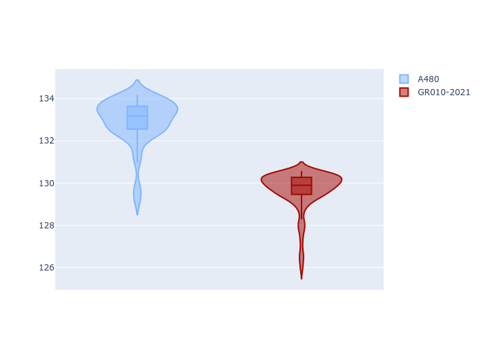
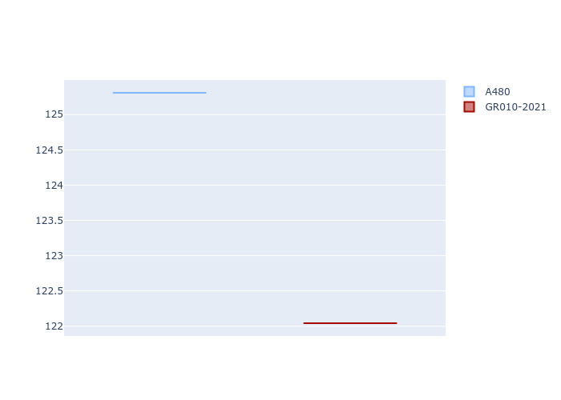
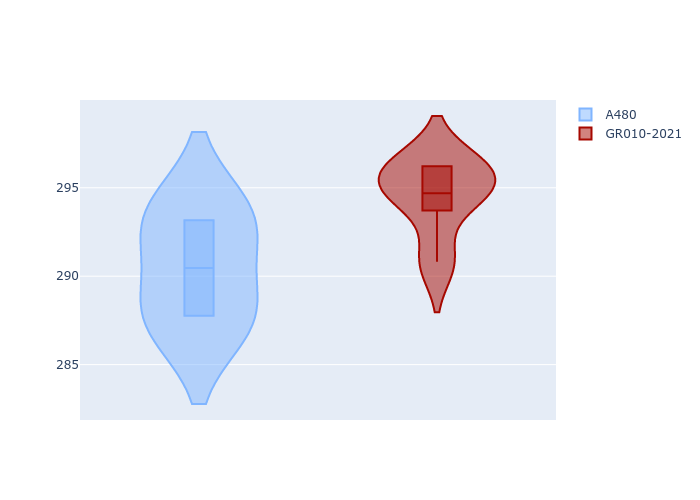
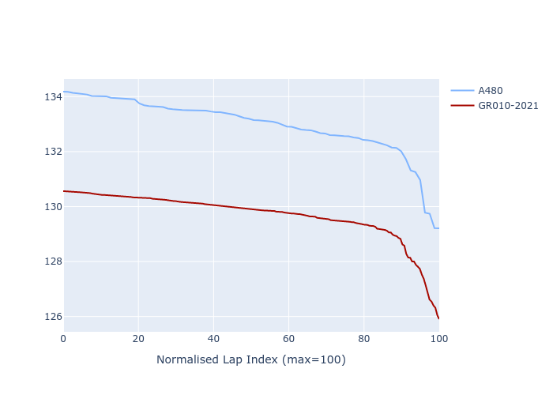

# Combined Plots

## Metadata

- BoP Accuracy: 56.19%
- Overall BoP Grade: E1
- Track: REFERENCETRACK
- Threshhold: 0.0kph
- Average Laptime: 2:11.31
- Average Quali Laptime: 2:05.28
- Average Topspeed: 314.07kph

## BoP Table
| Manufacturer   | Car        | Weight   | Power   | PINC   | E/Stint   | FDS   | RDP    | QDP    | TDP   |
|:---------------|:-----------|:---------|:--------|:-------|:----------|:------|:-------|:-------|:------|
| Alpine         | A480       | 930kg    | 454.0kw | -      | 816MJ     | -     | 43.48% | 50.00% | 2.07% |
| Toyota         | GR010-2021 | 1030kg   | 520.0kw | -      | 908MJ     | -     | 52.70% | 33.33% | 1.32% |

## Performance Table
| Manufacturer   | Car        | RP      | QP      | Vavg      |   RDLC | BOP-Grade   | Match   |
|:---------------|:-----------|:--------|:--------|:----------|-------:|:------------|:--------|
| Alpine         | A480       | 2:12.96 | 2:06.83 | 311.89kph |   1.05 | +Ω1         | 17.50%  |
| Toyota         | GR010-2021 | 2:09.67 | 2:03.72 | 316.25kph |   1.05 | -A2         | 94.87%  |

## Race Laptimes

## Quali Laptimes

## Topspeeds

## Laptimes Lineplot

