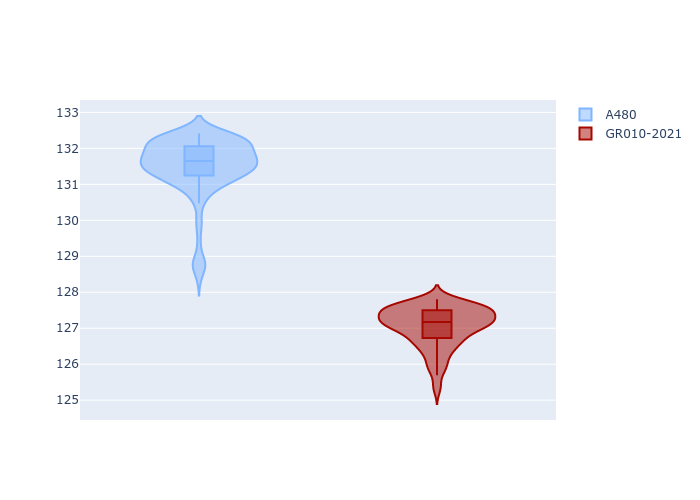
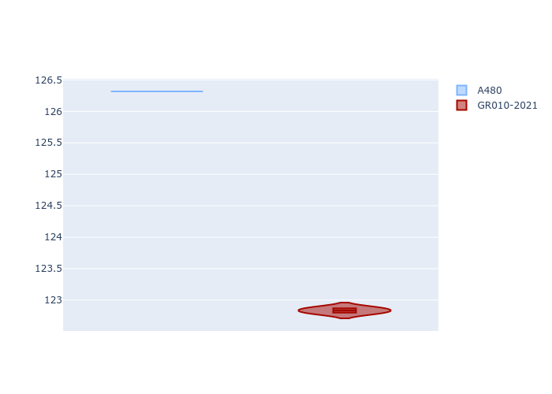
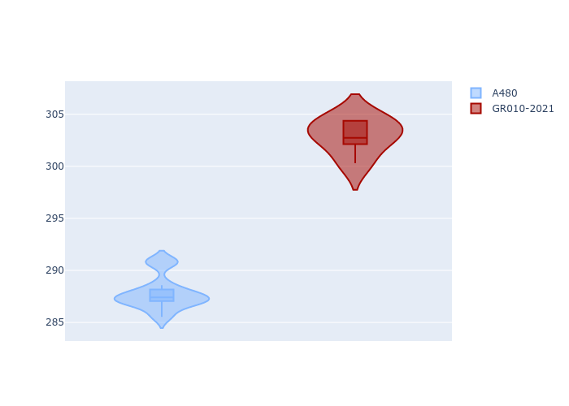
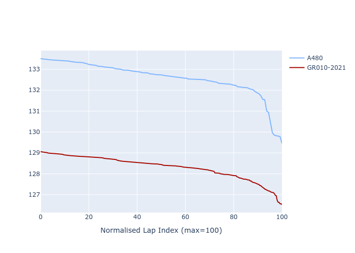

# Combined Plots

## Metadata

- BoP Accuracy: 39.62%
- Overall BoP Grade: Ω1
- Track: REFERENCETRACK
- Threshhold: 0.0kph

## BoP Table
| Manufacturer   | Car        | Weight   | Power   | PINC   | E/Stint   | FDS   | RDP    | QDP     | TDP   |
|:---------------|:-----------|:---------|:--------|:-------|:----------|:------|:-------|:--------|:------|
| Alpine         | A480       | 930kg    | 454.0kw | -      | 816MJ     | -     | 52.70% | 100.00% | 4.84% |
| Toyota         | GR010-2021 | 1030kg   | 520.0kw | -      | 908MJ     | -     | 51.62% | 40.00%  | 0.98% |

## Performance Table
| Manufacturer   | Car        | RP      | QP      | Vavg      |   RDLC | BOP-Grade   | Match   |
|:---------------|:-----------|:--------|:--------|:----------|-------:|:------------|:--------|
| Alpine         | A480       | 2:11.50 | 2:04.80 | 287.80kph |   1.05 | +Ω1         | 7.09%   |
| Toyota         | GR010-2021 | 2:07.05 | 2:01.17 | 302.90kph |   1.05 | -C2         | 72.16%  |

## Race Laptimes

## Quali Laptimes

## Topspeeds

## Laptimes Lineplot

