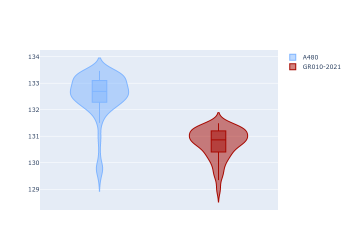
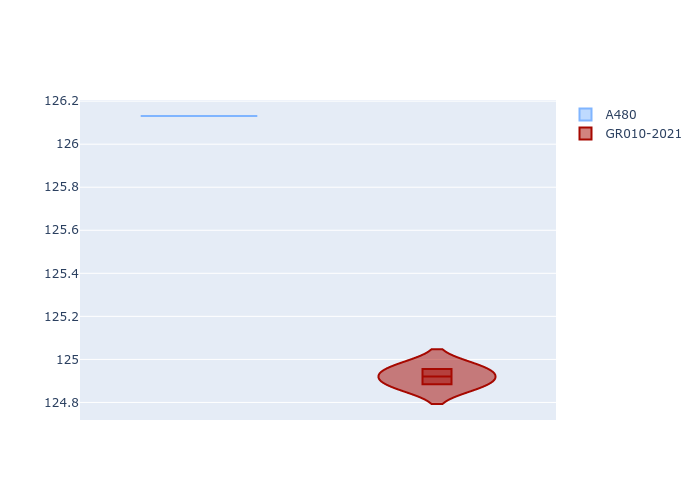
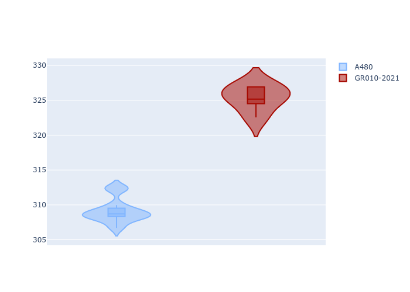
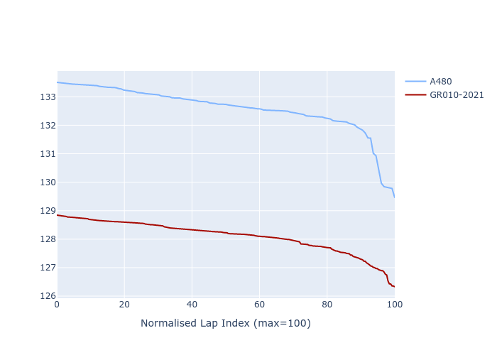

# Combined Plots

## Metadata

- BoP Accuracy: 66.53%
- Overall BoP Grade: D1
- Track: REFERENCETRACK
- Threshhold: 0.0kph
- Average Laptime: 2:11.63
- Average Quali Laptime: 2:05.66
- Laptime Std Dev: 0.91 seconds
- Filtered Average Topspeed: 317.15kph

## BoP Table
| Manufacturer   | Car        | Weight   | Power   | PINC   | E/Stint   | FDS   | RDP    | QDP     | TDP   |
|:---------------|:-----------|:---------|:--------|:-------|:----------|:------|:-------|:--------|:------|
| Alpine         | A480       | 930kg    | 454.0kw | -      | 816MJ     | -     | 52.70% | 100.00% | 4.84% |
| Toyota         | GR010-2021 | 1030kg   | 520.0kw | -      | 908MJ     | -     | 51.21% | 40.00%  | 0.98% |

## Performance Table
| Manufacturer   | Car        | RP      | QP      | Vavg      |   RDLC | BOP-Grade   | Match   |
|:---------------|:-----------|:--------|:--------|:----------|-------:|:------------|:--------|
| Alpine         | A480       | 2:12.54 | 2:06.28 | 309.05kph |   1.05 | +Ω1         | 35.43%  |
| Toyota         | GR010-2021 | 2:10.73 | 2:05.05 | 325.26kph |   1.05 | ~A1         | 97.63%  |

## Race Laptimes

## Quali Laptimes

## Topspeeds

## Laptimes Lineplot

