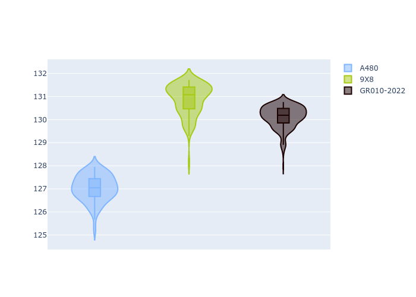
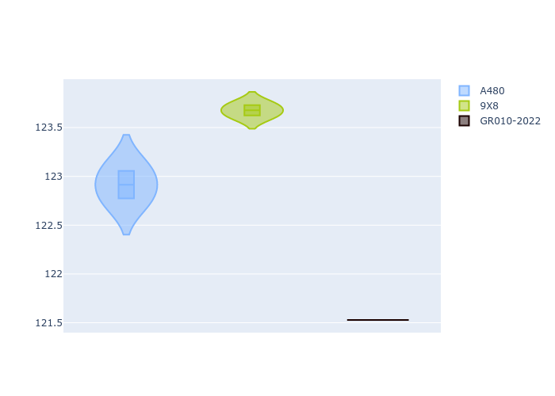
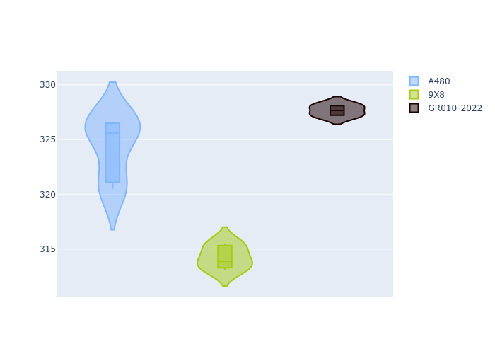
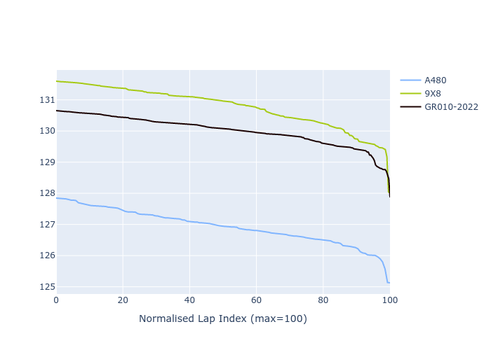

# Combined Plots

## Metadata

- BoP Accuracy: 35.59%
- Overall BoP Grade: Ω1
- Track: REFERENCETRACK
- Threshhold: 0.0kph
- Average Laptime: 2:09.34
- Average Quali Laptime: 2:04.47
- Laptime Std Dev: 1.66 seconds
- Filtered Average Topspeed: 321.73kph

## BoP Table
| Manufacturer   | Car        | Weight   | Power   | PINC   | E/Stint   | FDS   | RDP    | QDP     | TDP   |
|:---------------|:-----------|:---------|:--------|:-------|:----------|:------|:-------|:--------|:------|
| Alpine         | A480       | 930kg    | 454.0kw | -      | 807MJ     | -     | 55.97% | 100.00% | 3.57% |
| Peugeot        | 9X8        | 1030kg   | 520.0kw | -      | 910MJ     | -     | 52.93% | 66.67%  | 1.65% |
| Toyota         | GR010-2022 | 1030kg   | 520.0kw | -      | 908MJ     | -     | 56.94% | 50.00%  | 0.80% |

## Performance Table
| Manufacturer   | Car        | RP      | QP      | Vavg      |   RDLC | BOP-Grade   | Match   |
|:---------------|:-----------|:--------|:--------|:----------|-------:|:------------|:--------|
| Alpine         | A480       | 2:07.03 | 2:02.88 | 324.02kph |   1.03 | -Ω1         | 47.06%  |
| Peugeot        | 9X8        | 2:10.88 | 2:06.13 | 313.89kph |   1.04 | +Ω1         | 13.82%  |
| Toyota         | GR010-2022 | 2:10.12 | 2:04.39 | 327.28kph |   1.05 | +Ω1         | 45.88%  |

## Race Laptimes

## Quali Laptimes

## Topspeeds

## Laptimes Lineplot

