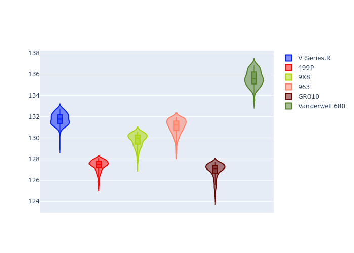

# Combined Plots

## Metadata

- BoP Accuracy: 30.75%
- Overall BoP Grade: Ω1
- Track: REFERENCETRACK
- Threshhold: 0.0kph
- Average Laptime: 2:10.40
- Average Quali Laptime: 2:04.33
- Average Topspeed: 310.05kph

## BoP Table
| Manufacturer   | Car            | Weight   | Power   | PINC   | E/Stint   | FDS   | RDP    | QDP    | TDP    |
|:---------------|:---------------|:---------|:--------|:-------|:----------|:------|:-------|:-------|:-------|
| Cadillac       | V-Series.R     | 1030kg   | 520.0kw | -      | 908MJ     | -     | 60.57% | 33.33% | 10.98% |
| Ferrari        | 499P           | 1030kg   | 520.0kw | -      | 906MJ     | -     | 57.14% | 33.33% | 1.36%  |
| Peugeot        | 9X8            | 1030kg   | 520.0kw | -      | 907MJ     | -     | 58.91% | 25.00% | 7.66%  |
| Porsche        | 963            | 1030kg   | 520.0kw | -      | 912MJ     | -     | 55.50% | 40.00% | 0.77%  |
| Toyota         | GR010          | 1030kg   | 520.0kw | -      | 912MJ     | -     | 49.60% | 25.00% | 0.99%  |
| Vanwall        | Vanderwell 680 | 1030kg   | 520.0kw | -      | 906MJ     | -     | 55.76% | 50.00% | 1.74%  |

## Performance Table
| Manufacturer   | Car            | RP      | QP      | Vavg      |   RDLC | BOP-Grade   | Match   |
|:---------------|:---------------|:--------|:--------|:----------|-------:|:------------|:--------|
| Cadillac       | V-Series.R     | 2:11.73 | 2:04.61 | 298.43kph |   1.06 | +Ω1         | 22.82%  |
| Ferrari        | 499P           | 2:07.36 | 2:01.66 | 318.06kph |   1.05 | -Ω1         | 7.39%   |
| Peugeot        | 9X8            | 2:09.78 | 2:04.80 | 300.00kph |   1.04 | ~A1         | 97.94%  |
| Porsche        | 963            | 2:11.08 | 2:05.18 | 316.91kph |   1.05 | +E1         | 56.36%  |
| Toyota         | GR010          | 2:06.89 | 2:00.63 | 326.40kph |   1.05 | -Ω2         | 0.00%   |
| Vanwall        | Vanderwell 680 | 2:15.58 | 2:09.10 | 300.52kph |   1.05 | +Ω2         | 0.00%   |

## Race Laptimes

## Quali Laptimes

## Topspeeds

## Laptimes Lineplot

