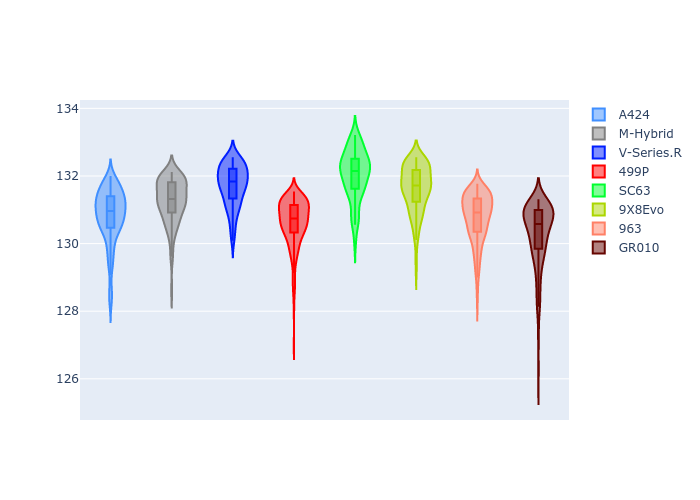
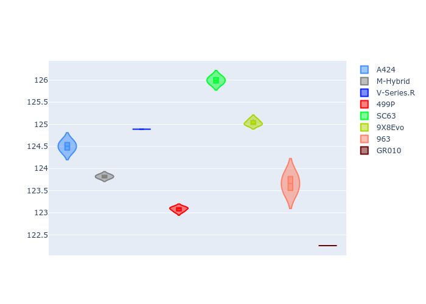
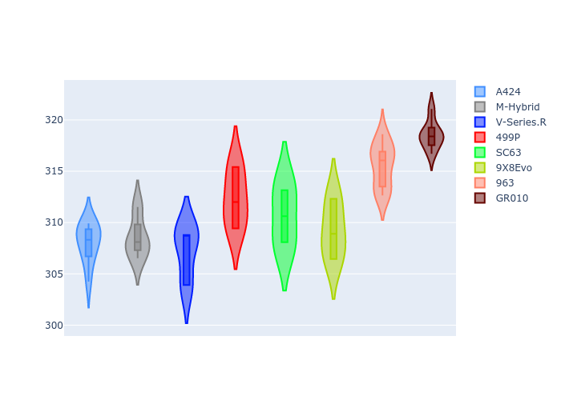
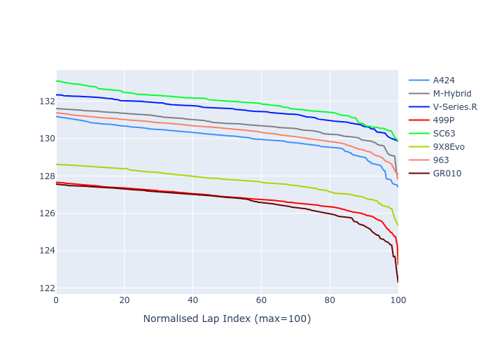

# Combined Plots

## Metadata

- BoP Accuracy: 44.24%
- Overall BoP Grade: Ω1
- Track: REFERENCETRACK
- Threshhold: 0.0kph
- Average Laptime: 2:09.46
- Average Quali Laptime: 2:03.13
- Average Topspeed: 310.88kph

## BoP Table
| Manufacturer   | Car        | Weight   | Power   | PINC   | E/Stint   | FDS   | RDP    | QDP     | TDP   |
|:---------------|:-----------|:---------|:--------|:-------|:----------|:------|:-------|:--------|:------|
| Alpine         | A424       | 1030kg   | 520.0kw | -      | 918MJ     | -     | 49.36% | 50.00%  | 1.83% |
| BMW            | M-Hybrid   | 1030kg   | 520.0kw | -      | 914MJ     | -     | 56.07% | 66.67%  | 2.08% |
| Cadillac       | V-Series.R | 1030kg   | 520.0kw | -      | 909MJ     | -     | 54.89% | 100.00% | 2.44% |
| Ferrari        | 499P       | 1030kg   | 520.0kw | -      | 914MJ     | -     | 51.49% | 60.00%  | 0.79% |
| Lamborghini    | SC63       | 1030kg   | 520.0kw | -      | 909MJ     | -     | 48.50% | 100.00% | 1.90% |
| Peugeot        | 9X8Evo     | 1030kg   | 520.0kw | -      | 916MJ     | -     | 50.72% | 100.00% | 1.40% |
| Porsche        | 963        | 1030kg   | 520.0kw | -      | 913MJ     | -     | 50.90% | 22.22%  | 1.58% |
| Toyota         | GR010      | 1030kg   | 520.0kw | -      | 913MJ     | -     | 50.98% | 20.00%  | 3.14% |

## Performance Table
| Manufacturer   | Car        | RP      | QP      | Vavg      |   RDLC | BOP-Grade   | Match   |
|:---------------|:-----------|:--------|:--------|:----------|-------:|:------------|:--------|
| Alpine         | A424       | 2:10.02 | 2:04.55 | 307.69kph |   1.04 | +D1         | 65.95%  |
| BMW            | M-Hybrid   | 2:10.76 | 2:03.86 | 308.20kph |   1.06 | +Ω1         | 25.26%  |
| Cadillac       | V-Series.R | 2:11.50 | 2:04.93 | 306.81kph |   1.05 | +Ω1         | 6.98%   |
| Ferrari        | 499P       | 2:06.78 | 2:00.29 | 311.91kph |   1.05 | -D2         | 60.88%  |
| Lamborghini    | SC63       | 2:11.91 | 2:06.04 | 310.26kph |   1.05 | +Ω1         | 3.09%   |
| Peugeot        | 9X8Evo     | 2:07.73 | 2:02.15 | 308.87kph |   1.05 | -A2         | 91.43%  |
| Porsche        | 963        | 2:10.39 | 2:03.70 | 315.18kph |   1.05 | +Ω1         | 43.89%  |
| Toyota         | GR010      | 2:06.56 | 1:59.50 | 318.16kph |   1.06 | -E1         | 56.46%  |

## Race Laptimes

## Quali Laptimes

## Topspeeds

## Laptimes Lineplot

