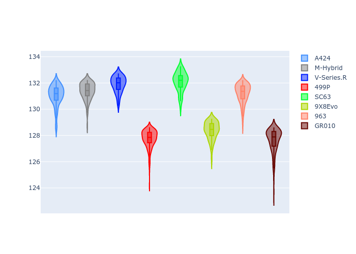
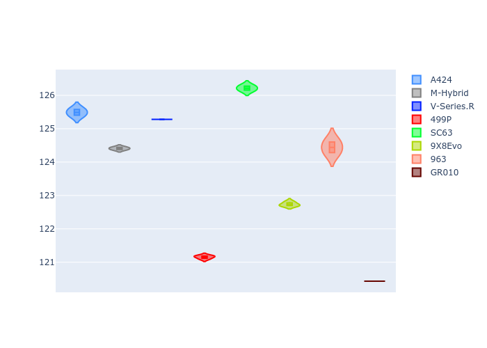
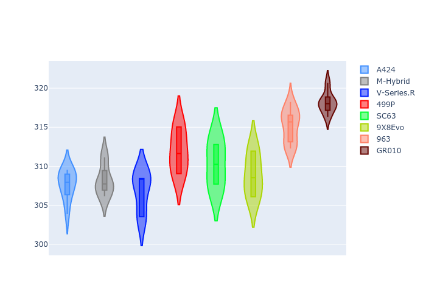
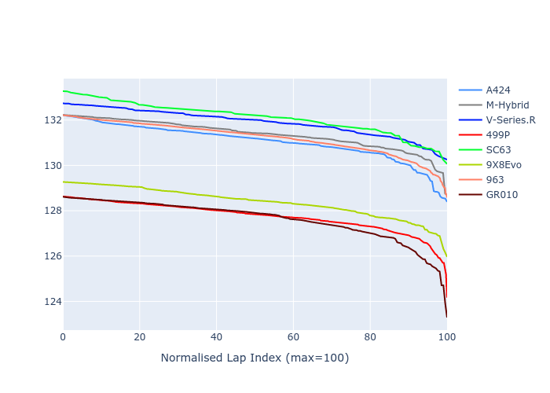

# Combined Plots

## Metadata

- BoP Accuracy: 42.45%
- Overall BoP Grade: Ω1
- Track: REFERENCETRACK
- Threshhold: 0.0kph

## BoP Table
| Manufacturer   | Car        | Weight   | Power   | PINC   | E/Stint   | FDS   | RDP    | QDP     | TDP   |
|:---------------|:-----------|:---------|:--------|:-------|:----------|:------|:-------|:--------|:------|
| Alpine         | A424       | 1030kg   | 520.0kw | -      | 918MJ     | -     | 49.36% | 50.00%  | 1.83% |
| BMW            | M-Hybrid   | 1030kg   | 520.0kw | -      | 914MJ     | -     | 56.07% | 66.67%  | 2.08% |
| Cadillac       | V-Series.R | 1030kg   | 520.0kw | -      | 909MJ     | -     | 54.89% | 100.00% | 2.44% |
| Ferrari        | 499P       | 1030kg   | 520.0kw | -      | 913MJ     | -     | 51.49% | 60.00%  | 0.79% |
| Lamborghini    | SC63       | 1030kg   | 520.0kw | -      | 909MJ     | -     | 48.50% | 100.00% | 1.90% |
| Peugeot        | 9X8Evo     | 1030kg   | 520.0kw | -      | 915MJ     | -     | 50.72% | 100.00% | 1.40% |
| Porsche        | 963        | 1030kg   | 520.0kw | -      | 913MJ     | -     | 50.90% | 22.22%  | 1.58% |
| Toyota         | GR010      | 1030kg   | 520.0kw | -      | 913MJ     | -     | 50.98% | 20.00%  | 3.14% |

## Performance Table
| Manufacturer   | Car        | RP      | QP      | Vavg      |   RDLC | BOP-Grade   | Match   |
|:---------------|:-----------|:--------|:--------|:----------|-------:|:------------|:--------|
| Alpine         | A424       | 2:10.16 | 2:04.50 | 307.68kph |   1.05 | +D2         | 63.36%  |
| BMW            | M-Hybrid   | 2:10.87 | 2:03.79 | 308.21kph |   1.06 | +Ω1         | 24.23%  |
| Cadillac       | V-Series.R | 2:11.61 | 2:04.84 | 306.83kph |   1.05 | +Ω1         | 6.98%   |
| Ferrari        | 499P       | 2:06.81 | 2:00.15 | 311.93kph |   1.06 | -E1         | 55.92%  |
| Lamborghini    | SC63       | 2:12.00 | 2:05.94 | 310.28kph |   1.05 | +Ω1         | 2.06%   |
| Peugeot        | 9X8Evo     | 2:07.79 | 2:02.04 | 308.84kph |   1.05 | -A2         | 91.43%  |
| Porsche        | 963        | 2:10.49 | 2:03.62 | 315.21kph |   1.06 | +Ω1         | 42.55%  |
| Toyota         | GR010      | 2:06.56 | 1:59.34 | 318.23kph |   1.06 | -E2         | 53.11%  |

## Race Laptimes

## Quali Laptimes

## Topspeeds

## Laptimes Lineplot

