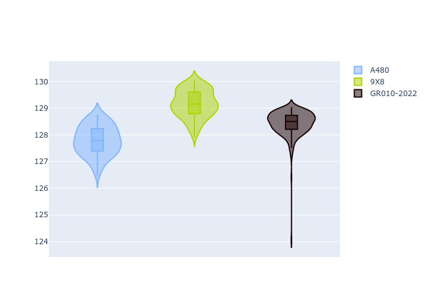
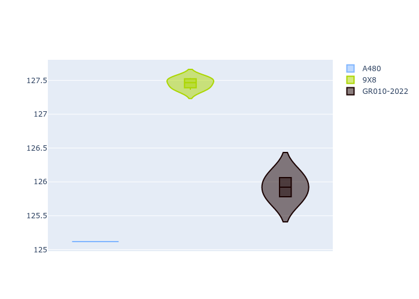
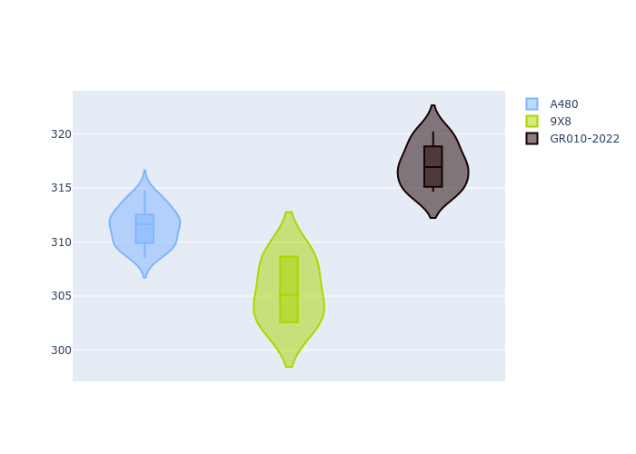
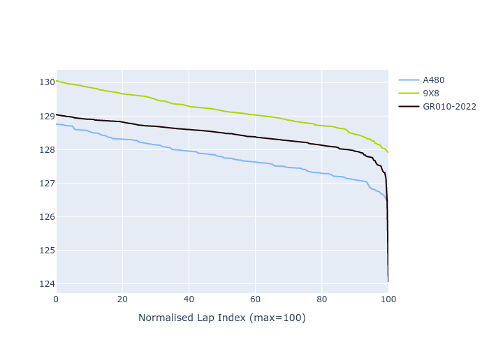

# Combined Plots

## Metadata

- BoP Accuracy: 86.40%
- Overall BoP Grade: B1
- Track: REFERENCETRACK
- Threshhold: 0.0kph
- Average Laptime: 2:08.46
- Average Quali Laptime: 2:07.34
- Average Topspeed: 311.32kph

## BoP Table
| Manufacturer   | Car        | Weight   | Power   | PINC   | E/Stint   | FDS   | RDP    | QDP     | TDP    |
|:---------------|:-----------|:---------|:--------|:-------|:----------|:------|:-------|:--------|:-------|
| Alpine         | A480       | 930kg    | 454.0kw | -      | 800MJ     | -     | 61.30% | 100.00% | 11.72% |
| Peugeot        | 9X8        | 1030kg   | 520.0kw | -      | 910MJ     | -     | 62.67% | 66.67%  | 1.30%  |
| Toyota         | GR010-2022 | 1030kg   | 520.0kw | -      | 909MJ     | -     | 58.84% | 40.00%  | 3.32%  |

## Performance Table
| Manufacturer   | Car        | RP      | QP      | Vavg      |   RDLC | BOP-Grade   | Match   |
|:---------------|:-----------|:--------|:--------|:----------|-------:|:------------|:--------|
| Alpine         | A480       | 2:07.79 | 2:06.43 | 311.44kph |   1.01 | ~A1         | 100.00% |
| Peugeot        | 9X8        | 2:09.17 | 2:08.54 | 305.45kph |   1    | +E1         | 59.57%  |
| Toyota         | GR010-2022 | 2:08.43 | 2:07.04 | 317.08kph |   1.01 | ~A1         | 99.63%  |

## Race Laptimes

## Quali Laptimes

## Topspeeds

## Laptimes Lineplot

