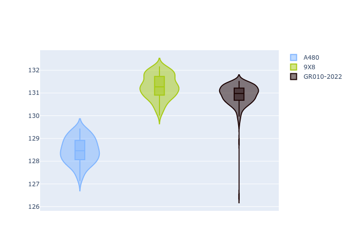
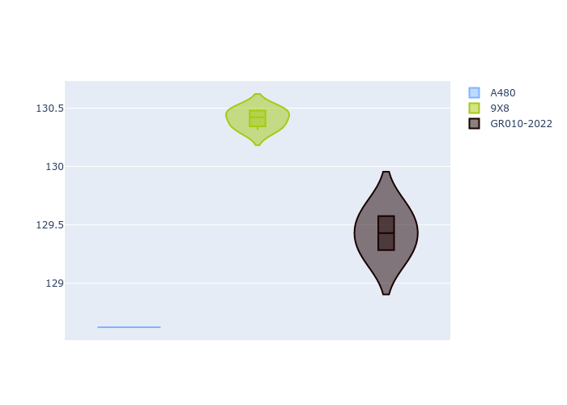
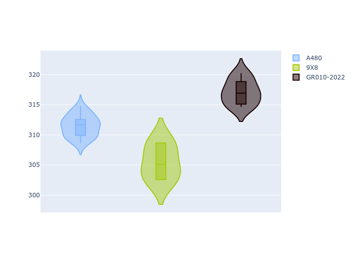
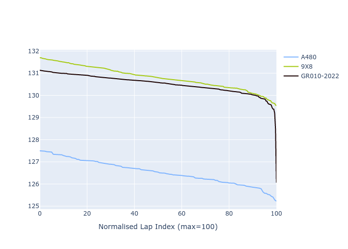

# Combined Plots

## Metadata

- BoP Accuracy: 83.03%
- Overall BoP Grade: B2
- Track: REFERENCETRACK
- Threshhold: 0.0kph
- Average Laptime: 2:07.43
- Average Quali Laptime: 2:06.33
- Average Topspeed: 311.32kph

## BoP Table
| Manufacturer   | Car        | Weight   | Power   | PINC   | E/Stint   | FDS   | RDP    | QDP     | TDP    |
|:---------------|:-----------|:---------|:--------|:-------|:----------|:------|:-------|:--------|:-------|
| Alpine         | A480       | 930kg    | 454.0kw | -      | 800MJ     | -     | 61.30% | 100.00% | 11.72% |
| Peugeot        | 9X8        | 1030kg   | 520.0kw | -      | 910MJ     | -     | 62.67% | 66.67%  | 1.30%  |
| Toyota         | GR010-2022 | 1030kg   | 520.0kw | -      | 909MJ     | -     | 58.84% | 40.00%  | 3.32%  |

## Performance Table
| Manufacturer   | Car        | RP      | QP      | Vavg      |   RDLC | BOP-Grade   | Match   |
|:---------------|:-----------|:--------|:--------|:----------|-------:|:------------|:--------|
| Alpine         | A480       | 2:06.58 | 2:05.25 | 311.44kph |   1.01 | ~A1         | 100.00% |
| Peugeot        | 9X8        | 2:08.26 | 2:07.65 | 305.45kph |   1    | +Ω1         | 49.46%  |
| Toyota         | GR010-2022 | 2:07.46 | 2:06.09 | 317.08kph |   1.01 | ~A1         | 99.63%  |

## Race Laptimes

## Quali Laptimes

## Topspeeds

## Laptimes Lineplot

