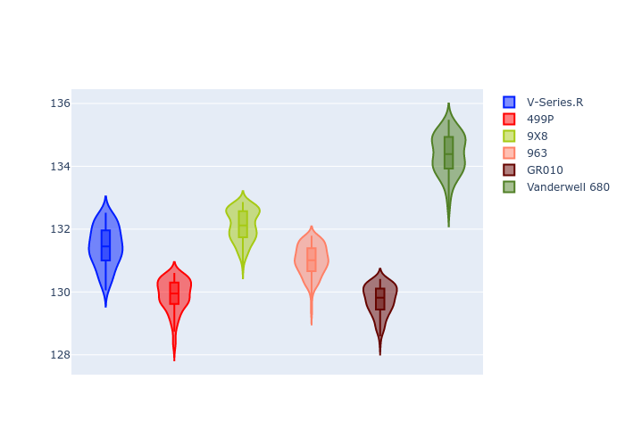
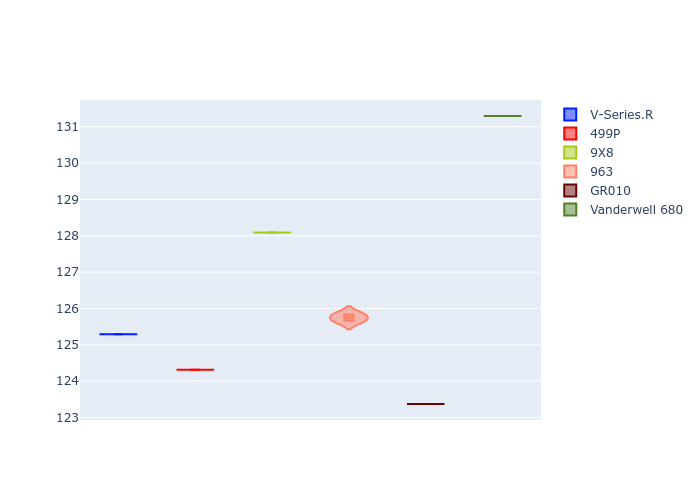
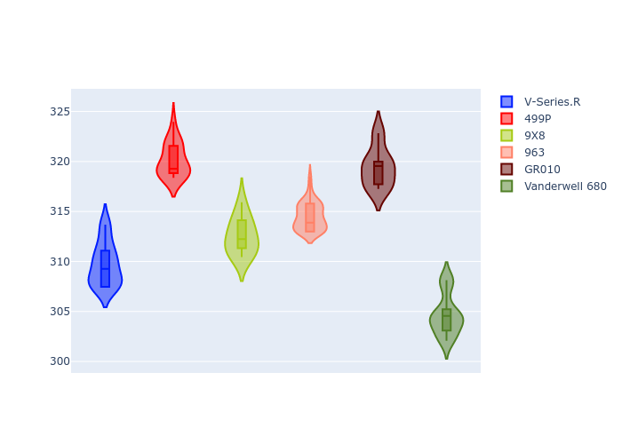
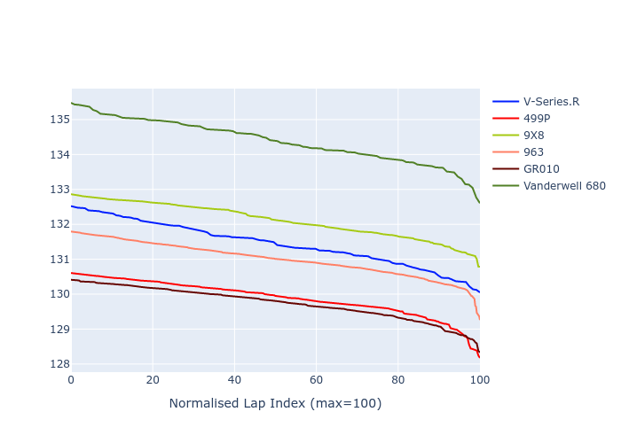

# Combined Plots

## Metadata

- BoP Accuracy: 57.71%
- Overall BoP Grade: E1
- Track: REFERENCETRACK
- Threshhold: 0.0kph
- Average Laptime: 2:11.42
- Average Quali Laptime: 2:06.69
- Laptime Std Dev: 1.56 seconds
- Filtered Average Topspeed: 313.86kph

## BoP Table
| Manufacturer   | Car            | Weight   | Power   | PINC   | E/Stint   | FDS   | RDP    | QDP    | TDP    |
|:---------------|:---------------|:---------|:--------|:-------|:----------|:------|:-------|:-------|:-------|
| Cadillac       | V-Series.R     | 1030kg   | 520.0kw | -      | 906MJ     | -     | 53.88% | 50.00% | 21.12% |
| Ferrari        | 499P           | 1030kg   | 520.0kw | -      | 906MJ     | -     | 58.11% | 20.00% | 4.15%  |
| Peugeot        | 9X8            | 1030kg   | 520.0kw | -      | 906MJ     | -     | 56.83% | 25.00% | 2.08%  |
| Porsche        | 963            | 1030kg   | 520.0kw | -      | 909MJ     | -     | 60.72% | 25.00% | 10.69% |
| Toyota         | GR010          | 1030kg   | 520.0kw | -      | 907MJ     | -     | 56.77% | 25.00% | 2.48%  |
| Vanwall        | Vanderwell 680 | 1030kg   | 520.0kw | -      | 903MJ     | -     | 53.08% | 50.00% | 10.27% |

## Performance Table
| Manufacturer   | Car            | RP      | QP      | Vavg      |   RDLC | BOP-Grade   | Match   |
|:---------------|:---------------|:--------|:--------|:----------|-------:|:------------|:--------|
| Cadillac       | V-Series.R     | 2:11.44 | 2:05.67 | 310.07kph |   1.05 | +B1         | 88.98%  |
| Ferrari        | 499P           | 2:09.88 | 2:05.19 | 320.49kph |   1.04 | -E1         | 55.85%  |
| Peugeot        | 9X8            | 2:12.11 | 2:08.06 | 312.91kph |   1.03 | +E1         | 56.98%  |
| Porsche        | 963            | 2:11.00 | 2:06.01 | 314.89kph |   1.04 | ~A1         | 98.28%  |
| Toyota         | GR010          | 2:09.73 | 2:04.05 | 319.78kph |   1.05 | -Ω1         | 46.15%  |
| Vanwall        | Vanderwell 680 | 2:14.38 | 2:11.14 | 305.01kph |   1.02 | +Ω2         | 0.00%   |

## Race Laptimes

## Quali Laptimes

## Topspeeds

## Laptimes Lineplot

