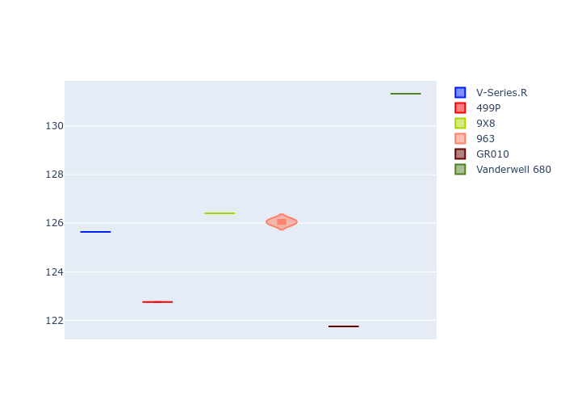
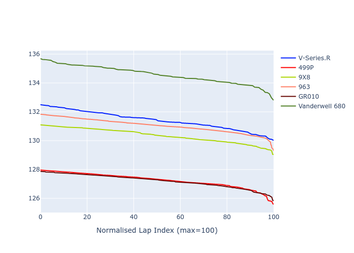

# Combined Plots

## Metadata

- BoP Accuracy: 25.97%
- Overall BoP Grade: Ω1
- Track: REFERENCETRACK
- Threshhold: 0.0kph

## BoP Table
| Manufacturer   | Car            | Weight   | Power   | PINC   | E/Stint   | FDS   | RDP    | QDP    | TDP    |
|:---------------|:---------------|:---------|:--------|:-------|:----------|:------|:-------|:-------|:-------|
| Cadillac       | V-Series.R     | 1030kg   | 520.0kw | -      | 906MJ     | -     | 53.88% | 50.00% | 21.12% |
| Ferrari        | 499P           | 1030kg   | 520.0kw | -      | 906MJ     | -     | 57.89% | 20.00% | 4.15%  |
| Peugeot        | 9X8            | 1030kg   | 520.0kw | -      | 906MJ     | -     | 56.61% | 25.00% | 2.08%  |
| Porsche        | 963            | 1030kg   | 520.0kw | -      | 909MJ     | -     | 60.72% | 25.00% | 10.69% |
| Toyota         | GR010          | 1030kg   | 520.0kw | -      | 907MJ     | -     | 56.77% | 25.00% | 2.48%  |
| Vanwall        | Vanderwell 680 | 1030kg   | 520.0kw | -      | 903MJ     | -     | 53.08% | 50.00% | 10.27% |

## Performance Table
| Manufacturer   | Car            | RP      | QP      | Vavg      |   RDLC | BOP-Grade   | Match   |
|:---------------|:---------------|:--------|:--------|:----------|-------:|:------------|:--------|
| Cadillac       | V-Series.R     | 2:08.78 | 2:02.74 | 306.10kph |   1.05 | +Ω1         | 22.03%  |
| Ferrari        | 499P           | 2:03.85 | 1:59.13 | 316.38kph |   1.04 | -Ω2         | 0.00%   |
| Peugeot        | 9X8            | 2:07.52 | 2:03.29 | 308.89kph |   1.03 | ~A1         | 100.00% |
| Porsche        | 963            | 2:08.48 | 2:03.20 | 310.85kph |   1.04 | +Ω1         | 33.78%  |
| Toyota         | GR010          | 2:03.91 | 1:58.26 | 315.68kph |   1.05 | -Ω2         | 0.00%   |
| Vanwall        | Vanderwell 680 | 2:12.21 | 2:08.60 | 301.10kph |   1.03 | +Ω2         | 0.00%   |

## Race Laptimes

## Quali Laptimes

## Topspeeds

## Laptimes Lineplot

