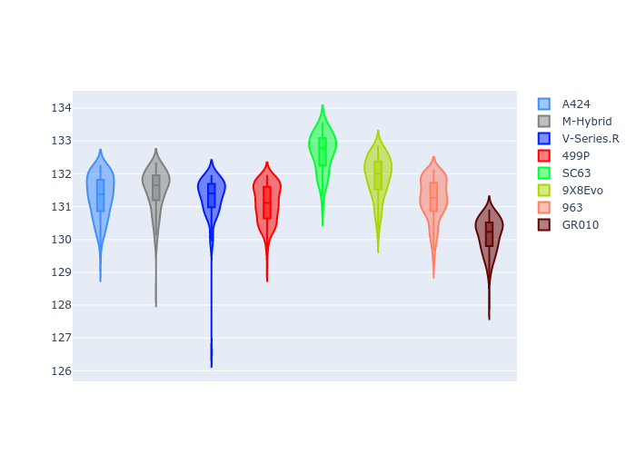
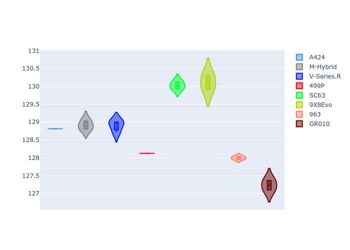
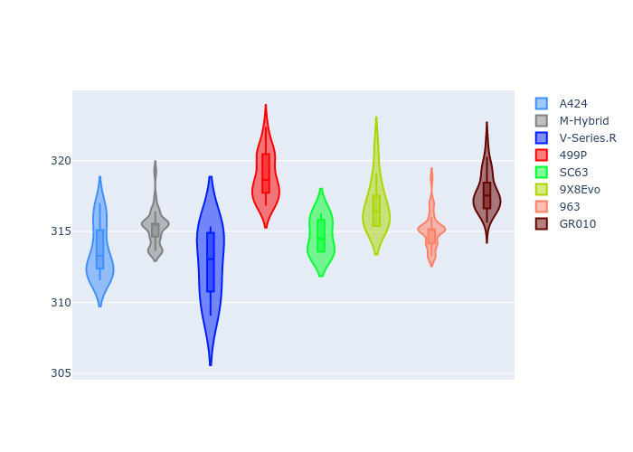
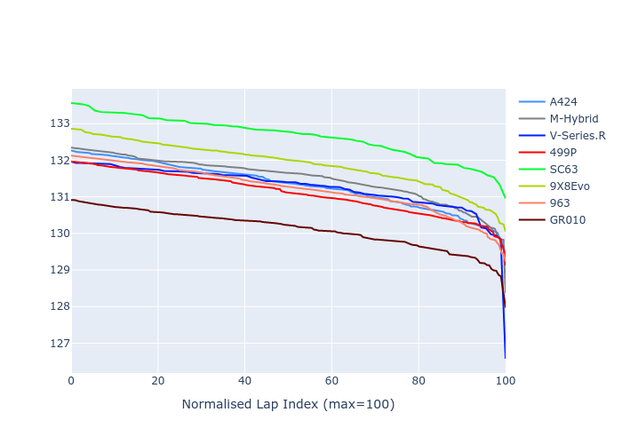

# Combined Plots

## Metadata

- BoP Accuracy: 85.05%
- Overall BoP Grade: B1
- Track: REFERENCETRACK
- Threshhold: 0.0kph
- Average Laptime: 2:11.38
- Average Quali Laptime: 2:08.76
- Laptime Std Dev: 0.67 seconds
- Filtered Average Topspeed: 315.61kph

## BoP Table
| Manufacturer   | Car        | Weight   | Power   | PINC   | E/Stint   | FDS   | RDP    | QDP    | TDP   |
|:---------------|:-----------|:---------|:--------|:-------|:----------|:------|:-------|:-------|:------|
| Alpine         | A424       | 1030kg   | 520.0kw | -      | 917MJ     | -     | 49.77% | 25.00% | 9.44% |
| BMW            | M-Hybrid   | 1030kg   | 520.0kw | -      | 914MJ     | -     | 49.88% | 60.00% | 6.84% |
| Cadillac       | V-Series.R | 1030kg   | 520.0kw | -      | 910MJ     | -     | 46.63% | 75.00% | 3.70% |
| Ferrari        | 499P       | 1030kg   | 520.0kw | -      | 913MJ     | -     | 52.53% | 11.11% | 7.86% |
| Lamborghini    | SC63       | 1030kg   | 520.0kw | -      | 910MJ     | -     | 50.68% | 75.00% | 4.68% |
| Peugeot        | 9X8Evo     | 1030kg   | 520.0kw | -      | 923MJ     | -     | 51.88% | 40.00% | 2.90% |
| Porsche        | 963        | 1030kg   | 520.0kw | -      | 912MJ     | -     | 48.03% | 20.00% | 5.44% |
| Toyota         | GR010      | 1030kg   | 520.0kw | -      | 915MJ     | -     | 49.73% | 33.33% | 7.04% |

## Performance Table
| Manufacturer   | Car        | RP      | QP      | Vavg      |   RDLC | BOP-Grade   | Match   |
|:---------------|:-----------|:--------|:--------|:----------|-------:|:------------|:--------|
| Alpine         | A424       | 2:11.32 | 2:08.81 | 313.64kph |   1.02 | ~A1         | 99.53%  |
| BMW            | M-Hybrid   | 2:11.50 | 2:08.91 | 315.27kph |   1.02 | -A2         | 93.72%  |
| Cadillac       | V-Series.R | 2:11.25 | 2:08.90 | 312.74kph |   1.02 | ~A1         | 98.89%  |
| Ferrari        | 499P       | 2:11.10 | 2:08.13 | 318.86kph |   1.02 | ~A1         | 100.00% |
| Lamborghini    | SC63       | 2:12.65 | 2:10.03 | 314.71kph |   1.02 | +Ω1         | 24.32%  |
| Peugeot        | 9X8Evo     | 2:11.90 | 2:10.11 | 316.86kph |   1.01 | +D1         | 66.06%  |
| Porsche        | 963        | 2:11.22 | 2:08.00 | 315.06kph |   1.03 | ~A1         | 100.00% |
| Toyota         | GR010      | 2:10.12 | 2:07.23 | 317.75kph |   1.02 | ~A1         | 97.86%  |

## Race Laptimes

## Quali Laptimes

## Topspeeds

## Laptimes Lineplot

