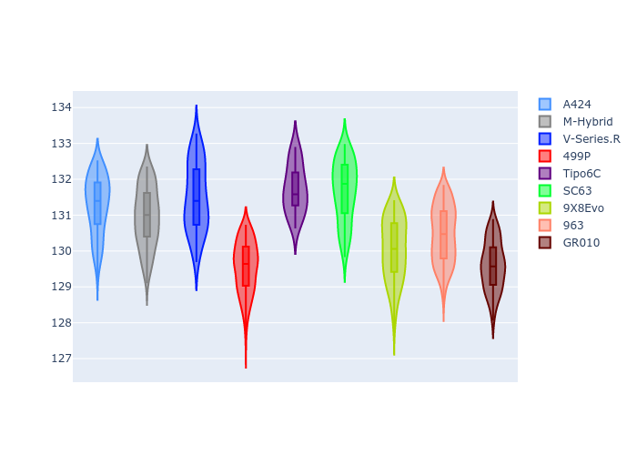
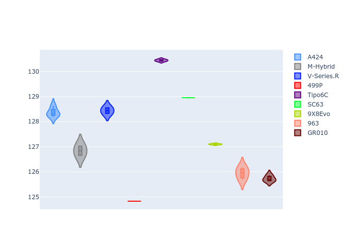
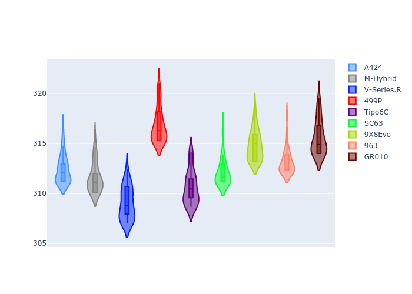
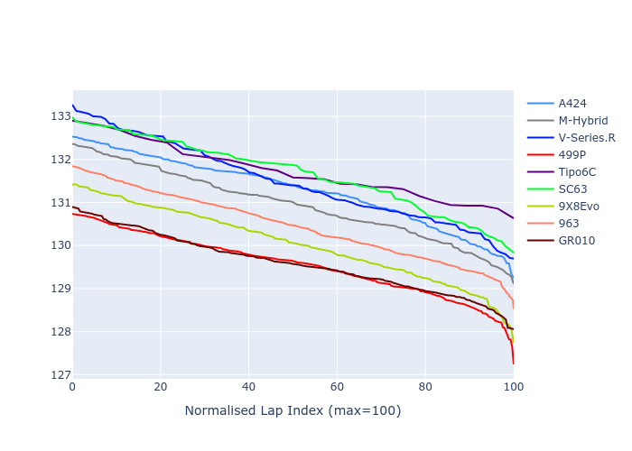

# Combined Plots

## Metadata

- BoP Accuracy: 81.37%
- Overall BoP Grade: B2
- Track: REFERENCETRACK
- Threshhold: 0.0kph
- Average Laptime: 2:10.75
- Average Quali Laptime: 2:07.40
- Laptime Std Dev: 0.82 seconds
- Filtered Average Topspeed: 312.89kph

## BoP Table
| Manufacturer     | Car        | Weight   | Power   | PINC   | E/Stint   | FDS   | RDP    | QDP     | TDP    |
|:-----------------|:-----------|:---------|:--------|:-------|:----------|:------|:-------|:--------|:-------|
| Alpine           | A424       | 1030kg   | 520.0kw | -      | 913MJ     | -     | 46.25% | 100.00% | 13.95% |
| BMW              | M-Hybrid   | 1030kg   | 520.0kw | -      | 912MJ     | -     | 54.22% | 40.00%  | 10.62% |
| Cadillac         | V-Series.R | 1030kg   | 520.0kw | -      | 911MJ     | -     | 53.20% | 66.67%  | 30.73% |
| Ferrari          | 499P       | 1030kg   | 520.0kw | -      | 912MJ     | -     | 46.66% | 20.00%  | 11.63% |
| Isotta Fraschini | Tipo6C     | 1030kg   | 520.0kw | -      | 917MJ     | -     | 45.31% | 66.67%  | 41.77% |
| Lamborghini      | SC63       | 1030kg   | 520.0kw | -      | 911MJ     | -     | 53.69% | 33.33%  | 14.95% |
| Peugeot          | 9X8Evo     | 1030kg   | 520.0kw | -      | 911MJ     | -     | 49.50% | 50.00%  | 18.03% |
| Porsche          | 963        | 1030kg   | 520.0kw | -      | 911MJ     | -     | 51.94% | 42.86%  | 3.54%  |
| Toyota           | GR010      | 1030kg   | 520.0kw | -      | 916MJ     | -     | 54.63% | 50.00%  | 8.80%  |

## Performance Table
| Manufacturer     | Car        | RP      | QP      | Vavg      |   RDLC | BOP-Grade   | Match   |
|:-----------------|:-----------|:--------|:--------|:----------|-------:|:------------|:--------|
| Alpine           | A424       | 2:11.28 | 2:08.37 | 312.41kph |   1.02 | +B2         | 83.78%  |
| BMW              | M-Hybrid   | 2:10.95 | 2:06.84 | 311.58kph |   1.03 | +A2         | 91.46%  |
| Cadillac         | V-Series.R | 2:11.48 | 2:08.44 | 309.02kph |   1.02 | +D1         | 69.44%  |
| Ferrari          | 499P       | 2:09.55 | 2:04.83 | 316.79kph |   1.04 | -B2         | 80.77%  |
| Isotta Fraschini | Tipo6C     | 2:11.73 | 2:10.44 | 310.59kph |   1.01 | +C2         | 72.41%  |
| Lamborghini      | SC63       | 2:11.66 | 2:08.95 | 312.15kph |   1.02 | +D2         | 64.22%  |
| Peugeot          | 9X8Evo     | 2:10.04 | 2:07.10 | 314.80kph |   1.02 | -B1         | 89.45%  |
| Porsche          | 963        | 2:10.46 | 2:05.94 | 313.12kph |   1.04 | ~A1         | 98.23%  |
| Toyota           | GR010      | 2:09.59 | 2:05.72 | 315.57kph |   1.03 | -B2         | 82.59%  |

## Race Laptimes

## Quali Laptimes

## Topspeeds

## Laptimes Lineplot

