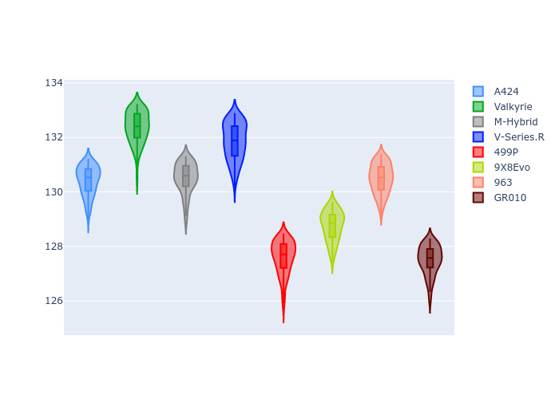
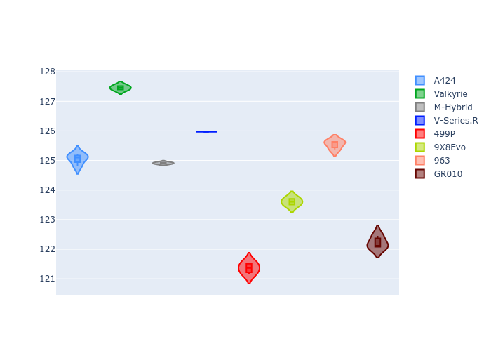

# Combined Plots

## Metadata

- BoP Accuracy: 26.70%
- Overall BoP Grade: Ω1
- Track: REFERENCETRACK
- Threshhold: 0.0kph

## BoP Table
| Manufacturer   | Car        | Weight   | Power   | PINC   | E/Stint   | FDS   | RDP    | QDP    | TDP    |
|:---------------|:-----------|:---------|:--------|:-------|:----------|:------|:-------|:-------|:-------|
| Alpine         | A424       | 1030kg   | 520.0kw | -      | 919MJ     | -     | 50.24% | 66.67% | 11.49% |
| Aston Martin   | Valkyrie   | 1030kg   | 520.0kw | -      | 911MJ     | -     | 53.85% | 66.67% | 18.16% |
| BMW            | M-Hybrid   | 1030kg   | 520.0kw | -      | 916MJ     | -     | 50.24% | 18.18% | 45.69% |
| Cadillac       | V-Series.R | 1030kg   | 520.0kw | -      | 910MJ     | -     | 48.82% | 25.00% | 34.93% |
| Ferrari        | 499P       | 1030kg   | 520.0kw | -      | 913MJ     | -     | 47.24% | 60.00% | 6.77%  |
| Peugeot        | 9X8Evo     | 1030kg   | 520.0kw | -      | 916MJ     | -     | 50.94% | 40.00% | 10.63% |
| Porsche        | 963        | 1030kg   | 520.0kw | -      | 914MJ     | -     | 51.26% | 50.00% | 19.00% |
| Toyota         | GR010      | 1030kg   | 520.0kw | -      | 913MJ     | -     | 50.00% | 42.86% | 4.49%  |

## Performance Table
| Manufacturer   | Car        | RP      | QP      | Vavg      |   RDLC | BOP-Grade   | Match   |
|:---------------|:-----------|:--------|:--------|:----------|-------:|:------------|:--------|
| Alpine         | A424       | 2:08.31 | 2:02.97 | 312.33kph |   1.04 | +E1         | 56.81%  |
| Aston Martin   | Valkyrie   | 2:10.24 | 2:05.34 | 309.95kph |   1.04 | +Ω1         | 0.89%   |
| BMW            | M-Hybrid   | 2:08.46 | 2:02.88 | 308.88kph |   1.05 | +Ω1         | 45.54%  |
| Cadillac       | V-Series.R | 2:09.89 | 2:04.02 | 307.15kph |   1.05 | +Ω1         | 1.46%   |
| Ferrari        | 499P       | 2:04.87 | 1:58.75 | 314.10kph |   1.05 | -Ω2         | 0.00%   |
| Peugeot        | 9X8Evo     | 2:06.04 | 2:00.96 | 313.47kph |   1.04 | -E1         | 55.56%  |
| Porsche        | 963        | 2:08.40 | 2:03.48 | 309.96kph |   1.04 | +E2         | 53.37%  |
| Toyota         | GR010      | 2:04.90 | 1:59.70 | 312.11kph |   1.04 | -Ω2         | 0.00%   |

## Race Laptimes

## Quali Laptimes

## Topspeeds

## Laptimes Lineplot

