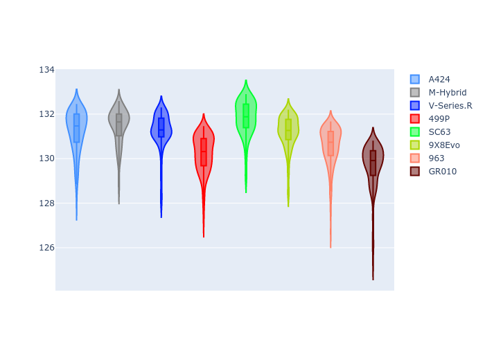
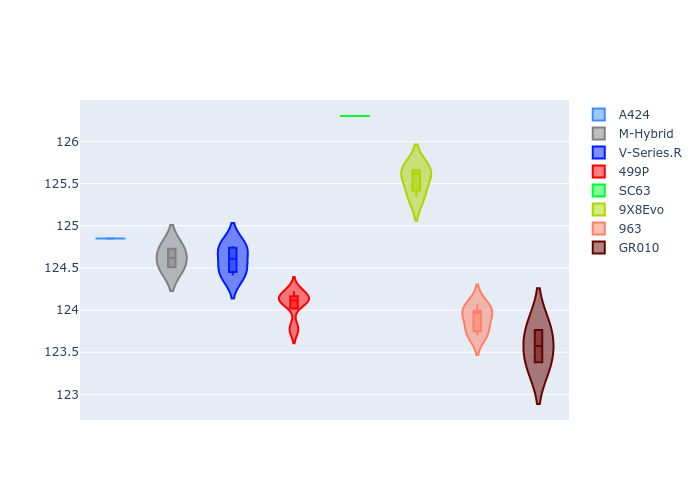
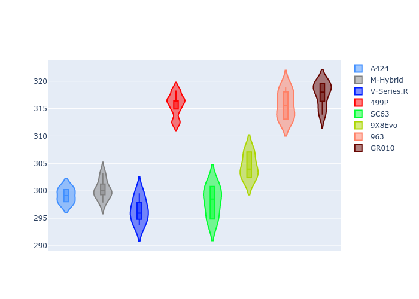
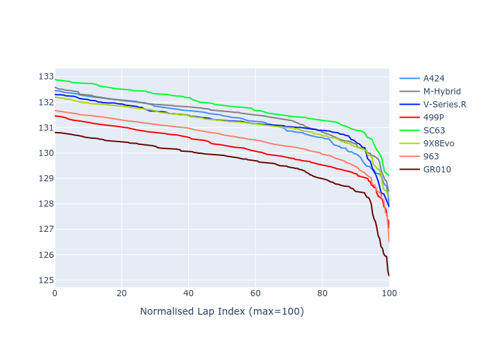

# Combined Plots

## Metadata

- BoP Accuracy: 85.83%
- Overall BoP Grade: B1
- Track: REFERENCETRACK
- Threshhold: 0.0kph
- Average Laptime: 2:10.92
- Average Quali Laptime: 2:04.68
- Laptime Std Dev: 0.67 seconds
- Filtered Average Topspeed: 305.93kph

## BoP Table
| Manufacturer   | Car        | Weight   | Power   | PINC   | E/Stint   | FDS   | RDP    | QDP    | TDP   |
|:---------------|:-----------|:---------|:--------|:-------|:----------|:------|:-------|:-------|:------|
| Alpine         | A424       | 1030kg   | 520.0kw | -      | 915MJ     | -     | 47.65% | 25.00% | 0.83% |
| BMW            | M-Hybrid   | 1030kg   | 520.0kw | -      | 914MJ     | -     | 52.03% | 40.00% | 1.43% |
| Cadillac       | V-Series.R | 1030kg   | 520.0kw | -      | 911MJ     | -     | 52.99% | 80.00% | 3.59% |
| Ferrari        | 499P       | 1030kg   | 520.0kw | -      | 913MJ     | -     | 52.91% | 62.50% | 1.33% |
| Lamborghini    | SC63       | 1030kg   | 520.0kw | -      | 911MJ     | -     | 58.55% | 33.33% | 2.49% |
| Peugeot        | 9X8Evo     | 1030kg   | 520.0kw | -      | 916MJ     | -     | 49.25% | 75.00% | 1.24% |
| Porsche        | 963        | 1030kg   | 520.0kw | -      | 913MJ     | -     | 51.62% | 41.67% | 0.96% |
| Toyota         | GR010      | 1030kg   | 520.0kw | -      | 914MJ     | -     | 51.27% | 25.00% | 3.54% |

## Performance Table
| Manufacturer   | Car        | RP      | QP      | Vavg      |   RDLC | BOP-Grade   | Match   |
|:---------------|:-----------|:--------|:--------|:----------|-------:|:------------|:--------|
| Alpine         | A424       | 2:11.26 | 2:04.85 | 299.14kph |   1.05 | +C1         | 76.68%  |
| BMW            | M-Hybrid   | 2:11.45 | 2:04.62 | 300.21kph |   1.05 | +C1         | 78.28%  |
| Cadillac       | V-Series.R | 2:11.22 | 2:04.60 | 296.48kph |   1.05 | +B1         | 87.10%  |
| Ferrari        | 499P       | 2:10.23 | 2:04.07 | 315.74kph |   1.05 | ~A1         | 99.20%  |
| Lamborghini    | SC63       | 2:11.82 | 2:06.30 | 298.07kph |   1.04 | +E1         | 57.66%  |
| Peugeot        | 9X8Evo     | 2:11.18 | 2:05.55 | 304.49kph |   1.04 | +A2         | 93.51%  |
| Porsche        | 963        | 2:10.56 | 2:03.89 | 315.70kph |   1.05 | ~A1         | 99.17%  |
| Toyota         | GR010      | 2:09.64 | 2:03.57 | 317.61kph |   1.05 | ~A1         | 95.04%  |

## Race Laptimes

## Quali Laptimes

## Topspeeds

## Laptimes Lineplot

