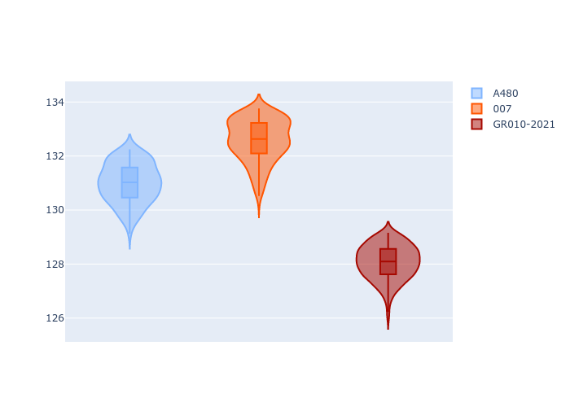
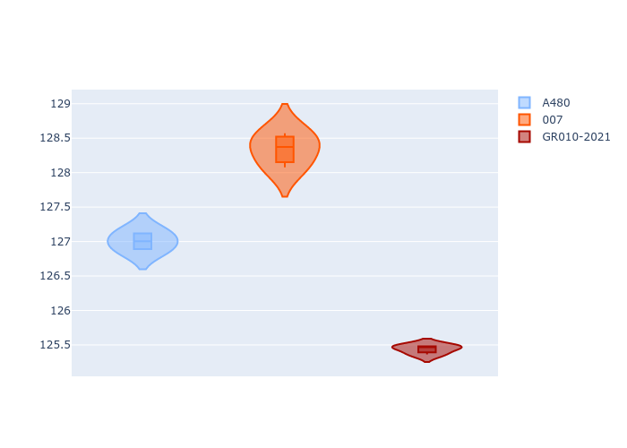
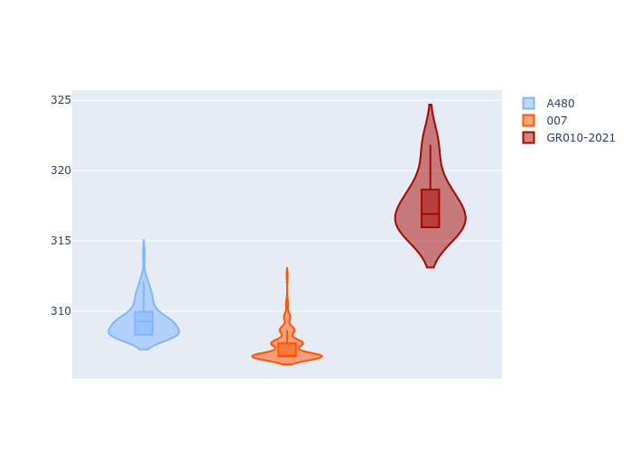
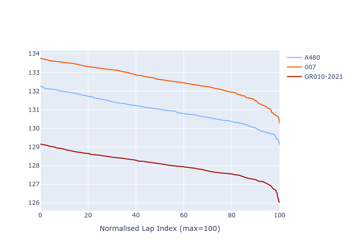

# Combined Plots

## Metadata

- BoP Accuracy: 76.89%
- Overall BoP Grade: C1
- Track: REFERENCETRACK
- Threshhold: 0.0kph
- Average Laptime: 2:11.17
- Average Quali Laptime: 2:07.14
- Laptime Std Dev: 1.05 seconds
- Filtered Average Topspeed: 311.38kph

## BoP Table
| Manufacturer   | Car        | Weight   | Power   | PINC   | E/Stint   | FDS   | RDP    | QDP    | TDP    |
|:---------------|:-----------|:---------|:--------|:-------|:----------|:------|:-------|:-------|:-------|
| Alpine         | A480       | 930kg    | 454.0kw | -      | 845MJ     | -     | 47.68% | 28.57% | 21.48% |
| Glickenhaus    | 007        | 1030kg   | 520.0kw | -      | 965MJ     | -     | 45.28% | 37.50% | 14.42% |
| Toyota         | GR010-2021 | 1030kg   | 520.0kw | -      | 963MJ     | -     | 51.35% | 60.00% | 0.85%  |

## Performance Table
| Manufacturer   | Car        | RP      | QP      | Vavg      |   RDLC | BOP-Grade   | Match   |
|:---------------|:-----------|:--------|:--------|:----------|-------:|:------------|:--------|
| Alpine         | A480       | 2:10.96 | 2:07.27 | 309.22kph |   1.03 | ~A1         | 100.00% |
| Glickenhaus    | 007        | 2:12.54 | 2:08.31 | 307.39kph |   1.03 | +Ω1         | 37.76%  |
| Toyota         | GR010-2021 | 2:10.00 | 2:05.85 | 317.53kph |   1.03 | -A2         | 92.89%  |

## Race Laptimes

## Quali Laptimes

## Topspeeds

## Laptimes Lineplot

