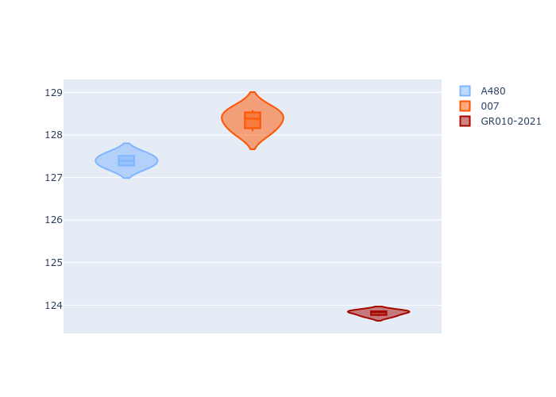
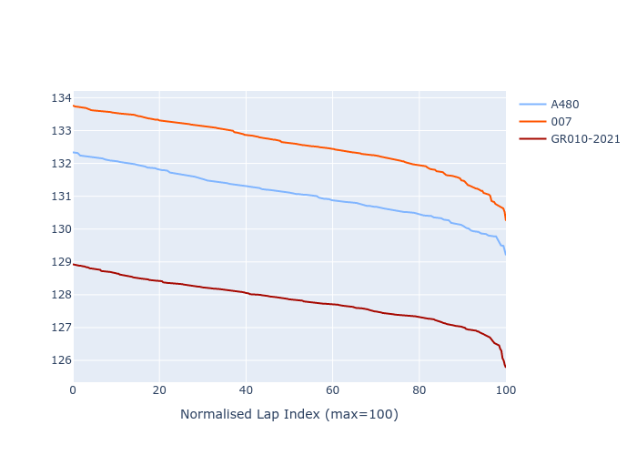

# Combined Plots

## Metadata

- BoP Accuracy: 41.38%
- Overall BoP Grade: Ω1
- Track: REFERENCETRACK
- Threshhold: 0.0kph

## BoP Table
| Manufacturer   | Car        | Weight   | Power   | PINC   | E/Stint   | FDS   | RDP    | QDP    | TDP    |
|:---------------|:-----------|:---------|:--------|:-------|:----------|:------|:-------|:-------|:-------|
| Alpine         | A480       | 930kg    | 454.0kw | -      | 845MJ     | -     | 47.96% | 28.57% | 21.48% |
| Glickenhaus    | 007        | 1030kg   | 520.0kw | -      | 965MJ     | -     | 45.28% | 37.50% | 14.42% |
| Toyota         | GR010-2021 | 1030kg   | 520.0kw | -      | 963MJ     | -     | 51.22% | 60.00% | 0.85%  |

## Performance Table
| Manufacturer   | Car        | RP      | QP      | Vavg      |   RDLC | BOP-Grade   | Match   |
|:---------------|:-----------|:--------|:--------|:----------|-------:|:------------|:--------|
| Alpine         | A480       | 2:09.57 | 2:06.00 | 295.14kph |   1.03 | +C1         | 79.55%  |
| Glickenhaus    | 007        | 2:11.13 | 2:07.04 | 293.40kph |   1.03 | +Ω1         | 14.50%  |
| Toyota         | GR010-2021 | 2:06.67 | 2:02.77 | 303.08kph |   1.03 | -Ω1         | 30.08%  |

## Race Laptimes

## Quali Laptimes

## Topspeeds

## Laptimes Lineplot

