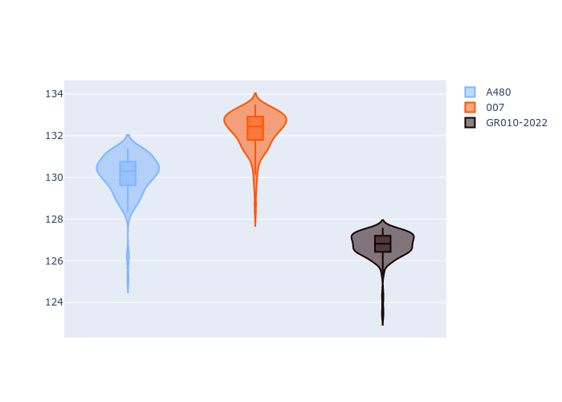
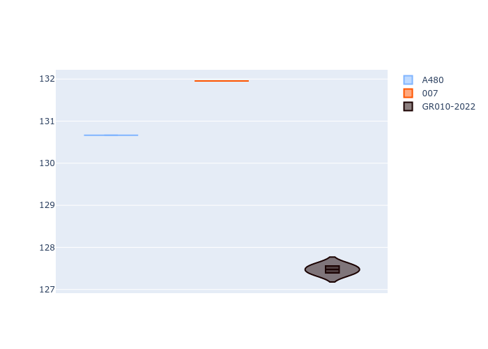
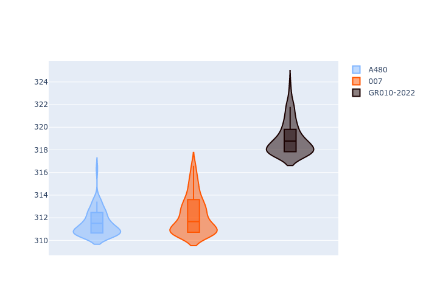
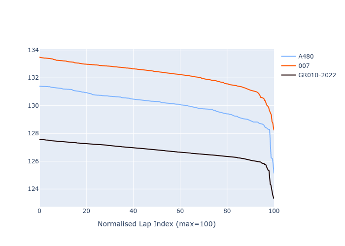

# Combined Plots

## Metadata

- BoP Accuracy: 59.99%
- Overall BoP Grade: E1
- Track: REFERENCETRACK
- Threshhold: 0.0kph
- Average Laptime: 2:09.70
- Average Quali Laptime: 2:10.03
- Average Topspeed: 314.24kph

## BoP Table
| Manufacturer   | Car        | Weight   | Power   | PINC   | E/Stint   | FDS   | RDP    | QDP    | TDP    |
|:---------------|:-----------|:---------|:--------|:-------|:----------|:------|:-------|:-------|:-------|
| Alpine         | A480       | 930kg    | 454.0kw | -      | 783MJ     | -     | 43.36% | 33.33% | 17.74% |
| Glickenhaus    | 007        | 1030kg   | 520.0kw | -      | 910MJ     | -     | 45.93% | 20.00% | 27.89% |
| Toyota         | GR010-2022 | 1030kg   | 520.0kw | -      | 906MJ     | -     | 48.39% | 66.67% | 12.11% |

## Performance Table
| Manufacturer   | Car        | RP      | QP      | Vavg      |   RDLC | BOP-Grade   | Match   |
|:---------------|:-----------|:--------|:--------|:----------|-------:|:------------|:--------|
| Alpine         | A480       | 2:10.11 | 2:10.67 | 311.49kph |   1    | -C1         | 76.88%  |
| Glickenhaus    | 007        | 2:12.26 | 2:11.95 | 312.24kph |   1    | +Ω1         | 6.29%   |
| Toyota         | GR010-2022 | 2:06.74 | 2:07.47 | 318.99kph |   0.99 | ~A1         | 96.80%  |

## Race Laptimes

## Quali Laptimes

## Topspeeds

## Laptimes Lineplot

