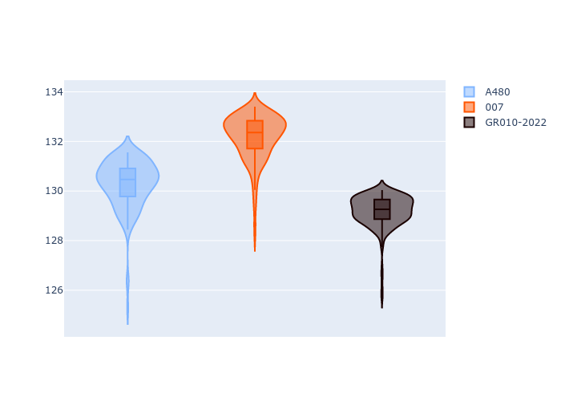
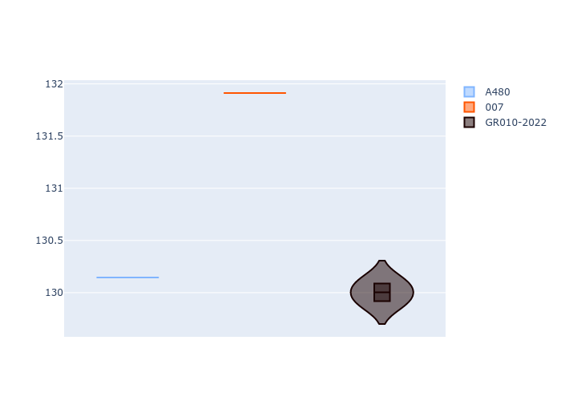
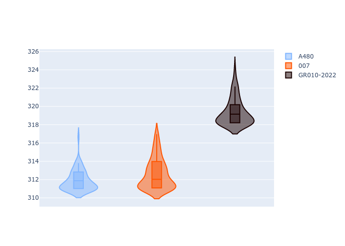
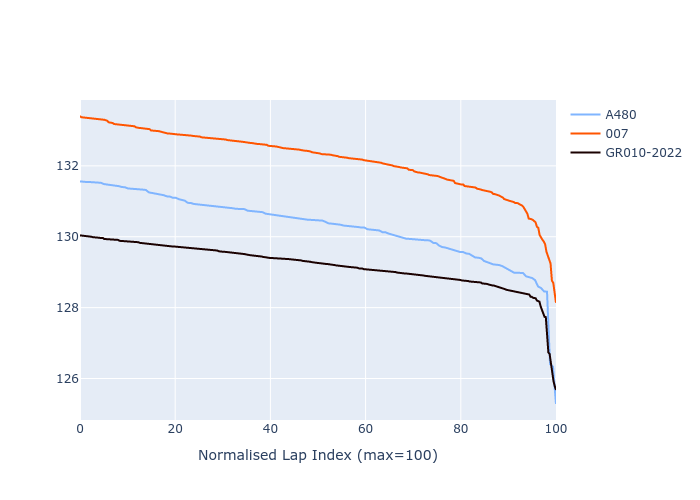

# Combined Plots

## Metadata

- BoP Accuracy: 73.89%
- Overall BoP Grade: C2
- Track: REFERENCETRACK
- Threshhold: 0.0kph
- Average Laptime: 2:10.54
- Average Quali Laptime: 2:11.06
- Laptime Std Dev: 1.23 seconds
- Filtered Average Topspeed: 314.34kph

## BoP Table
| Manufacturer   | Car        | Weight   | Power   | PINC   | E/Stint   | FDS   | RDP    | QDP    | TDP    |
|:---------------|:-----------|:---------|:--------|:-------|:----------|:------|:-------|:-------|:-------|
| Alpine         | A480       | 930kg    | 454.0kw | -      | 783MJ     | -     | 43.36% | 33.33% | 17.74% |
| Glickenhaus    | 007        | 1030kg   | 520.0kw | -      | 910MJ     | -     | 45.93% | 20.00% | 27.89% |
| Toyota         | GR010-2022 | 1030kg   | 520.0kw | -      | 906MJ     | -     | 48.39% | 66.67% | 12.11% |

## Performance Table
| Manufacturer   | Car        | RP      | QP      | Vavg      |   RDLC | BOP-Grade   | Match   |
|:---------------|:-----------|:--------|:--------|:----------|-------:|:------------|:--------|
| Alpine         | A480       | 2:10.28 | 2:11.01 | 311.59kph |   0.99 | ~A1         | 98.75%  |
| Glickenhaus    | 007        | 2:12.17 | 2:12.05 | 312.34kph |   1    | +Ω1         | 24.00%  |
| Toyota         | GR010-2022 | 2:09.18 | 2:10.13 | 319.09kph |   0.99 | ~A1         | 98.93%  |

## Race Laptimes

## Quali Laptimes

## Topspeeds

## Laptimes Lineplot

