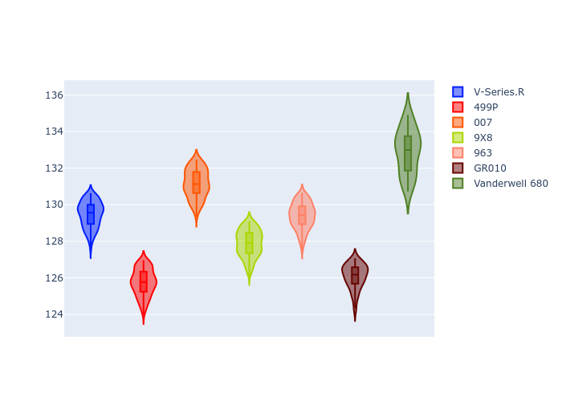
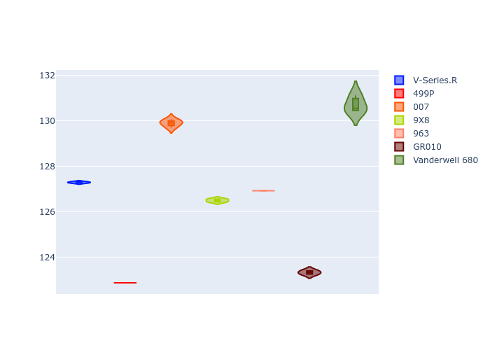
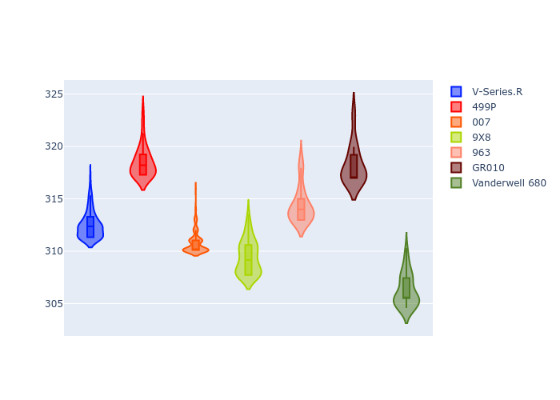
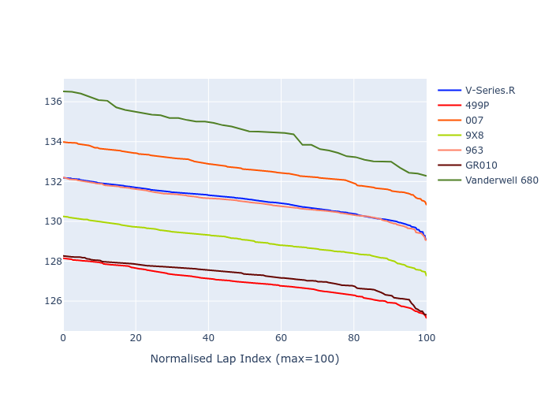

# Combined Plots

## Metadata

- BoP Accuracy: 39.56%
- Overall BoP Grade: Ω1
- Track: REFERENCETRACK
- Threshhold: 0.0kph

## BoP Table
| Manufacturer   | Car            | Weight   | Power   | PINC   | E/Stint   | FDS   | RDP    | QDP    | TDP    |
|:---------------|:---------------|:---------|:--------|:-------|:----------|:------|:-------|:-------|:-------|
| Cadillac       | V-Series.R     | 1030kg   | 520.0kw | -      | 909MJ     | -     | 38.01% | 28.57% | 13.28% |
| Ferrari        | 499P           | 1030kg   | 520.0kw | -      | 907MJ     | -     | 38.44% | 16.67% | 5.59%  |
| Glickenhaus    | 007            | 1030kg   | 520.0kw | -      | 913MJ     | -     | 36.08% | 57.14% | 16.80% |
| Peugeot        | 9X8            | 1030kg   | 520.0kw | -      | 910MJ     | -     | 37.23% | 50.00% | 14.95% |
| Porsche        | 963            | 1030kg   | 520.0kw | -      | 912MJ     | -     | 35.21% | 25.00% | 3.20%  |
| Toyota         | GR010          | 1030kg   | 520.0kw | -      | 910MJ     | -     | 37.75% | 40.00% | 2.44%  |
| Vanwall        | Vanderwell 680 | 1030kg   | 520.0kw | -      | 908MJ     | -     | 25.45% | 75.00% | 20.21% |

## Performance Table
| Manufacturer   | Car            | RP      | QP      | Vavg      |   RDLC | BOP-Grade   | Match   |
|:---------------|:---------------|:--------|:--------|:----------|-------:|:------------|:--------|
| Cadillac       | V-Series.R     | 2:09.47 | 2:05.72 | 312.48kph |   1.03 | +B1         | 85.08%  |
| Ferrari        | 499P           | 2:05.75 | 2:01.68 | 318.47kph |   1.03 | -Ω2         | 0.00%   |
| Glickenhaus    | 007            | 2:11.16 | 2:08.39 | 310.83kph |   1.02 | +Ω1         | 15.77%  |
| Peugeot        | 9X8            | 2:07.88 | 2:05.31 | 309.42kph |   1.02 | -B1         | 86.19%  |
| Porsche        | 963            | 2:09.40 | 2:05.38 | 314.39kph |   1.03 | +B1         | 88.66%  |
| Toyota         | GR010          | 2:06.07 | 2:02.13 | 318.21kph |   1.03 | -Ω1         | 1.19%   |
| Vanwall        | Vanderwell 680 | 2:12.91 | 2:09.11 | 306.26kph |   1.03 | +Ω2         | 0.00%   |

## Race Laptimes

## Quali Laptimes

## Topspeeds

## Laptimes Lineplot

