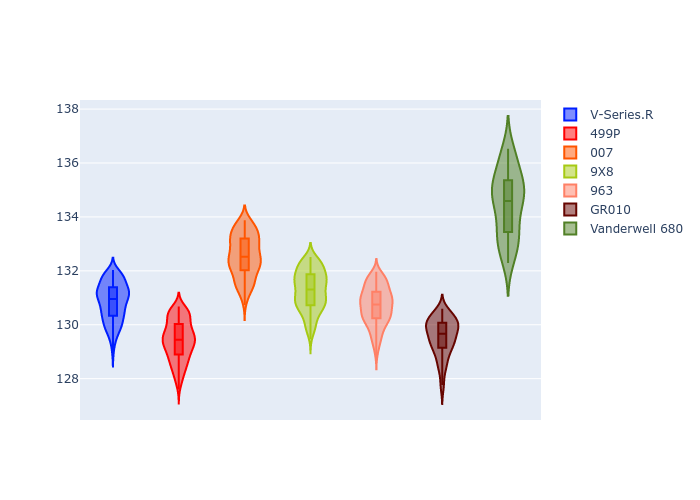
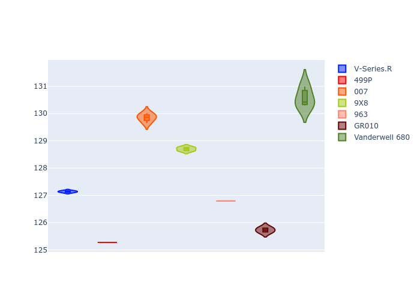
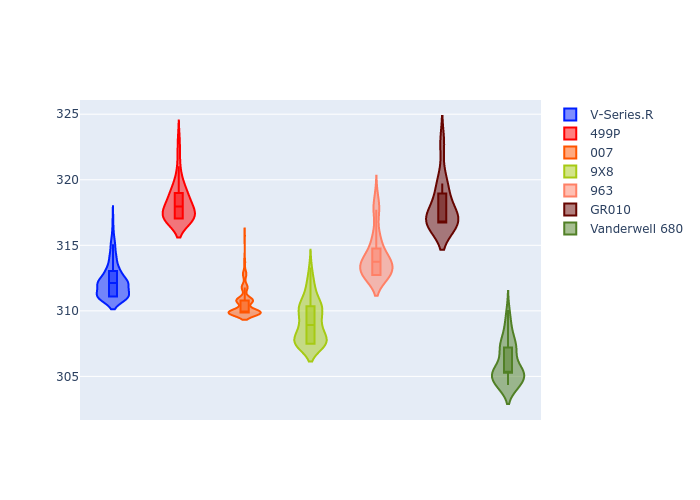
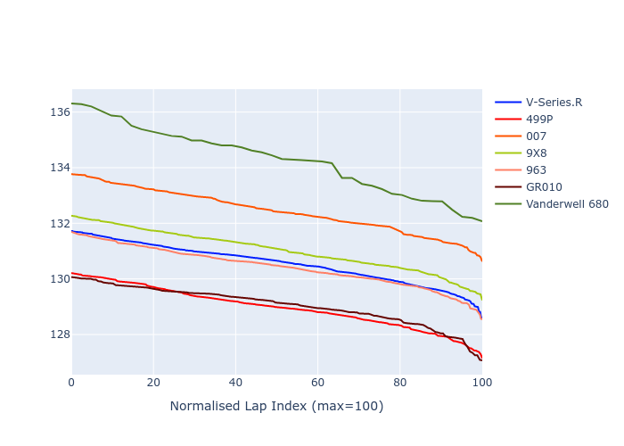

# Combined Plots

## Metadata

- BoP Accuracy: 69.88%
- Overall BoP Grade: D1
- Track: REFERENCETRACK
- Threshhold: 0.0kph
- Average Laptime: 2:11.33
- Average Quali Laptime: 2:07.72
- Laptime Std Dev: 1.55 seconds
- Filtered Average Topspeed: 312.63kph

## BoP Table
| Manufacturer   | Car            | Weight   | Power   | PINC   | E/Stint   | FDS   | RDP    | QDP    | TDP    |
|:---------------|:---------------|:---------|:--------|:-------|:----------|:------|:-------|:-------|:-------|
| Cadillac       | V-Series.R     | 1030kg   | 520.0kw | -      | 909MJ     | -     | 37.71% | 28.57% | 13.28% |
| Ferrari        | 499P           | 1030kg   | 520.0kw | -      | 907MJ     | -     | 38.44% | 16.67% | 5.59%  |
| Glickenhaus    | 007            | 1030kg   | 520.0kw | -      | 913MJ     | -     | 36.23% | 57.14% | 16.80% |
| Peugeot        | 9X8            | 1030kg   | 520.0kw | -      | 910MJ     | -     | 37.23% | 50.00% | 14.95% |
| Porsche        | 963            | 1030kg   | 520.0kw | -      | 912MJ     | -     | 35.21% | 25.00% | 3.20%  |
| Toyota         | GR010          | 1030kg   | 520.0kw | -      | 910MJ     | -     | 37.75% | 40.00% | 2.44%  |
| Vanwall        | Vanderwell 680 | 1030kg   | 520.0kw | -      | 908MJ     | -     | 25.45% | 75.00% | 20.21% |

## Performance Table
| Manufacturer   | Car            | RP      | QP      | Vavg      |   RDLC | BOP-Grade   | Match   |
|:---------------|:---------------|:--------|:--------|:----------|-------:|:------------|:--------|
| Cadillac       | V-Series.R     | 2:10.87 | 2:07.14 | 312.24kph |   1.03 | ~A1         | 97.89%  |
| Ferrari        | 499P           | 2:09.50 | 2:05.28 | 318.22kph |   1.03 | -E1         | 57.47%  |
| Glickenhaus    | 007            | 2:12.60 | 2:09.85 | 310.59kph |   1.02 | +E2         | 52.48%  |
| Peugeot        | 9X8            | 2:11.33 | 2:08.70 | 309.19kph |   1.02 | ~A1         | 100.00% |
| Porsche        | 963            | 2:10.81 | 2:06.80 | 314.15kph |   1.03 | ~A1         | 96.80%  |
| Toyota         | GR010          | 2:09.82 | 2:05.73 | 317.96kph |   1.03 | -C2         | 75.00%  |
| Vanwall        | Vanderwell 680 | 2:14.36 | 2:10.57 | 306.03kph |   1.03 | +Ω1         | 9.52%   |

## Race Laptimes

## Quali Laptimes

## Topspeeds

## Laptimes Lineplot

