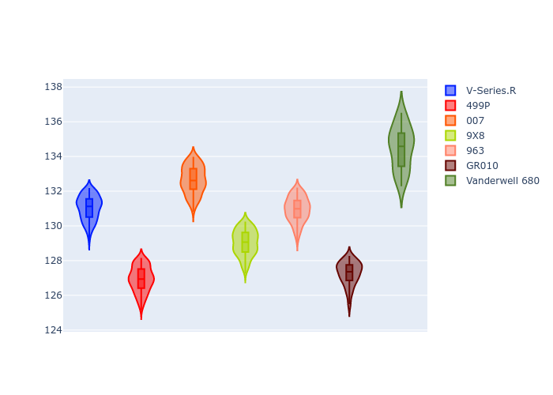

# Combined Plots

## Metadata

- BoP Accuracy: 36.03%
- Overall BoP Grade: Ω1
- Track: REFERENCETRACK
- Threshhold: 0.0kph
- Average Laptime: 2:10.33
- Average Quali Laptime: 2:06.78
- Average Topspeed: 312.62kph

## BoP Table
| Manufacturer   | Car            | Weight   | Power   | PINC   | E/Stint   | FDS   | RDP    | QDP    | TDP    |
|:---------------|:---------------|:---------|:--------|:-------|:----------|:------|:-------|:-------|:-------|
| Cadillac       | V-Series.R     | 1030kg   | 520.0kw | -      | 909MJ     | -     | 37.71% | 28.57% | 13.28% |
| Ferrari        | 499P           | 1030kg   | 520.0kw | -      | 907MJ     | -     | 38.44% | 16.67% | 5.59%  |
| Glickenhaus    | 007            | 1030kg   | 520.0kw | -      | 913MJ     | -     | 36.23% | 57.14% | 16.80% |
| Peugeot        | 9X8            | 1030kg   | 520.0kw | -      | 910MJ     | -     | 37.23% | 50.00% | 14.95% |
| Porsche        | 963            | 1030kg   | 520.0kw | -      | 912MJ     | -     | 35.21% | 25.00% | 3.20%  |
| Toyota         | GR010          | 1030kg   | 520.0kw | -      | 910MJ     | -     | 37.75% | 40.00% | 2.44%  |
| Vanwall        | Vanderwell 680 | 1030kg   | 520.0kw | -      | 908MJ     | -     | 25.45% | 75.00% | 20.21% |

## Performance Table
| Manufacturer   | Car            | RP      | QP      | Vavg      |   RDLC | BOP-Grade   | Match   |
|:---------------|:---------------|:--------|:--------|:----------|-------:|:------------|:--------|
| Cadillac       | V-Series.R     | 2:11.03 | 2:07.29 | 312.23kph |   1.03 | +C1         | 78.10%  |
| Ferrari        | 499P           | 2:06.93 | 2:02.87 | 318.21kph |   1.03 | -Ω2         | 0.00%   |
| Glickenhaus    | 007            | 2:12.65 | 2:09.89 | 310.58kph |   1.02 | +Ω1         | 13.22%  |
| Peugeot        | 9X8            | 2:09.03 | 2:06.49 | 309.18kph |   1.02 | -C1         | 79.50%  |
| Porsche        | 963            | 2:10.94 | 2:06.92 | 314.14kph |   1.03 | +B2         | 81.40%  |
| Toyota         | GR010          | 2:07.26 | 2:03.32 | 317.95kph |   1.03 | -Ω2         | 0.00%   |
| Vanwall        | Vanderwell 680 | 2:14.50 | 2:10.70 | 306.02kph |   1.03 | +Ω2         | 0.00%   |

## Race Laptimes

## Quali Laptimes

## Topspeeds

## Laptimes Lineplot

