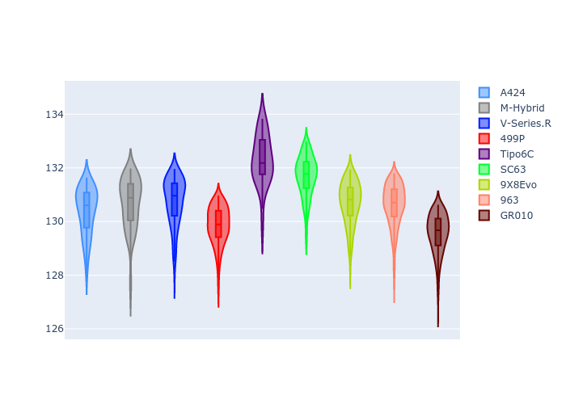
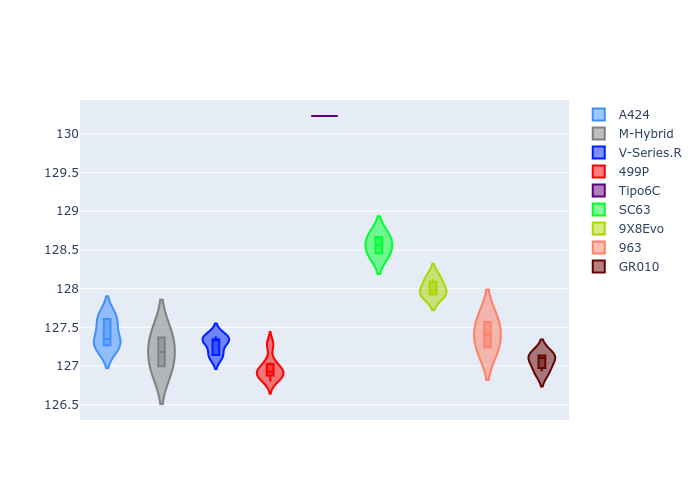
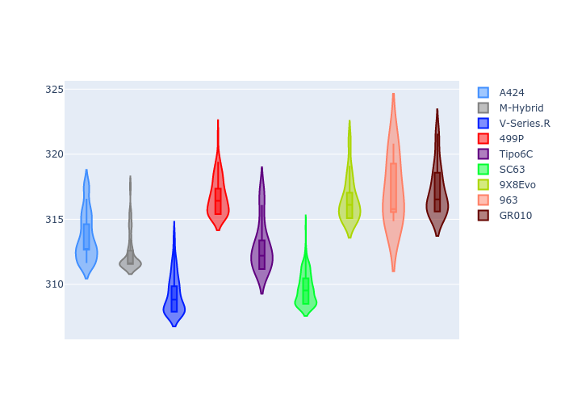
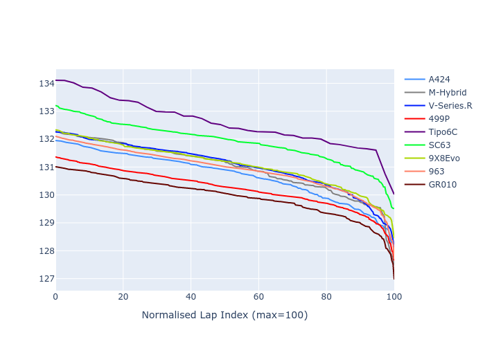

# Combined Plots

## Metadata

- BoP Accuracy: 87.56%
- Overall BoP Grade: B1
- Track: REFERENCETRACK
- Threshhold: 0.0kph
- Average Laptime: 2:10.72
- Average Quali Laptime: 2:07.73
- Laptime Std Dev: 0.79 seconds
- Filtered Average Topspeed: 314.31kph

## BoP Table
| Manufacturer     | Car        | Weight   | Power   | PINC   | E/Stint   | FDS   | RDP    | QDP    | TDP    |
|:-----------------|:-----------|:---------|:--------|:-------|:----------|:------|:-------|:-------|:-------|
| Alpine           | A424       | 1030kg   | 520.0kw | -      | 911MJ     | -     | 44.91% | 62.50% | 24.00% |
| BMW              | M-Hybrid   | 1030kg   | 520.0kw | -      | 911MJ     | -     | 41.75% | 50.00% | 8.15%  |
| Cadillac         | V-Series.R | 1030kg   | 520.0kw | -      | 909MJ     | -     | 31.03% | 75.00% | 11.68% |
| Ferrari          | 499P       | 1030kg   | 520.0kw | -      | 902MJ     | -     | 36.57% | 70.00% | 5.75%  |
| Isotta Fraschini | Tipo6C     | 1030kg   | 520.0kw | -      | 915MJ     | -     | 25.33% | 50.00% | 11.93% |
| Lamborghini      | SC63       | 1030kg   | 520.0kw | -      | 908MJ     | -     | 32.08% | 66.67% | 16.53% |
| Peugeot          | 9X8Evo     | 1030kg   | 520.0kw | -      | 905MJ     | -     | 31.11% | 37.50% | 4.26%  |
| Porsche          | 963        | 1030kg   | 520.0kw | -      | 911MJ     | -     | 33.39% | 11.11% | 0.20%  |
| Toyota           | GR010      | 1030kg   | 520.0kw | -      | 912MJ     | -     | 32.95% | 42.86% | 4.38%  |

## Performance Table
| Manufacturer     | Car        | RP      | QP      | Vavg      |   RDLC | BOP-Grade   | Match   |
|:-----------------|:-----------|:--------|:--------|:----------|-------:|:------------|:--------|
| Alpine           | A424       | 2:10.39 | 2:07.43 | 314.04kph |   1.02 | ~A1         | 100.00% |
| BMW              | M-Hybrid   | 2:10.67 | 2:07.18 | 312.78kph |   1.03 | ~A1         | 97.67%  |
| Cadillac         | V-Series.R | 2:10.76 | 2:07.32 | 309.58kph |   1.03 | ~A1         | 99.71%  |
| Ferrari          | 499P       | 2:09.85 | 2:06.96 | 317.10kph |   1.02 | ~A1         | 98.44%  |
| Isotta Fraschini | Tipo6C     | 2:12.30 | 2:10.03 | 313.32kph |   1.02 | +Ω1         | 34.21%  |
| Lamborghini      | SC63       | 2:11.68 | 2:08.50 | 310.00kph |   1.02 | +D2         | 61.18%  |
| Peugeot          | 9X8Evo     | 2:10.69 | 2:07.90 | 316.87kph |   1.02 | ~A1         | 100.00% |
| Porsche          | 963        | 2:10.62 | 2:07.34 | 317.56kph |   1.03 | ~A1         | 99.61%  |
| Toyota           | GR010      | 2:09.56 | 2:06.87 | 317.53kph |   1.02 | ~A1         | 97.20%  |

## Race Laptimes

## Quali Laptimes

## Topspeeds

## Laptimes Lineplot

