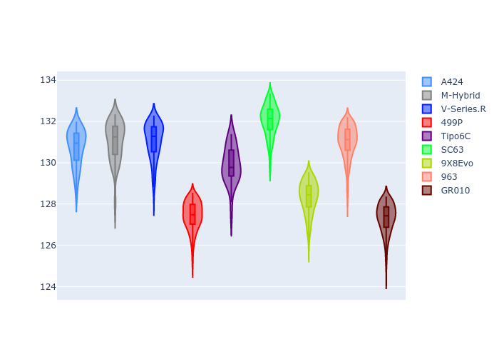
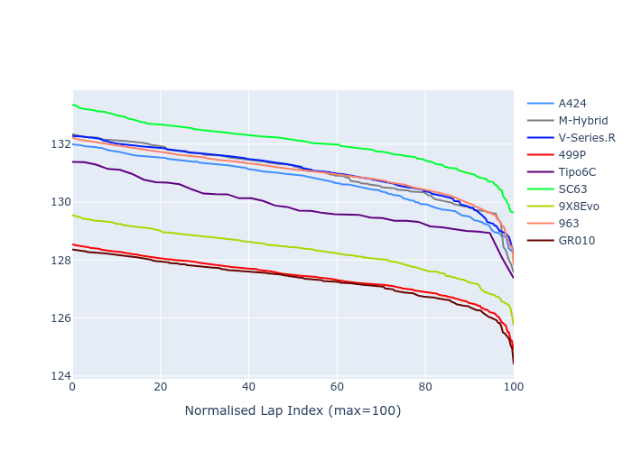

# Combined Plots

## Metadata

- BoP Accuracy: 64.18%
- Overall BoP Grade: D2
- Track: REFERENCETRACK
- Threshhold: 0.0kph

## BoP Table
| Manufacturer     | Car        | Weight   | Power   | PINC   | E/Stint   | FDS   | RDP    | QDP    | TDP    |
|:-----------------|:-----------|:---------|:--------|:-------|:----------|:------|:-------|:-------|:-------|
| Alpine           | A424       | 1030kg   | 520.0kw | -      | 912MJ     | -     | 44.91% | 62.50% | 24.00% |
| BMW              | M-Hybrid   | 1030kg   | 520.0kw | -      | 912MJ     | -     | 41.75% | 50.00% | 8.15%  |
| Cadillac         | V-Series.R | 1030kg   | 520.0kw | -      | 909MJ     | -     | 31.03% | 75.00% | 11.68% |
| Ferrari          | 499P       | 1030kg   | 520.0kw | -      | 902MJ     | -     | 36.65% | 70.00% | 5.75%  |
| Isotta Fraschini | Tipo6C     | 1030kg   | 520.0kw | -      | 915MJ     | -     | 25.33% | 50.00% | 11.93% |
| Lamborghini      | SC63       | 1030kg   | 520.0kw | -      | 908MJ     | -     | 32.08% | 66.67% | 16.53% |
| Peugeot          | 9X8Evo     | 1030kg   | 520.0kw | -      | 905MJ     | -     | 31.11% | 37.50% | 4.26%  |
| Porsche          | 963        | 1030kg   | 520.0kw | -      | 911MJ     | -     | 33.39% | 11.11% | 0.20%  |
| Toyota           | GR010      | 1030kg   | 520.0kw | -      | 912MJ     | -     | 32.95% | 42.86% | 4.38%  |

## Performance Table
| Manufacturer     | Car        | RP      | QP      | Vavg      |   RDLC | BOP-Grade   | Match   |
|:-----------------|:-----------|:--------|:--------|:----------|-------:|:------------|:--------|
| Alpine           | A424       | 2:09.99 | 2:06.37 | 308.52kph |   1.03 | +D1         | 67.96%  |
| BMW              | M-Hybrid   | 2:10.29 | 2:06.14 | 307.28kph |   1.03 | +E2         | 52.91%  |
| Cadillac         | V-Series.R | 2:10.33 | 2:06.24 | 304.13kph |   1.03 | +E2         | 51.14%  |
| Ferrari          | 499P       | 2:07.09 | 2:03.67 | 311.50kph |   1.03 | -B2         | 80.40%  |
| Isotta Fraschini | Tipo6C     | 2:09.63 | 2:06.78 | 307.81kph |   1.02 | +B2         | 84.21%  |
| Lamborghini      | SC63       | 2:11.38 | 2:07.54 | 304.53kph |   1.03 | +Ω1         | 15.29%  |
| Peugeot          | 9X8Evo     | 2:07.98 | 2:04.65 | 311.28kph |   1.03 | -A2         | 93.36%  |
| Porsche          | 963        | 2:10.31 | 2:06.37 | 311.97kph |   1.03 | +E1         | 57.51%  |
| Toyota           | GR010      | 2:06.98 | 2:03.74 | 311.95kph |   1.03 | -C2         | 74.83%  |

## Race Laptimes

## Quali Laptimes

## Topspeeds

## Laptimes Lineplot

