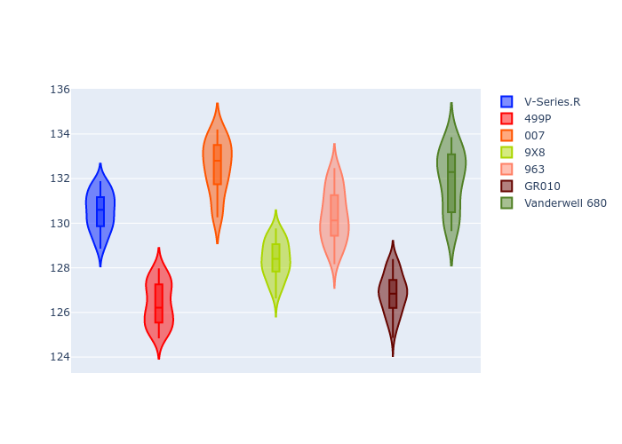
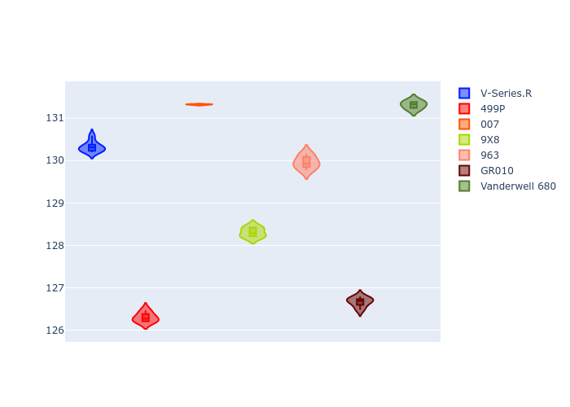
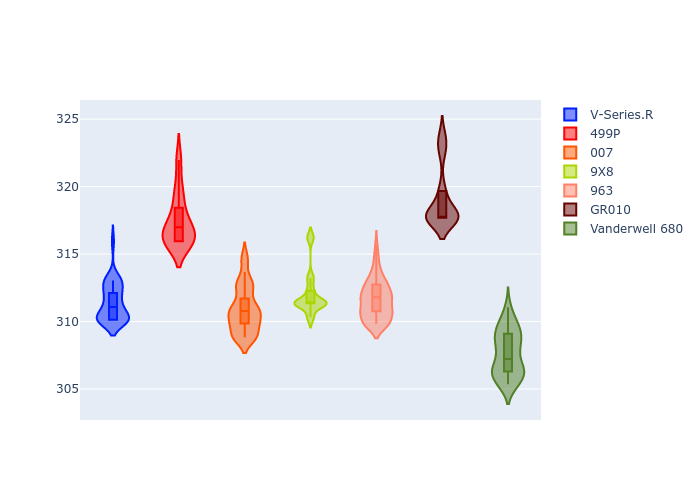
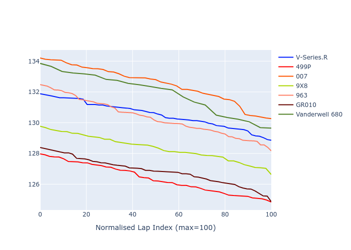

# Combined Plots

## Metadata

- BoP Accuracy: 47.67%
- Overall BoP Grade: Ω1
- Track: REFERENCETRACK
- Threshhold: 0.0kph

## BoP Table
| Manufacturer   | Car            | Weight   | Power   | PINC   | E/Stint   | FDS   | RDP    | QDP    | TDP    |
|:---------------|:---------------|:---------|:--------|:-------|:----------|:------|:-------|:-------|:-------|
| Cadillac       | V-Series.R     | 1030kg   | 520.0kw | -      | 909MJ     | -     | 36.81% | 66.67% | 20.86% |
| Ferrari        | 499P           | 1030kg   | 520.0kw | -      | 907MJ     | -     | 39.06% | 25.00% | 9.38%  |
| Glickenhaus    | 007            | 1030kg   | 520.0kw | -      | 913MJ     | -     | 37.50% | 75.00% | 27.50% |
| Peugeot        | 9X8            | 1030kg   | 520.0kw | -      | 910MJ     | -     | 41.12% | 66.67% | 8.57%  |
| Porsche        | 963            | 1030kg   | 520.0kw | -      | 912MJ     | -     | 33.50% | 32.00% | 28.93% |
| Toyota         | GR010          | 1030kg   | 520.0kw | -      | 910MJ     | -     | 43.94% | 60.00% | 7.58%  |
| Vanwall        | Vanderwell 680 | 1030kg   | 520.0kw | -      | 908MJ     | -     | 35.48% | 30.00% | 43.55% |

## Performance Table
| Manufacturer   | Car            | RP      | QP      | Vavg      |   RDLC | BOP-Grade   | Match   |
|:---------------|:---------------|:--------|:--------|:----------|-------:|:------------|:--------|
| Cadillac       | V-Series.R     | 2:10.86 | 2:09.14 | 308.63kph |   1.01 | +C1         | 80.00%  |
| Ferrari        | 499P           | 2:07.00 | 2:05.47 | 314.60kph |   1.01 | -Ω1         | 14.00%  |
| Glickenhaus    | 007            | 2:12.99 | 2:10.24 | 308.09kph |   1.02 | +Ω1         | 15.56%  |
| Peugeot        | 9X8            | 2:09.07 | 2:07.52 | 309.29kph |   1.01 | -B1         | 86.36%  |
| Porsche        | 963            | 2:10.69 | 2:08.80 | 308.80kph |   1.01 | +C1         | 77.27%  |
| Toyota         | GR010          | 2:07.47 | 2:05.84 | 316.23kph |   1.01 | -Ω1         | 24.14%  |
| Vanwall        | Vanderwell 680 | 2:12.29 | 2:10.15 | 304.89kph |   1.02 | +Ω1         | 36.36%  |

## Race Laptimes

## Quali Laptimes

## Topspeeds

## Laptimes Lineplot

