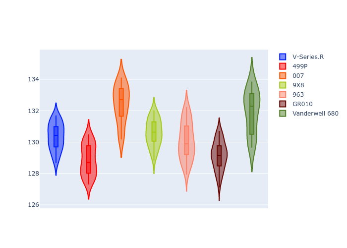
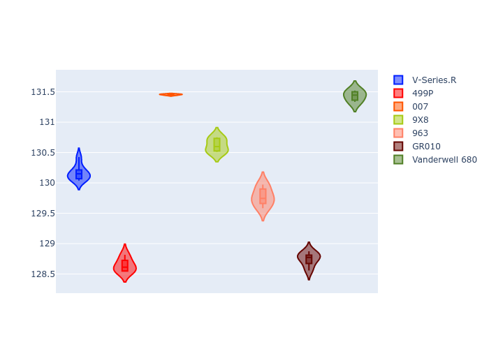
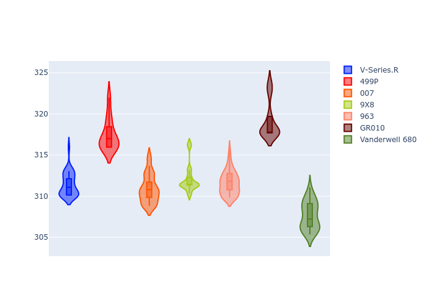
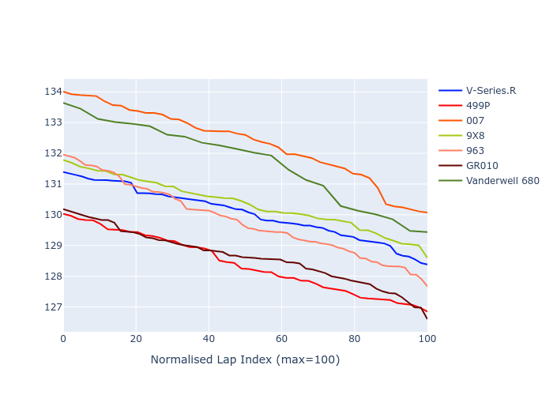

# Combined Plots

## Metadata

- BoP Accuracy: 72.40%
- Overall BoP Grade: C2
- Track: REFERENCETRACK
- Threshhold: 0.0kph
- Average Laptime: 2:10.49
- Average Quali Laptime: 2:10.42
- Laptime Std Dev: 1.22 seconds
- Filtered Average Topspeed: 312.98kph

## BoP Table
| Manufacturer   | Car            | Weight   | Power   | PINC   | E/Stint   | FDS   | RDP    | QDP    | TDP    |
|:---------------|:---------------|:---------|:--------|:-------|:----------|:------|:-------|:-------|:-------|
| Cadillac       | V-Series.R     | 1030kg   | 520.0kw | -      | 909MJ     | -     | 36.81% | 66.67% | 20.86% |
| Ferrari        | 499P           | 1030kg   | 520.0kw | -      | 907MJ     | -     | 39.06% | 25.00% | 9.38%  |
| Glickenhaus    | 007            | 1030kg   | 520.0kw | -      | 913MJ     | -     | 37.50% | 75.00% | 27.50% |
| Peugeot        | 9X8            | 1030kg   | 520.0kw | -      | 910MJ     | -     | 41.12% | 66.67% | 8.57%  |
| Porsche        | 963            | 1030kg   | 520.0kw | -      | 912MJ     | -     | 33.50% | 32.00% | 28.93% |
| Toyota         | GR010          | 1030kg   | 520.0kw | -      | 910MJ     | -     | 43.94% | 60.00% | 7.58%  |
| Vanwall        | Vanderwell 680 | 1030kg   | 520.0kw | -      | 908MJ     | -     | 35.48% | 30.00% | 43.55% |

## Performance Table
| Manufacturer   | Car            | RP      | QP      | Vavg      |   RDLC | BOP-Grade   | Match   |
|:---------------|:---------------|:--------|:--------|:----------|-------:|:------------|:--------|
| Cadillac       | V-Series.R     | 2:10.35 | 2:10.47 | 311.52kph |   1    | ~A1         | 100.00% |
| Ferrari        | 499P           | 2:08.87 | 2:09.11 | 317.55kph |   1    | -E1         | 58.00%  |
| Glickenhaus    | 007            | 2:12.43 | 2:11.56 | 310.98kph |   1.01 | +Ω1         | 40.00%  |
| Peugeot        | 9X8            | 2:10.59 | 2:10.86 | 312.19kph |   1    | ~A1         | 100.00% |
| Porsche        | 963            | 2:10.09 | 2:10.05 | 311.70kph |   1    | -A2         | 90.91%  |
| Toyota         | GR010          | 2:09.14 | 2:09.27 | 319.19kph |   1    | -C2         | 72.41%  |
| Vanwall        | Vanderwell 680 | 2:11.93 | 2:11.65 | 307.74kph |   1    | +Ω1         | 45.45%  |

## Race Laptimes

## Quali Laptimes

## Topspeeds

## Laptimes Lineplot

