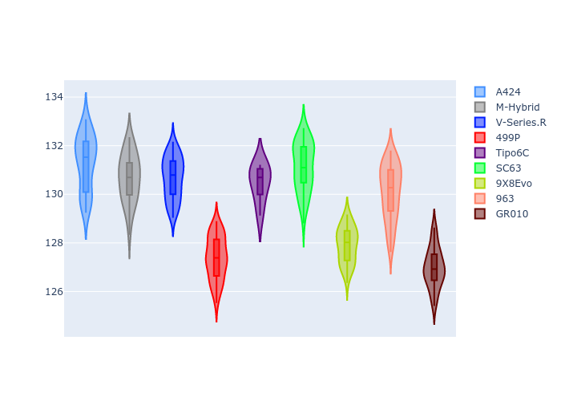
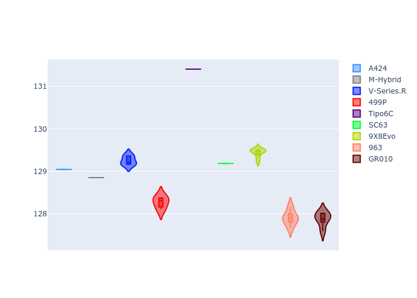
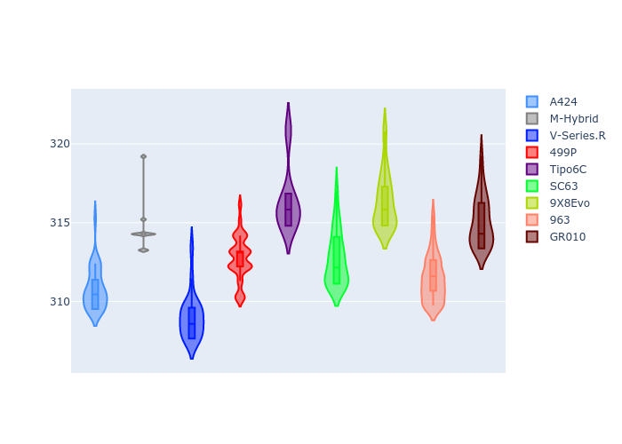
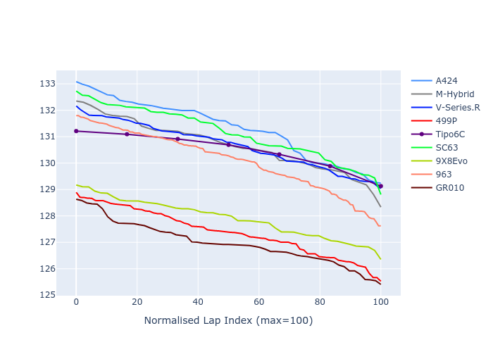

# Combined Plots

## Metadata

- BoP Accuracy: 80.20%
- Overall BoP Grade: B2
- Track: REFERENCETRACK
- Threshhold: 0.0kph
- Average Laptime: 2:10.72
- Average Quali Laptime: 2:09.02
- Laptime Std Dev: 0.95 seconds
- Filtered Average Topspeed: 312.98kph

## BoP Table
| Manufacturer     | Car        | Weight   | Power   | PINC   | E/Stint   | FDS   | RDP    | QDP    | TDP    |
|:-----------------|:-----------|:---------|:--------|:-------|:----------|:------|:-------|:-------|:-------|
| Alpine           | A424       | 1030kg   | 520.0kw | -      | 911MJ     | -     | 40.00% | 20.00% | 28.80% |
| BMW              | M-Hybrid   | 1030kg   | 520.0kw | -      | 911MJ     | -     | 37.07% | 20.00% | 7.76%  |
| Cadillac         | V-Series.R | 1030kg   | 520.0kw | -      | 909MJ     | -     | 41.14% | 33.33% | 12.00% |
| Ferrari          | 499P       | 1030kg   | 520.0kw | -      | 902MJ     | -     | 39.80% | 18.75% | 16.42% |
| Isotta Fraschini | Tipo6C     | 1030kg   | 520.0kw | -      | 915MJ     | -     | 33.33% | 16.67% | 15.04% |
| Lamborghini      | SC63       | 1030kg   | 520.0kw | -      | 908MJ     | -     | 38.17% | 20.00% | 23.66% |
| Peugeot          | 9X8Evo     | 1030kg   | 520.0kw | -      | 905MJ     | -     | 42.02% | 34.78% | 29.91% |
| Porsche          | 963        | 1030kg   | 520.0kw | -      | 911MJ     | -     | 35.99% | 45.45% | 33.88% |
| Toyota           | GR010      | 1030kg   | 520.0kw | -      | 912MJ     | -     | 40.97% | 62.50% | 23.61% |

## Performance Table
| Manufacturer     | Car        | RP      | QP      | Vavg      |   RDLC | BOP-Grade   | Match   |
|:-----------------|:-----------|:--------|:--------|:----------|-------:|:------------|:--------|
| Alpine           | A424       | 2:11.41 | 2:09.04 | 310.54kph |   1.02 | +C2         | 72.00%  |
| BMW              | M-Hybrid   | 2:10.74 | 2:08.85 | 314.43kph |   1.01 | -A2         | 90.70%  |
| Cadillac         | V-Series.R | 2:10.78 | 2:09.25 | 308.75kph |   1.01 | ~A1         | 98.61%  |
| Ferrari          | 499P       | 2:09.91 | 2:08.27 | 312.48kph |   1.01 | -B1         | 87.50%  |
| Isotta Fraschini | Tipo6C     | 2:12.79 | 2:11.41 | 316.16kph |   1.01 | +Ω1         | 28.57%  |
| Lamborghini      | SC63       | 2:11.07 | 2:09.18 | 312.42kph |   1.01 | -B1         | 88.00%  |
| Peugeot          | 9X8Evo     | 2:10.36 | 2:09.44 | 316.07kph |   1.01 | ~A1         | 98.00%  |
| Porsche          | 963        | 2:10.10 | 2:07.90 | 311.17kph |   1.02 | -B1         | 85.50%  |
| Toyota           | GR010      | 2:09.30 | 2:07.87 | 314.81kph |   1.01 | -C2         | 72.88%  |

## Race Laptimes

## Quali Laptimes

## Topspeeds

## Laptimes Lineplot

