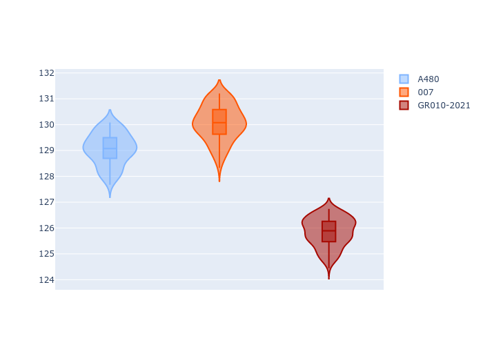
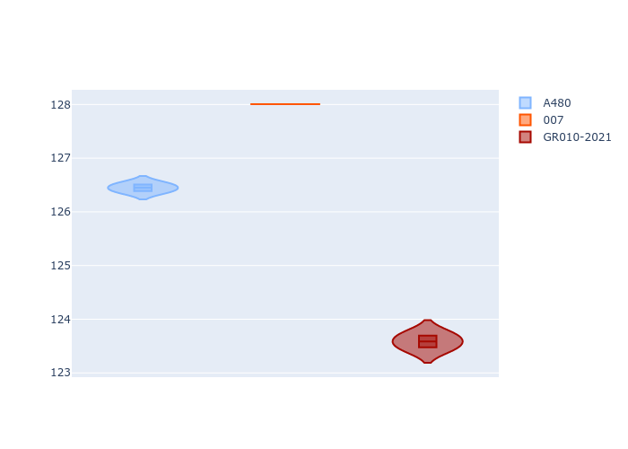
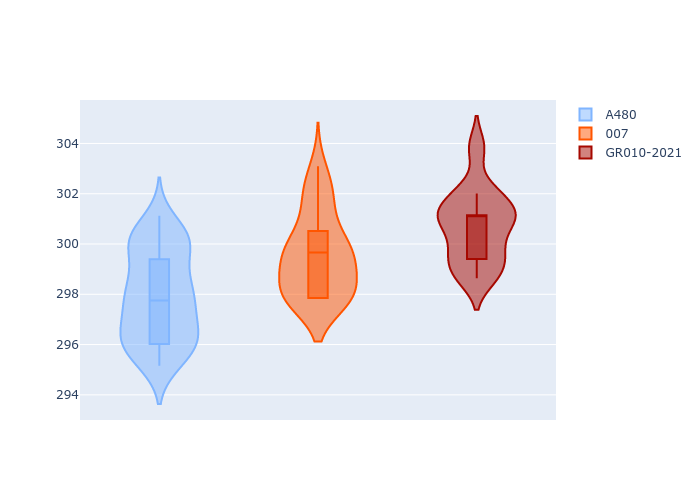
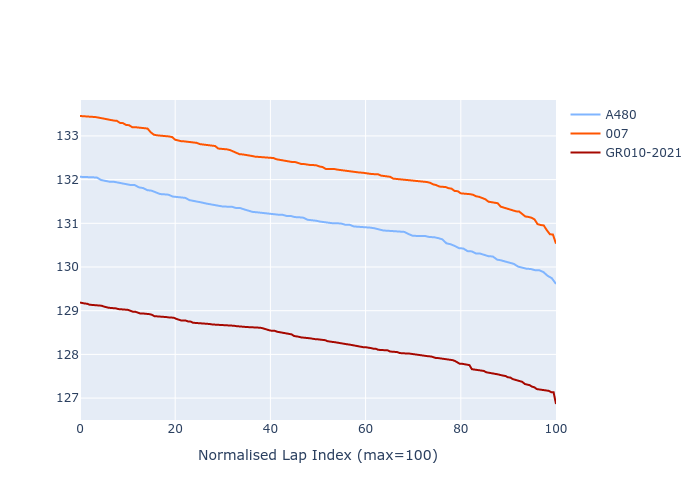

# Combined Plots

## Metadata

- BoP Accuracy: 34.38%
- Overall BoP Grade: Ω1
- Track: REFERENCETRACK
- Threshhold: 0.0kph
- Average Laptime: 2:10.54
- Average Quali Laptime: 2:08.24
- Average Topspeed: 314.45kph

## BoP Table
| Manufacturer   | Car        | Weight   | Power   | PINC   | E/Stint   | FDS   | RDP    | QDP    | TDP    |
|:---------------|:-----------|:---------|:--------|:-------|:----------|:------|:-------|:-------|:-------|
| Alpine         | A480       | 930kg    | 454.0kw | -      | 919MJ     | -     | 55.88% | 66.67% | 43.98% |
| Glickenhaus    | 007        | 1030kg   | 520.0kw | -      | 965MJ     | -     | 53.79% | 33.33% | 9.35%  |
| Toyota         | GR010-2021 | 1030kg   | 520.0kw | -      | 963MJ     | -     | 54.52% | 50.00% | 13.05% |

## Performance Table
| Manufacturer   | Car        | RP      | QP      | Vavg      |   RDLC | BOP-Grade   | Match   |
|:---------------|:-----------|:--------|:--------|:----------|-------:|:------------|:--------|
| Alpine         | A480       | 2:11.03 | 2:08.43 | 312.90kph |   1.02 | +C1         | 77.19%  |
| Glickenhaus    | 007        | 2:12.30 | 2:10.26 | 314.61kph |   1.02 | +Ω1         | 15.38%  |
| Toyota         | GR010-2021 | 2:08.29 | 2:06.04 | 315.85kph |   1.02 | -Ω1         | 10.55%  |

## Race Laptimes

## Quali Laptimes

## Topspeeds

## Laptimes Lineplot

