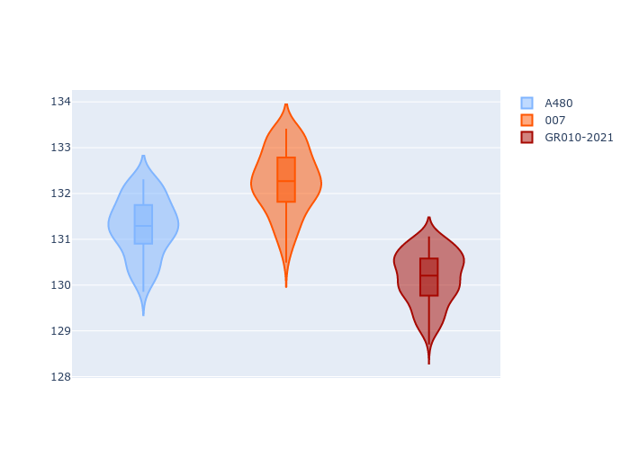
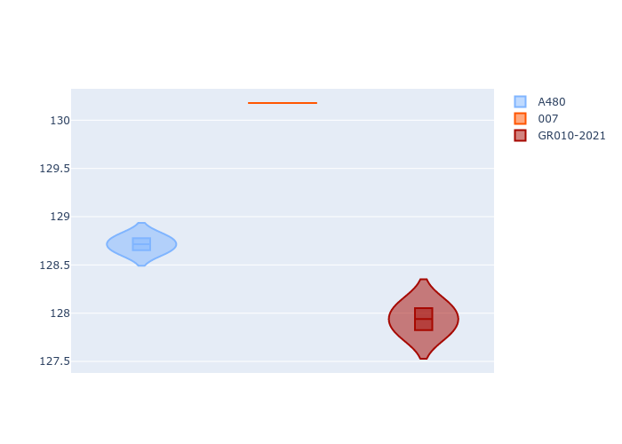
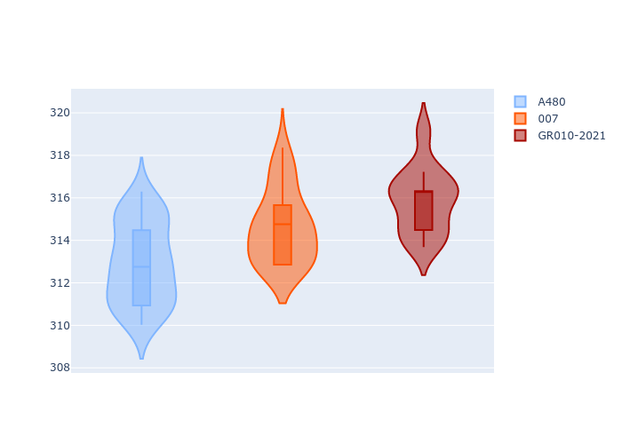
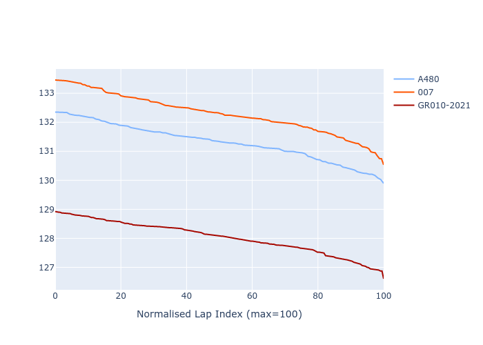

# Combined Plots

## Metadata

- BoP Accuracy: 68.93%
- Overall BoP Grade: D1
- Track: REFERENCETRACK
- Threshhold: 0.0kph
- Average Laptime: 2:10.87
- Average Quali Laptime: 2:08.56
- Laptime Std Dev: 1.00 seconds
- Filtered Average Topspeed: 314.83kph

## BoP Table
| Manufacturer   | Car        | Weight   | Power   | PINC   | E/Stint   | FDS   | RDP    | QDP    | TDP    |
|:---------------|:-----------|:---------|:--------|:-------|:----------|:------|:-------|:-------|:-------|
| Alpine         | A480       | 930kg    | 454.0kw | -      | 919MJ     | -     | 55.88% | 66.67% | 43.98% |
| Glickenhaus    | 007        | 1030kg   | 520.0kw | -      | 965MJ     | -     | 53.79% | 33.33% | 9.35%  |
| Toyota         | GR010-2021 | 1030kg   | 520.0kw | -      | 963MJ     | -     | 54.52% | 50.00% | 13.05% |

## Performance Table
| Manufacturer   | Car        | RP      | QP      | Vavg      |   RDLC | BOP-Grade   | Match   |
|:---------------|:-----------|:--------|:--------|:----------|-------:|:------------|:--------|
| Alpine         | A480       | 2:10.87 | 2:08.27 | 313.27kph |   1.02 | ~A1         | 98.25%  |
| Glickenhaus    | 007        | 2:12.10 | 2:10.07 | 314.98kph |   1.02 | +Ω1         | 37.18%  |
| Toyota         | GR010-2021 | 2:09.64 | 2:07.34 | 316.23kph |   1.02 | -C2         | 71.36%  |

## Race Laptimes

## Quali Laptimes

## Topspeeds

## Laptimes Lineplot

