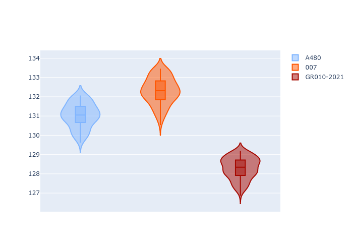
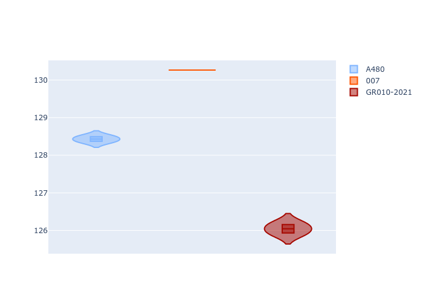

# Combined Plots

## Metadata

- BoP Accuracy: 27.15%
- Overall BoP Grade: Ω1
- Track: REFERENCETRACK
- Threshhold: 0.0kph

## BoP Table
| Manufacturer   | Car        | Weight   | Power   | PINC   | E/Stint   | FDS   | RDP    | QDP    | TDP    |
|:---------------|:-----------|:---------|:--------|:-------|:----------|:------|:-------|:-------|:-------|
| Alpine         | A480       | 930kg    | 454.0kw | -      | 919MJ     | -     | 54.90% | 66.67% | 43.98% |
| Glickenhaus    | 007        | 1030kg   | 520.0kw | -      | 965MJ     | -     | 53.79% | 33.33% | 9.35%  |
| Toyota         | GR010-2021 | 1030kg   | 520.0kw | -      | 963MJ     | -     | 54.79% | 50.00% | 13.05% |

## Performance Table
| Manufacturer   | Car        | RP      | QP      | Vavg      |   RDLC | BOP-Grade   | Match   |
|:---------------|:-----------|:--------|:--------|:----------|-------:|:------------|:--------|
| Alpine         | A480       | 2:09.05 | 2:06.45 | 297.91kph |   1.02 | +D1         | 66.07%  |
| Glickenhaus    | 007        | 2:10.06 | 2:08.01 | 299.53kph |   1.02 | +Ω1         | 15.38%  |
| Toyota         | GR010-2021 | 2:05.85 | 2:03.59 | 300.71kph |   1.02 | -Ω2         | 0.00%   |

## Race Laptimes

## Quali Laptimes

## Topspeeds

## Laptimes Lineplot

