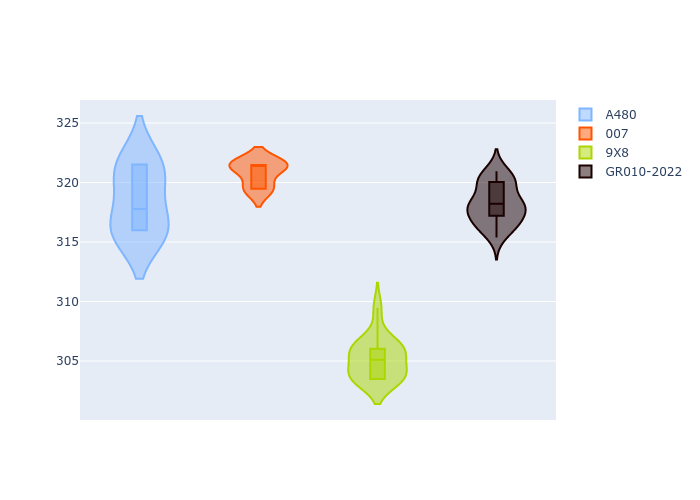

# Combined Plots

## Metadata

- BoP Accuracy: 53.37%
- Overall BoP Grade: E2
- Track: REFERENCETRACK
- Threshhold: 0.0kph

## BoP Table
| Manufacturer   | Car        | Weight   | Power   | PINC   | E/Stint   | FDS   | RDP    | QDP     | TDP   |
|:---------------|:-----------|:---------|:--------|:-------|:----------|:------|:-------|:--------|:------|
| Alpine         | A480       | 930kg    | 454.0kw | -      | 816MJ     | -     | 54.64% | 50.00%  | 2.97% |
| Glickenhaus    | 007        | 1030kg   | 520.0kw | -      | 910MJ     | -     | 45.83% | 33.33%  | 5.66% |
| Peugeot        | 9X8        | 1030kg   | 520.0kw | -      | 908MJ     | -     | 56.28% | 100.00% | 6.67% |
| Toyota         | GR010-2022 | 1030kg   | 520.0kw | -      | 907MJ     | -     | 55.18% | 100.00% | 5.72% |

## Performance Table
| Manufacturer   | Car        | RP      | QP      | Vavg      |   RDLC | BOP-Grade   | Match   |
|:---------------|:-----------|:--------|:--------|:----------|-------:|:------------|:--------|
| Alpine         | A480       | 2:07.29 | 2:04.89 | 304.50kph |   1.02 | ~A1         | 100.00% |
| Glickenhaus    | 007        | 2:10.24 | 2:06.98 | 306.78kph |   1.03 | +Ω1         | 2.27%   |
| Peugeot        | 9X8        | 2:06.95 | 2:04.08 | 291.82kph |   1.02 | -B1         | 86.78%  |
| Toyota         | GR010-2022 | 2:05.98 | 2:03.37 | 304.30kph |   1.02 | -Ω1         | 24.41%  |

## Race Laptimes

## Quali Laptimes

## Topspeeds

## Laptimes Lineplot

