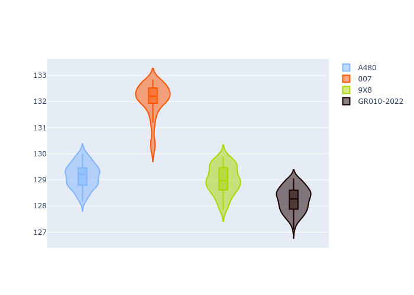

# Combined Plots

## Metadata

- BoP Accuracy: 60.34%
- Overall BoP Grade: D2
- Track: REFERENCETRACK
- Threshhold: 0.0kph
- Average Laptime: 2:09.62
- Average Quali Laptime: 2:06.54
- Average Topspeed: 315.65kph

## BoP Table
| Manufacturer   | Car        | Weight   | Power   | PINC   | E/Stint   | FDS   | RDP    | QDP     | TDP   |
|:---------------|:-----------|:---------|:--------|:-------|:----------|:------|:-------|:--------|:------|
| Alpine         | A480       | 930kg    | 454.0kw | -      | 816MJ     | -     | 54.64% | 50.00%  | 2.97% |
| Glickenhaus    | 007        | 1030kg   | 520.0kw | -      | 910MJ     | -     | 45.83% | 33.33%  | 5.66% |
| Peugeot        | 9X8        | 1030kg   | 520.0kw | -      | 908MJ     | -     | 56.28% | 100.00% | 6.67% |
| Toyota         | GR010-2022 | 1030kg   | 520.0kw | -      | 907MJ     | -     | 55.18% | 100.00% | 5.72% |

## Performance Table
| Manufacturer   | Car        | RP      | QP      | Vavg      |   RDLC | BOP-Grade   | Match   |
|:---------------|:-----------|:--------|:--------|:----------|-------:|:------------|:--------|
| Alpine         | A480       | 2:09.15 | 2:06.47 | 318.43kph |   1.02 | ~A1         | 97.17%  |
| Glickenhaus    | 007        | 2:12.08 | 2:08.53 | 320.80kph |   1.03 | +Ω1         | 6.82%   |
| Peugeot        | 9X8        | 2:08.99 | 2:05.82 | 305.17kph |   1.03 | -B1         | 87.60%  |
| Toyota         | GR010-2022 | 2:08.25 | 2:05.35 | 318.21kph |   1.02 | -Ω1         | 49.77%  |

## Race Laptimes

## Quali Laptimes

## Topspeeds

## Laptimes Lineplot

