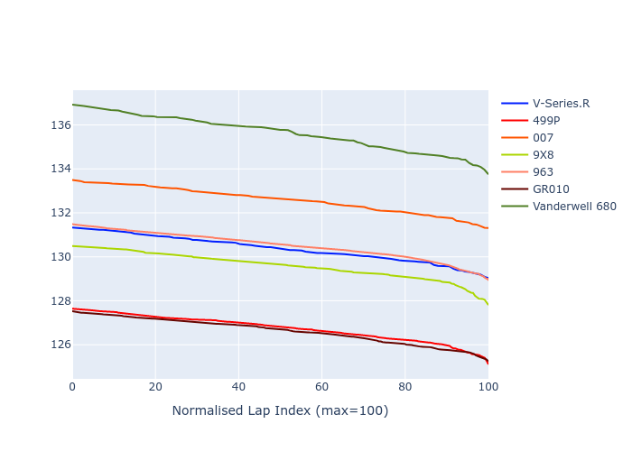

# Combined Plots

## Metadata

- BoP Accuracy: 35.62%
- Overall BoP Grade: Ω1
- Track: REFERENCETRACK
- Threshhold: 0.0kph

## BoP Table
| Manufacturer   | Car            | Weight   | Power   | PINC   | E/Stint   | FDS   | RDP    | QDP    | TDP    |
|:---------------|:---------------|:---------|:--------|:-------|:----------|:------|:-------|:-------|:-------|
| Cadillac       | V-Series.R     | 1030kg   | 520.0kw | -      | 909MJ     | -     | 54.55% | 66.67% | 35.38% |
| Ferrari        | 499P           | 1030kg   | 520.0kw | -      | 909MJ     | -     | 56.89% | 60.00% | 4.73%  |
| Glickenhaus    | 007            | 1030kg   | 520.0kw | -      | 916MJ     | -     | 52.76% | 66.67% | 19.07% |
| Peugeot        | 9X8            | 1030kg   | 520.0kw | -      | 912MJ     | -     | 55.50% | 75.00% | 2.88%  |
| Porsche        | 963            | 1030kg   | 520.0kw | -      | 909MJ     | -     | 58.08% | 37.50% | 32.75% |
| Toyota         | GR010          | 1030kg   | 520.0kw | -      | 914MJ     | -     | 57.39% | 80.00% | 1.18%  |
| Vanwall        | Vanderwell 680 | 1030kg   | 520.0kw | -      | 913MJ     | -     | 57.07% | 33.33% | 26.09% |

## Performance Table
| Manufacturer   | Car            | RP      | QP      | Vavg      |   RDLC | BOP-Grade   | Match   |
|:---------------|:---------------|:--------|:--------|:----------|-------:|:------------|:--------|
| Cadillac       | V-Series.R     | 2:08.29 | 2:04.98 | 299.37kph |   1.03 | +A2         | 92.59%  |
| Ferrari        | 499P           | 2:04.35 | 2:01.14 | 306.10kph |   1.03 | -Ω2         | 0.00%   |
| Glickenhaus    | 007            | 2:10.63 | 2:07.77 | 299.78kph |   1.02 | +Ω2         | 0.00%   |
| Peugeot        | 9X8            | 2:07.22 | 2:03.81 | 301.42kph |   1.03 | -B2         | 83.87%  |
| Porsche        | 963            | 2:08.69 | 2:05.46 | 301.08kph |   1.03 | +C2         | 72.88%  |
| Toyota         | GR010          | 2:04.42 | 2:01.47 | 307.86kph |   1.02 | -Ω2         | 0.00%   |
| Vanwall        | Vanderwell 680 | 2:13.64 | 2:09.45 | 290.89kph |   1.03 | +Ω2         | 0.00%   |

## Race Laptimes

## Quali Laptimes

## Topspeeds

## Laptimes Lineplot

